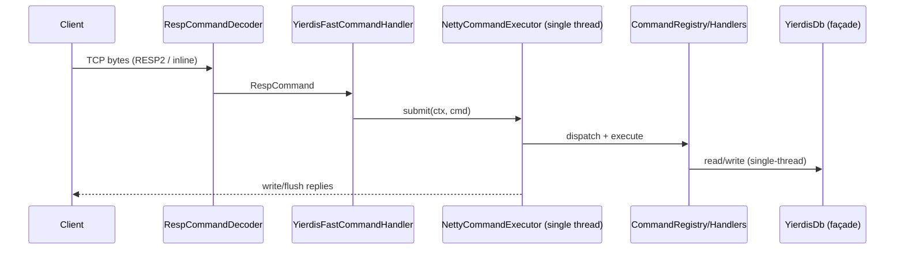
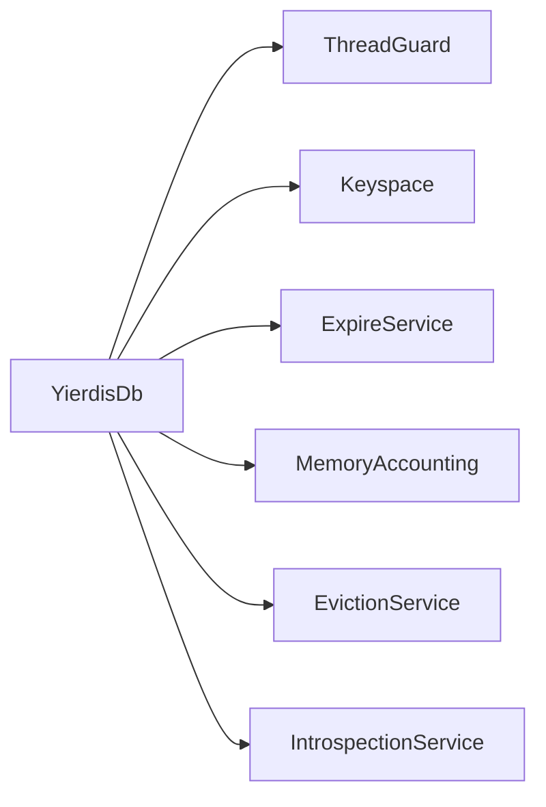

<!-- migrated_from: history/2026-01/202601161128_arch_refactor/how.md -->
<!-- migrated_at: 2026-02-24 23:14:10 -->

# Technical Design: 架构重构（命令/DB 解耦 + 执行模型硬化 + 预算/背压可解释化）

## Technical Solution

### Core Technologies
- Java 17 / Maven multi-module
- Netty (server/client/codec)
- RESP2 + 最小 RESP3（连接级协议状态由 `RespSession` 承载）
- bounded backlog + backpressure + 单线程命令语义（Redis 风格）
- 可选 off-heap（netty/unsafe/foreign 后端）

### Implementation Key Points

1. **命令层：Registry + Context + Domain Commands**
   - 目标：把 `YierdisFastCommandProcessor` 从“单类承载全部命令语义”拆成：
     - `CommandRegistry`：命令名 → handler 的唯一注册点（SSOT）
     - `CommandSupport`：承载 `YierdisDb` 访问与复用 scratch/通用解析逻辑（避免拆分后频繁分配）
     - `*Commands`（按 domain 拆分）：Key/String/List/Hash/Set/ZSet/Server
   - 兼容性：错误码/错误信息与现有实现保持一致；RESP3 的 null 语义仍由 `RespWriter/RespSession` 决定。

2. **DB：从“大而全类”拆成 façade + 内部服务**
   - `YierdisDb` 保留对外 API（避免修改面过大），但把内部职责拆到 package-private 组件：
     - `DbThreadGuard`：owner 线程绑定与 fail-fast
     - `DbMemoryAccounting`：`usedBytes`/结构开销估算/统计输出
     - `YierdisMemoryStats`：可观测的预算分解对象（供命令/日志输出复用）
   - 注：Expire/Eviction 目前仍保留在 `YierdisDb` 内（本次优先把“线程/预算/可观测性”从 God Object 中解耦出来）。

3. **执行器：公平调度 + retained-bytes 口径 + 可选 compaction**
   - 在保持“单线程执行 + flush coalescing + 背压滞回”的前提下，引入连接级公平性：
     - per-channel queue + round-robin drain（或等价策略）
     - 仍保留全局预算（capacity/bytes）作为硬上限
   - bytes 口径升级：
     - `RespFrame.length()`：逻辑帧长度（稳定，不变）
     - 新增 `RespFrame.retainedBytes()`：用于 backlog/backpressure 的“更接近实际 retained 内存”估算
   - compaction（可配置）：
     - 当 retainedBytes 明显大于 length 时，将 frame copy 到精确长度 buf 并替换 frame，释放大底层 buf，降低驻留。

4. **off-heap：默认安全 + 能力显式化 + 启动期可用性校验**
   - 将 keys/expires 的 off-heap 使用改为显式开关（默认关闭）。
   - 后端加载从“运行期反射失败”升级为“启动期强校验”：
     - 方案 A：引入 `ServiceLoader` provider（推荐，见 ADR）
     - 方案 B：保留反射，但在 startup 预检并输出明确诊断（保底）

## Architecture Design

### 端到端调用链（保持现有主链路）



### 执行器内部结构（新增公平性/retained bytes）

```mermaid
flowchart TD
  subgraph IO[Netty I/O threads]
    A[RespCommandDecoder] --> B[YierdisFastCommandHandler]
  end
  subgraph EX[Executor thread (single)]
    S[Scheduler: per-channel queues + RR]
    D[Dispatch: CommandRegistry]
    DB[YierdisDb façade]
    S --> D --> DB
  end
  B --> S
```

### DB 内部职责拆分（示意）



## Architecture Decision ADR

### ADR-20260116-01: 执行模型“单入口 + fail-fast”硬化
**Context:** 当前单线程语义依赖 server/执行器的正确装配与调用纪律；`YierdisDb` 在未 bind 时不会阻止跨线程访问，存在误用风险。  
**Decision:** server 仅保留“走执行器”的命令路径；DB 未绑定/跨线程访问一律 fail-fast。  
**Rationale:** 把“约定”变为“硬约束”，将竞态风险前置暴露到开发/测试阶段。  
**Alternatives:**  
- 方案 A：保持现状，仅靠文档约束 → 拒绝原因：误用成本高、回归难定位。  
- 方案 B：自动 bind（第一次访问绑定当前线程）→ 拒绝原因：会掩盖误用，产生隐性行为差异。  
**Impact:** 需要补齐 core/server 单测的 bind 调用；能显著降低未来维护风险。

### ADR-20260116-02: 命令层拆分为“Registry + Domain Commands”，保留低分配策略
**Context:** 单类承载全部命令会放大修改面，且难做精细单测；但拆分可能引入分配与性能回退。  
**Decision:** 引入 `CommandSupport` 复用 scratch；命令按 domain 拆分并统一注册；错误映射集中管理。  
**Rationale:** 在维持 hot-path 低分配的同时提升可维护性与可测试性。  
**Alternatives:**  
- 方案 A：继续单文件加注释/分段 → 拒绝原因：规模增长后不可持续。  
- 方案 B：基于 String 解析的 HashMap 路由 → 拒绝原因：容易引入额外分配与大小写转换成本（除非做专门优化）。  
**Impact:** 文件数量增加，但职责更清晰；新增命令的修改半径显著下降。

### ADR-20260116-03: retained bytes 口径升级 + 可选 frame compaction
**Context:** 零拷贝解码+排队会延长底层 buf 生命周期；若仅按 frame length 计费可能低估 retained memory。  
**Decision:** `RespFrame` 增加 `retainedBytes()` 口径用于预算；执行器支持可配置 compaction，将高驻留 frame 复制为精确长度。  
**Rationale:** 以更准确的预算口径治理 backpressure，同时在必要时“以拷贝换确定性”。  
**Alternatives:**  
- 方案 A：完全禁用零拷贝（总是 copy）→ 拒绝原因：对教学/性能对比不友好。  
- 方案 B：只改预算口径不做 compaction → 风险：仍可能出现驻留体积大导致抖动；作为保底可接受，但推荐提供 compaction。  
**Impact:** 需要修改 protocol/netty 适配与 server executor；新增针对 retained/compaction 的测试。

### ADR-20260116-04: off-heap 能力显式化（keys/expires 默认关闭）+ 启动期可用性校验
**Context:** raw address 能力风险高；反射加载后端会在运行期失败，影响可运维性。  
**Decision:** keys/expires 的 off-heap 使用改为显式开关；后端加载改为启动期强校验（优先 ServiceLoader）。  
**Rationale:** 默认安全，允许教学/实验开启增强能力；错误尽早暴露。  
**Alternatives:**  
- 方案 A：继续自动启用 keys/expires off-heap → 拒绝原因：风险面过大、难解释。  
- 方案 B：完全移除 address capability → 拒绝原因：不利于教学/对比实验。  
**Impact:** 新增/调整 server args；需要更新 wiki/offheap 文档与相关测试。

## API Design

### 对外命令（新增/扩展二选一）

**Option A（推荐）：新增 `INFO [section]`（最小实现）**
- `INFO`：默认输出 `server` + `memory` 两段（纯文本 bulk string，Redis 风格）
- `INFO MEMORY`：输出预算分解（heapEstimate/offheapUsed/overhead 等）

**Option B：扩展 `MEMORY` 子命令**
- `MEMORY STATS`：以 array 形式输出 key-value 列表（更结构化）

> 选择建议：Option A 更贴近 Redis 生态（redis-cli/运维习惯）；Option B 更易做严格测试。可二者兼容，但优先实现其一避免扩散。

### 新增/调整 server args（示例）
- `--executorSchedulingPolicy global|fair`：执行器调度策略
- `--frameCompactionThresholdBytes <bytes>` / `--frameCompactionRatio <n>`：compaction 触发条件
- `--offheapKeysEnabled`：是否启用 keys/expires 的 off-heap（默认 false）
- （可选）`--memoryDiagnosticsEnabled`：是否在 OOM/evict 时打印预算摘要（默认 true）

## Security and Performance

- **Security**
  - 保持协议输入上限（bulk/args/line）为硬限制，防止 DoS。
  - 错误信息继续做 CRLF 注入净化（避免 response splitting）。
  - 强制资源回收：`RespCommand.recycle()`/`RespFrame.close()`/off-heap `close()` 路径必须在所有异常路径覆盖。

- **Performance**
  - 拆分命令实现时保留 scratch 复用，避免额外分配。
  - retainedBytes 口径让 backpressure 更贴近真实内存驻留，降低 GC/直接内存抖动。
  - compaction 作为“必要时退化”机制：仅在驻留体积异常时触发，避免常态性能回退。
  - 公平调度减少 tail latency，提升多连接场景稳定性。

## Testing and Deployment

- **Testing**
  - 单元测试：命令 registry 路由、参数校验/错误码一致性、DB thread guard fail-fast。
  - Netty 测试：executor 公平性（多 channel）、backpressure bytes（retainedBytes）、compaction 后释放 buf、无泄漏（refCnt/allocator usedBytes）。
  - 回归测试：现有 command/db/offheap 测试全部通过。
  - 端到端：`scripts/smoke.sh` + `redis-cli` 兼容性基本验证。

- **Deployment**
  - 先在默认配置下保持可运行（无额外 flag 也能启动）。
  - 新能力（fair/compaction/offheapKeys）通过参数显式开启或默认安全策略启用（以最终实现决策为准），并在文档中说明差异与建议。
