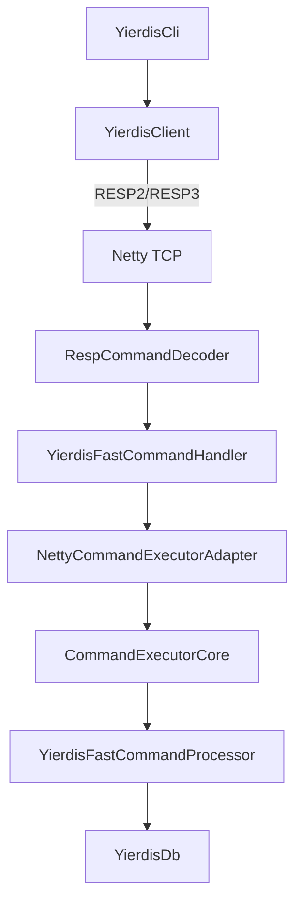

<!-- migrated_from: history/2026-01/202601161845_arch_refactor_5issues/how.md -->
<!-- migrated_at: 2026-02-24 23:14:10 -->

# Technical Design: 架构问题 5 项治理（arch_refactor_5issues）

## Technical Solution

### Core Technologies
- Java 17（Maven multi-module）
- Netty 4.1.x（server/client）
- picocli（server 参数解析）
- slf4j + logback（日志）
- JUnit 4（单测）

### Implementation Key Points

1. **模块边界与依赖方向修正（R1）**
   - 新增一个中立的 bytes 抽象模块（建议：`yierdis-bytes`），承载：
     - `BytesSink` / `BytesSource`（以及 direct 变体）
   - 迁移策略（推荐渐进式）：
     - Phase 1：新增 `yierdis-bytes`，并在 `yierdis-offheap/api` 保留现有接口作为桥接/兼容层（或反向桥接）
     - Phase 2：`yierdis-protocol` 改为依赖 `yierdis-bytes`，不再依赖 `yierdis-offheap-api`
     - Phase 3：逐步让 off-heap/netty 适配层实现新的 bytes 接口，最终移除旧接口（可延后）

2. **执行器职责拆分（R1）**
   - 将 `NettyCommandExecutor` 里的“核心调度/背压”与“Netty 写回”逻辑分层：
     - `CommandExecutorCore`（纯 Java，无 Netty）：队列、调度策略（GLOBAL/FAIR）、pending/bytes 统计、drain budget
     - `NettyCommandExecutorAdapter`（Netty 相关）：将 `(ctx, RespCommand)` 转为 core 可执行任务；负责 `ByteBuf` 分配、写回与 flush 合并
   - 目标：核心逻辑可在不启动 Netty 的条件下被单元测试覆盖。

3. **生命周期与资源安全（R2）**
   - 让 `RespCommand` 具备更安全的关闭语义：
     - 方案 A（推荐）：`RespCommand implements AutoCloseable`，`close()` 等价 `recycle()`，并提供工具方法 `safeClose/safeRecycle`
     - 在 server 的关键路径（handler/executor/decoder）用统一模板包裹，减少遗漏。
   - 强化 server 启动失败路径清理：
     - allocator/db/executor/线程组的创建与注册应在同一 `try/finally` 结构里，保证任何提前返回都能 close。

4. **背压与拒绝策略统一（R3）**
   - 明确语义：
     - **Backpressure**：关闭 `autoRead`，暂停读取后续命令；对“已读到的命令”仍尽量入队执行（前提：全局预算允许）
     - **Reject (busy)**：仅在“全局队列/bytes 预算耗尽”或“服务正在关闭”时触发
   - 引入全局 backpressure（可恢复）：
     - 当全局 `queuedTasks/queuedBytes` 超过高水位，记录被动进入 backpressure 的 channel 列表
     - 在 drainLoop 末尾，当全局降到低水位，批量尝试恢复这些 channel 的 `autoRead`
   - 配置策略：
     - 优先使用已有 `queueCapacity/queueMaxBytes` 推导默认 high/low（例如：high=cap，low=cap*0.8）
     - 如需要更明确的可控性，再在 `yierdis-args` 中补充显式参数（并更新 README）。

5. **RESP3 能力对齐（R4）**
   - 扩展协议对象模型（client 侧使用）：
     - 新增 `RespMap`（或等价结构），并在 `RespType` 中加入 `MAP`
     - `RespDecoder`（client 侧）支持解析 `%`（map）与 `_`（null）
   - CLI 输出增强：
     - `YierdisCli.printResp` / `printInline` 支持打印 map（key/value）与 RESP3 null
   - 兼容性原则：
     - 默认仍以 RESP2 模式工作
     - 仅在 server 端 `HELLO 3` 切换后才会遇到 RESP3 类型

6. **可维护性/可观测性（R5）**
   - 抽取 server bootstrap：
     - `YierdisServer` 只保留参数解析 + 调用 `ServerBootstrapper.start(config)` + 等待关闭
     - 资源创建/关闭顺序集中在 bootstrapper，降低 main 复杂度，便于测试复用
   - 增强日志：
     - `YierdisFastCommandHandler.exceptionCaught` 记录 root cause（区分 Protocol error / internal error），对外仍使用净化后的错误消息
   - inline args 解析一致性：
     - 提取共享解析器（或共享测试向量），保证 CLI 与 server inline command 行为一致

## Architecture Design

（目标形态示意）

## Architecture Decision ADR

### ADR-001: 引入中立 bytes 抽象模块（yierdis-bytes）
**Context:** `yierdis-protocol` 目前直接依赖 `yierdis-offheap-api` 的包路径，边界不清晰且容易误导依赖方向。  
**Decision:** 新增 `yierdis-bytes` 承载 bytes 抽象；`protocol` 依赖 `bytes`；off-heap 层通过适配实现/桥接。  
**Rationale:** 解耦依赖、提升模块可读性，降低后续演进成本。  
**Alternatives:** 保持现状并仅靠文档解释 → 拒绝原因：长期维护风险仍在。  
**Impact:** Maven 模块调整；需要分阶段迁移与兼容。  

### ADR-002: 执行器拆分为 core + netty adapter
**Context:** `NettyCommandExecutor` 当前同时承担调度/背压/写回，导致难测试与耦合加深。  
**Decision:** 将纯调度逻辑抽到 core，Netty 相关封装在 adapter。  
**Rationale:** 提升可测试性、降低耦合、便于未来支持不同 I/O 栈。  
**Alternatives:** 仅重构现有类但不拆分 → 拒绝原因：耦合问题无法根治。  
**Impact:** 类结构调整、测试需要补齐。  

### ADR-003: 统一背压语义，busy 仅用于全局过载/关闭
**Context:** 当前实现将部分背压条件直接转为 busy，可能造成过载放大与语义不一致。  
**Decision:** 背压只暂停读取；拒绝仅用于全局预算/关闭；并引入可恢复的全局 backpressure。  
**Rationale:** 更符合“背压”的本意，减少 busy 风暴。  
**Impact:** 行为变化需用测试固定，避免回归。  

### ADR-004: client/CLI 支持 RESP3 最小子集以覆盖 HELLO 3
**Context:** Server 已支持 RESP3 的 HELLO handshake，但内置 client/CLI 无法解码 map/null。  
**Decision:** 扩展协议对象模型与 decoder，支持 `%`/`_`，并更新 CLI 打印与测试。  
**Rationale:** 将 RESP3 分支纳入工程化回归，避免功能漂移。  
**Impact:** protocol 类型扩展、兼容性与测试增加。  

## Security and Performance
- **Security**
  - 保持错误消息净化（防止 CRLF 注入 / response splitting）
  - 保持输入上限（bulk/args/line）与 backpressure 双重约束
- **Performance**
  - 保持 server fast-path（`RespCommandDecoder` + `RespWriter`）的低分配特性
  - 对全局 backpressure 的恢复机制做批量/限速处理，避免恢复时抖动

## Testing and Deployment
- **Testing**
  - 单测覆盖：core 调度、背压恢复、busy 策略、生命周期回收
  - 集成覆盖：启动 server，client 执行 `HELLO 3` 并验证 map/null
- **Deployment**
  - Maven `mvn test` 通过
  - 运行 README 中的启动/redis-cli smoke commands 作为人工验收
