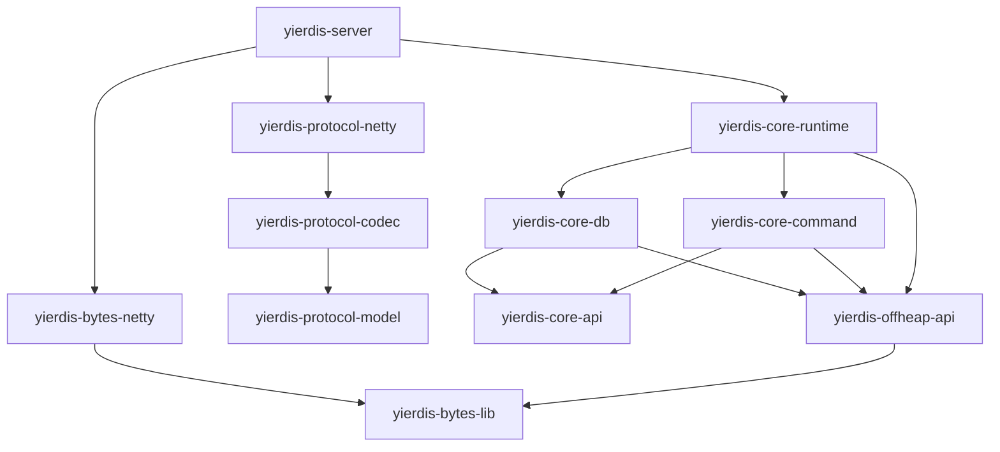

# 变更提案: package-structure-review

## 元信息
```yaml
类型: 优化（架构评审）
方案类型: overview
优先级: P1
状态: ✅完成
创建: 2026-02-25
```

---

## 1. 需求

### 背景
本项目是一个教学/演示导向的内存 KV 服务端（Redis 风格命令子集），采用 Maven 多模块结构，并强调 **core/protocol 等 SSOT 模块尽量 Netty-free**，将 Netty 依赖集中在 `*-netty` 适配层和 `yierdis-server/yierdis-client` 应用层。

用户希望评审：**当前模块拆分与 Java package 组织是否合理**，以及如果要继续演进，应该优先做哪些结构性治理（护栏/命名/边界）。

### 目标
- 给出结论：当前“模块结构 + 包结构”的合理性判断（优点/风险）。
- 形成一份可执行的演进建议（按优先级 P0/P1/P2），避免未来出现循环依赖与边界漂移。
- 明确两条路径：
  - **保守路径（推荐）**：不大改模块名/包名，先强化护栏 + 渐进式治理。
  - **激进路径（备选）**：允许调整模块边界/包名前缀，面向长期可维护性做强分层重构。

### 约束条件
```yaml
时间约束: 本次为评审与建议输出，不做代码重构落地
性能约束: 不能为了“洁癖式结构”牺牲教学可读性与现有 fast-path（如 off-heap 路径）的可解释性
兼容性约束: 如未来迁移包名/模块边界，必须通过构建护栏与测试矩阵逐步推进，避免一次性大搬家
业务约束: 对外仅承诺 Custom Protocol v1；core/protocol/offheap-api 等模块的 Netty-free 约束需要持续保持
```

### 验收标准
- [ ] 给出当前 Maven 多模块结构与依赖方向的摘要（含关键护栏）。
- [ ] 识别出最关键的结构性风险点（命名/边界/依赖漂移）。
- [ ] 输出一份按优先级划分的改进建议（P0/P1/P2），包含最小迁移策略。
- [ ] 生成并归档本 overview 方案包，作为后续结构治理的参考入口。

---

## 2. 方案

### 技术方案
本次评审以“事实 → 风险 → 建议”的方式输出，事实以代码与构建配置为准：

**现状事实（摘要）**
- 根聚合：`yierdis-parent`（Java 17），modules: `yierdis-offheap / yierdis-bytes / yierdis-protocol / yierdis-core / yierdis-executor-core / yierdis-args / yierdis-client / yierdis-server / yierdis-bench`。
- `yierdis-core`: `core-api / core-db / core-command / core-runtime`（其中 `core-command` 显式 ban `core-db`，避免耦合/循环）。
- `yierdis-protocol`: `protocol-model / protocol-codec / protocol-netty`（Netty 依赖集中在 `protocol-netty`）。
- `yierdis-bytes`: `bytes-lib / bytes-netty`（Netty 依赖集中在 `bytes-netty`）。
- `yierdis-offheap`: `offheap-api / offheap-netty / offheap-unsafe` + `offheap-foreign(profile)`（`offheap-api` Netty-free；`offheap-unsafe` 通过 `NettyPlatformDependentMemoryAccess` 使用 Netty internal 的 `PlatformDependent`）。
- 已有护栏（方向正确）：
  - `yierdis-core-command/pom.xml`：`maven-enforcer-plugin` ban `yierdis-core-db`。
  - `ArchitectureBoundaryTest`：禁止 `db/ops` import `yier.bubu.redis.protocol.*`。
  - `CoreApiBoundaryGuardTest`/`CoreCommandBoundaryGuardTest`：用于兜底“禁止 import io.netty.* / 禁止越界依赖”。

**结论（倾向）**
- 当前模块与包的组织 **整体比较合理**：分层清晰、依赖方向干净、护栏已落地。
- 但存在几个“长期会恶化”的点：顶层包可扩散、offheap 命名暗示可能引发边界歧义、adapter 层网状依赖风险、以及 Netty-free 约束需要更硬的构建规则兜底。

**推荐方案：保守治理（P0 护栏 → P1 渐进式包瘦身）**
- 在不大改模块边界的前提下，优先把“约定”升级为“构建失败”，并把最可能扩散的顶层包收口。
- 激进重构作为长期备选，避免在当前阶段引入大面积包名迁移的成本与回归风险。

### 影响范围
```yaml
涉及模块:
  - yierdis-parent: 依赖护栏/enforcer 规则归口（如推进）
  - yierdis-core/*: Netty-free 约束、分层依赖 DAG 的持续加固
  - yierdis-protocol/*: model/codec/netty 边界与 adapter 纪律
  - yierdis-bytes/*: adapter 纪律
  - yierdis-offheap/*: offheap-unsafe 的 Netty internal 依赖策略与命名边界讨论
  - yierdis-server: 顶层包收口（如推进）
预计变更文件: 0（本次为评审概述文档，不做代码修改）
```

### 风险评估
| 风险 | 等级 | 应对 |
|------|------|------|
| enforcer/架构测试规则过严导致短期构建失败 | 中 | 先以“扫描+报告”模式落地，再逐步切换为阻断；按模块分批收敛 |
| server 顶层包迁移带来大量 import 改动与潜在反射/入口类名风险 | 中 | 采用“并存 + 薄代理入口”的迁移策略，并用集成测试兜底 |
| offheap-unsafe 依赖 Netty internal（PlatformDependent）在未来升级 Netty/Java 时不稳定 | 中 | 明确依赖策略（允许/禁止）；如要去 Netty，单独立项并阶段化推进 |
| adapter 模块互相借工具类形成网状依赖 | 中 | 在 parent 中固化允许依赖矩阵，并为 adapter 添加“只做 glue code”的架构测试 |

---

## 3. 技术设计（可选）

> 涉及架构变更、API设计、数据模型变更时填写

### 架构设计


### API设计
> 本次为结构评审，不新增对外 API。

### 数据模型
> 本次为结构评审，不新增数据模型。

---

## 4. 核心场景

> 执行完成后同步到对应模块文档

### 场景: 新增代码时如何放置（结构守门）
**模块**: 全局
**条件**: 新增一个类/功能点/适配器
**行为**:
- 若出现 `io.netty.*` 依赖：只能放在 `*-netty` 或 `yierdis-server/yierdis-client`，禁止进入 core/protocol-model/codec/offheap-api/bytes-lib。
- 若是命令语义与路由：优先放在 `yierdis-core-command`（保持 SSOT），禁止直接在 server 层“内联语义”。
- 若是存储实现细节：放在 `yierdis-core-db` 或 offheap 实现模块（视边界策略），但禁止向上依赖 command/protocol。
**结果**: 模块边界保持单向，构建护栏能在 PR 阶段阻止越界依赖。

---

## 5. 技术决策

> 本方案涉及的技术决策，归档后成为决策的唯一完整记录

### package-structure-review#D001: 选择“保守治理”作为近期路线
**日期**: 2026-02-25
**状态**: ✅采纳
**背景**: 当前结构总体合理且已有护栏，但仍存在长期易恶化点（顶层包扩散、adapter 网状依赖、Netty-free 漂移、offheap 命名语义歧义）。需要选择一条演进路线来降低未来复杂度。
**选项分析**:
| 选项 | 优点 | 缺点 |
|------|------|------|
| A: 保守治理（推荐） | 低风险、可渐进推进；与“教学/演示”定位匹配；优先把约束固化为护栏 | 不能一次性消除所有历史命名与边界歧义，收益分阶段体现 |
| B: 激进重构（备选） | 长期边界最清晰；可把模块/包结构设计成“写不出循环依赖”的形态 | 成本与风险高（大量包名迁移/装配方式变化/潜在回归），不适合在当前迭代立即推进 |
**决策**: 选择方案 A（保守治理）
**理由**:
- 现有 Maven 模块拆分已能表达分层意图，且护栏已存在，继续强化即可获得主要收益。
- 用户需求为“评审合理性”，不要求立即重构；保守方案能快速提升长期可维护性。
- 激进方案适合作为后续里程碑（当需要对外发布/长期维护成本显著上升时再启动）。
**影响**:
- 近期：以构建护栏与包治理为主（可能影响 parent POM 与少量包名收敛）。
- 中长期：如推进命名与边界收敛，会触及 `yierdis-server`（顶层包瘦身）、`yierdis-offheap-*`（依赖策略）与 adapter 模块纪律。
