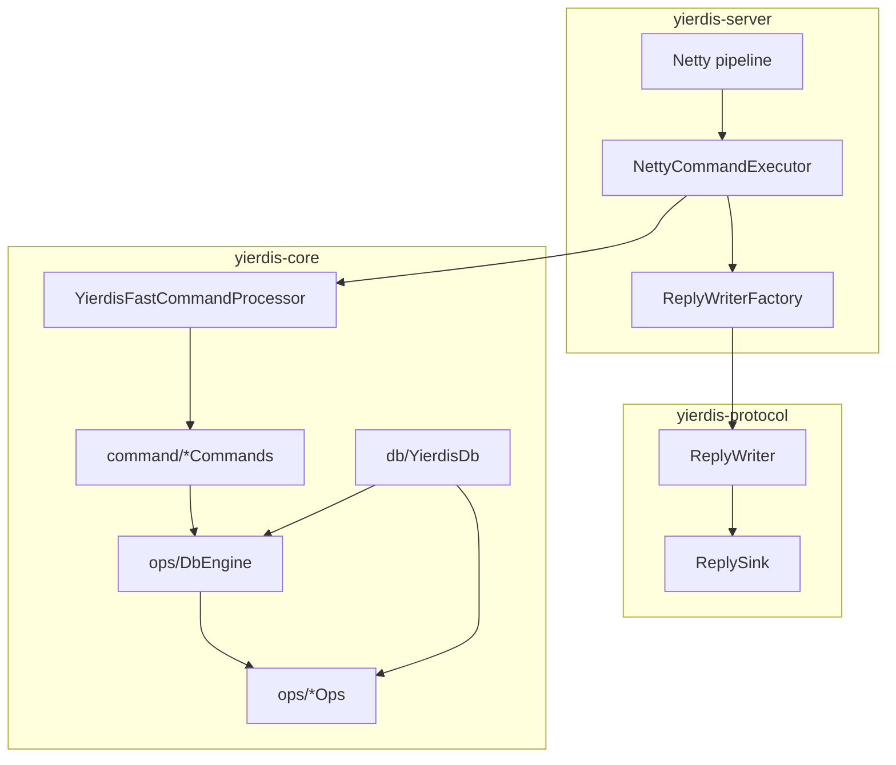

# Technical Design: Command/DB 边界收口与执行器协议解耦（DbEngine + ReplyWriterFactory）

## Technical Solution

### Core Technologies
- Java 17（Maven 多模块）
- Netty（server I/O 与 executor 调度）
- 自定义协议：Custom Protocol v1（NDJSON），协议抽象：`yierdis-protocol` 的 `Command/ReplyWriter/ReplySink/Session`

### Implementation Key Points

1. **DbEngine 作为 command-facing 的唯一“引擎视图”：**
   - 通过 `ops` 层的一组小接口（`KeyspaceOps/TtlOps/MemoryOps/DbLifecycleOps/ValueOps/...`）组合出 DB 能力；
   - `YierdisDb` 继续作为核心实现，但只以 `DbEngine` 形态暴露给命令层。
2. **去除命令层对 `YierdisDb` 的硬绑定：**
   - `YierdisDbRouter` 改为返回 `DbEngine`（或等价 router 接口）；
   - `CommandSupport`/`*Commands`/`YierdisFastCommandProcessor` 仅引用 `ops` 类型与异常。
3. **收敛写入选项与异常：**
   - 把 `SetMode/ExpireOption` 从 `YierdisDb` 内部类型迁移到 `ops`；
   - 把 `WrongTypeException/CommandException` 作为 `ops` 层异常，供 command 统一捕获并映射到 `ReplyWriter.error(...)`。
4. **治理 streaming API：从“Reply*”迁移到“数据语义”：**
   - 命名从 `*ReplyCount/*ReplyInto` 调整为 `*count/*writeTo` 或 “cursor + forEach”；
   - value 层最多依赖 `ReplySink`（仅 bulk-string），不承担 reply shape。
5. **执行器协议解耦：引入 `ReplyWriterFactory`：**
   - 让 server 层在装配 executor 时注入 writer 工厂；
   - executor 与 handler 统一通过工厂拿到 `ReplyWriter`，不再直接依赖 `JsonLineReplyWriter`。

## Architecture Design

## Architecture Decision ADR

### ADR-20260208-02: 命令层仅依赖 ops 的 DbEngine（禁止直接引用 YierdisDb）

**Context:**  
`YierdisDb` 作为具体实现类在命令层被直接依赖，使得存储引擎的内部演进（拆分、持久化、复制、多后端）会“反向”侵入命令语义层；同时 `ops` 层签名泄漏 `YierdisDb` 的嵌套类型，导致抽象边界无法起到隔离作用。

**Decision:**  
- 将 `DbEngine` 提升为 command-facing 的唯一入口，并补齐缺失的子能力边界（keyspace/ttl/memory/lifecycle）；
- 将写入选项与异常类型迁移到 `ops`，确保命令层不再 import `YierdisDb`；
- 通过 router/support 的返回类型调整，在编译期强制依赖方向：`command → ops → (db impl)`。

**Rationale:**  
- 编译期约束比“约定”更可靠，可持续控制耦合；
- 可为后续物理拆分 `YierdisDb`（方案二）提供稳定外壳；
- 有利于 future：多 DB、embedded instance、不同存储后端（heap/off-heap/持久化）共存。

**Alternatives:**  
- 继续让 `command` 直接依赖 `YierdisDb` → 拒绝原因：耦合无法收敛，巨型类演进风险持续累积。  
- 引入 `Facade` 但保留 `YierdisDb` 依赖 → 拒绝原因：只能弱化调用点，无法形成编译期护栏。

**Impact:**  
- 内部 API 会发生较大联动改动（但属于可控范围内的内部重构）；
- 需要补齐回归锚点以防语义漂移；
- executor 的协议解耦可与该 ADR 并行推进（降低跨层渗透）。

## API Design

> 说明：以下为建议形态，具体以实现时的最小可行接口为准（避免 `DbEngine` 再次膨胀）。

### `DbEngine`（ops 编排入口）
- `values()`：保持现有类型 ops 入口（String/Hash/List/Set/ZSet/HLL）
- `keyspace()`：TYPE/DEL/EXISTS/KEYS/SCAN 等 keyspace 能力
- `ttl()`：EXPIRE/PEXPIRE/EXPIREAT/PERSIST/TTL/PTTL 能力
- `memory()`：MEMORY USAGE/STATS、OBJECT ENCODING 能力
- `lifecycle()`：FLUSHDB、size 等生命周期/管理能力（仅命令需要的最小集合）
- `eviction()/expiration()`：保持现有治理入口（maxmemory/cleanup）

### Reply streaming（建议方向）
- 将 `*ReplyCount/*ReplyInto` 迁移为数据语义命名：
  - `*count(...)`：仅返回元素数（命令层用于 header）
  - `*writeTo(..., ReplySink out)`：写出 bulk 值（value 层只依赖 `ReplySink`）
- 可选增强（如后续需要）：为 `ReplyWriter` 增加“未知长度容器”能力（begin/end），以彻底消除 count 需求（需评估协议与兼容性）

### server：`ReplyWriterFactory`
- `ReplyWriter newWriter(BytesSink out, Session session)`（或等价签名）
- 默认实现：Custom Protocol v1（`JsonLineReplyWriter`）

## Security and Performance

- **Security:**
  - 不引入任何明文 token/密钥；
  - 明确 `ReplySink`/cursor 的生命周期约束：同步写出、不得缓存引用，避免 off-heap slice 越界或泄漏。
- **Performance:**
  - 允许引入更清晰的抽象，但需保证热点路径可做到零额外分配（至少提供无额外对象创建的实现路径）；
  - 聚合读 streaming 的接口变更需避免隐式 `List<byte[]>` 聚合；
  - executor 的 writer factory 必须避免每条命令引入额外 adapter 分配（推荐直接构造 writer + 复用 BytesSink）。

## Testing and Deployment

- **Testing:**
  - `mvn test` 全量回归；
  - 增加/复用针对 `SET` 组合选项、聚合读 streaming、busy/backpressure 的测试锚点；
  - 使用 `rg` 做分层约束回归：command 包不再出现 `import yier.bubu.redis.db.YierdisDb;`。
- **Deployment:**
  - 纯内部重构，不改变对外协议与启动参数；可按阶段合并，确保每一步可编译、可回归。
