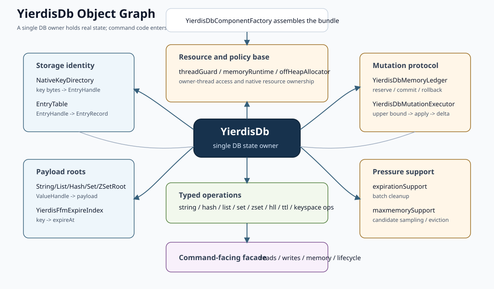

# DB Internals

本文专门解释 Yierdis 的单 DB 内核：`YierdisDb` 拥有哪些状态，命令如何穿过
`DbReads` / `DbWrites` 落到类型化 ops，写路径为什么必须经过 memory ledger，
以及 TTL、maxmemory、native entry 和 type root 如何协作。

如果你还没有建立主链路印象，建议先读：

- [`request-execution-flow.md`](./request-execution-flow.md)
- [`main-path-walkthrough.md`](./main-path-walkthrough.md)
- [`commands-and-data-model.md`](./commands-and-data-model.md)

这篇文档的目标不是重复命令列表，而是回答一个更底层的问题：

- 一个 key 在 DB 内核里到底由哪些结构共同表示？
- 一次读操作和写操作分别经过哪些内部协作者？
- 为什么 TTL、LRU、memory accounting 和 value release 不能散落在命令代码里？

## 先记住一句话

`YierdisDb` 不是一个“大 Map 包装类”，而是一个单 DB 状态 owner。

它真正持有的是一张对象图：



```text
YierdisDb
  -> EntryTable
  -> NativeKeyDirectory
  -> StringRoot / ListRoot / HashRoot / SetRoot / ZSetRoot
  -> YierdisFfmExpireIndex
  -> YierdisDbKeyLifecycle
  -> YierdisDbMutationExecutor
  -> YierdisDbMemoryLedger
  -> YierdisDbExpirationSupport
  -> YierdisDbMaxmemorySupport
  -> Yierdis*Ops
  -> DbReads / DbWrites / ExpirationManager / MemoryOps / DbLifecycleOps
```

如果只把它理解成 `key -> value`，会漏掉真正的内核逻辑：

- key bytes、entry metadata 和 payload 不在同一个结构里
- 读路径会做惰性过期和 LRU touch
- 写路径先 reserve memory，再执行 mutation，再按实际 delta commit
- 删除 key 必须同时释放 entry、key bytes、expire metadata 和 type root payload
- maxmemory 可以是单 DB 本地预算，也可以由 instance 级 governor 跨 DB 协调
- 所有 DB 访问必须在 owner thread 上执行

## 从 Instance 到单 DB

生产启动和 embedded 启动时，命令层不会直接创建 DB。DB 由 runtime 层装配：

```text
YierdisInstance
  -> RuntimeDbEngine[]
     -> YierdisDb
        -> DbEngine facades
```

这三层边界要分清：

- `YierdisInstance`
  负责多 DB 数量、FFM runtime 归属、global/per-db maxmemory 和 runtime 生命周期。
- `RuntimeDbEngine`
  是 runtime 看到的 DB contract，除了 `DbEngine` 能力外，还包含 thread binding、
  shutdown、maintenance 和 maxmemory participant hook。
- `DbEngine`
  是 command 层看到的能力视图，只暴露 `reads()`、`writes()`、`expiration()`、
  `memory()` 和 `lifecycle()`。

所以命令实现通常走的是：

```text
CommandSupport
  -> DbEngine / DbReads / DbWrites
  -> YierdisDbReads / YierdisDbWrites
  -> YierdisStringOps / YierdisKeyspaceOps / ...
```

命令层不应该 import 或调用 `YierdisDb` 具体实现类。

## 构造阶段做了什么

`YierdisDb` 构造函数本身不再手写所有协作者创建逻辑。对象图主要由这几个类收敛：

- `YierdisDbConfig`
  校验并保存 `maxmemoryBytes`、`MaxmemoryPolicy`、samples、eviction 时间预算、
  expire cleanup 时间预算，并决定 LRU clock 是否启用。
- `YierdisDbStorageComponents`
  解析或创建 `YierdisFfmMemoryRuntime`、`OffHeapAllocator`、production stable allocator
  backed entry table、key directory、expire index 和各 type root。
- `YierdisDbComponentFactory`
  创建 ledger、mutation executor、expiration support、maxmemory support、key lifecycle、
  所有类型化 ops，以及 command-facing facade。
- `YierdisDbComponents`
  只是 factory 返回给 `YierdisDb` 的包内对象图 bundle。
- `YierdisDbRuntimeInternals`
  给 `Yierdis*Ops` 提供最小内部入口：`checkThread()`、`executeMutation(...)`、
  `keyLifecycle()` 和 `ledger()`。

这样做的结果是：

- `YierdisDb` 继续作为状态 owner
- `Yierdis*Ops` 不需要拿完整 DB 实现类
- command 层只依赖 `yierdis-db-api` 的稳定能力接口
- runtime 层通过 `RuntimeDbEngine` 和 maxmemory SPI 做装配与协调

## 存储图

当前单 DB 的 key/value 图拆成四层：

```text
NativeKeyDirectory
  key bytes -> EntryHandle(raw NativeHandle)

EntryTable
  EntryHandle -> native ENTRY_RECORD

EntryRecord
  ValueType + ValueEncoding + ValueHandle(raw NativeHandle) + expireAtMillis + estimated bytes + LRU clock

TypeRoot
  ValueHandle -> payload
```

这里的 handle 都是 64-bit identity，不是 native 物理地址。`EntryHandle` 包装
`ENTRY_RECORD` 类型的 object-table-backed `NativeHandle`，`EntryTable` 通过 allocator resolve handle 后才读写
entry metadata。`ValueHandle` 也包装 `NativeHandle` raw value，用 string/list/hash/set/zset
对应的 kind 给 type root payload 一个稳定引用形状；但当前多数 `ValueHandle.slotId()` 是 type root 局部 identity，不等同于 object table slot。

### `NativeKeyDirectory`

`NativeKeyDirectory` 是 key 目录。它保存 key bytes，并把 key 映射到
`EntryHandle`。它不理解 value 类型，不负责释放 payload，也不直接维护 TTL 语义。

它提供给上层的能力包括：

- key lookup
- key insertion/removal
- random key sampling
- cursor scan
- native table stats

### `EntryTable` 和 `EntryRecord`

`EntryTable` 使用 `YierdisStableNativeAllocator` 保存 native `ENTRY_RECORD`
metadata。每条 record 逻辑大小是 56 bytes，`EntryHandle` 保存的是 allocator stable
handle，DB 层不会保存 entry 的 physical page id、offset 或 raw address。

`EntryRecord` 是每个 key 的 metadata，包含：

- `ValueType`
- `ValueEncoding`
- `ValueHandle`
- key hash / key handle identity
- `expireAtMillis`
- 估算字节数
- LRU/LFU 槽位

注意：`EntryRecord` 不保存 Java collection 本体。它只保存 metadata 和指向 type root
payload 的 handle。

entry record 的读写流程是：

```text
EntryTable.get/replace
  -> allocator.resolve(entryHandle.nativeHandle(), READ_ONLY/READ_WRITE)
  -> NativeObjectView 按固定 offset 读写 56 bytes metadata
  -> view.close() 释放 pin
```

因此 active defrag 移动 entry record 时，只需要更新 allocator object table 中的 physical
block。`NativeKeyDirectory` 和 DB graph 里保存的 `EntryHandle` 不需要重写。

### Type Root

不同逻辑类型的真实 payload 由不同 root 管：

- `StringRoot`
- `ListRoot`
- `HashRoot`
- `SetRoot`
- `ZSetRoot`

root 的职责是：

- 创建、读取、修改 payload
- 返回当前 encoding 和 estimated bytes
- 通过 `ValueHandle` 释放 payload
- 在 DB clear / shutdown 时释放内部 native 资源

集合类型内部仍会使用 `ListValue`、`HashValue`、`SetValue`、`ZSetValue` 等结构，
但这些是 root 内部的 payload 实现，不再是 keyspace 的顶层 value 容器。

当前 type roots 的实现边界是：

- `StringRoot` 用 `OffHeapAllocator` 管理连续 bytes buffer，`ValueHandle` 使用 `STRING_BYTES` kind。
- `ListRoot` / `HashRoot` / `SetRoot` / `ZSetRoot` 用对应 `LIST_NODE` / `HASH_NODE` /
  `SET_NODE` / `ZSET_NODE` kind 构造 `ValueHandle`，内部 payload adapter 仍管理自己的 heap
  控制结构和 FFM-backed bytes。
- `ValueHandle` 提供统一 raw identity，但不表示所有集合控制结构都已经完全 native 化，也不表示每个 value handle 都能通过 stable allocator resolve。

stable allocator、object table、pin/quarantine、`realloc` 和 defrag 的完整语义见
[`native-allocator-and-handles.md`](./native-allocator-and-handles.md)。

### Expire Index

TTL 由两份信息协作：

- `EntryRecord.expireAtMillis`
- `YierdisFfmExpireIndex` 中的 key handle -> expireAtMillis 索引

`EntryRecord` 让单 key 读取时能快速知道 TTL metadata；expire index 让 cleanup 能从
“有 TTL 的 key 集合”里采样，而不是扫描所有 key。

## Key Lifecycle 是中心协调者

`YierdisDbKeyLifecycle` 是 DB 内核里最关键的协作者。它连接了：

- key bytes / `BytesView`
- `NativeKeyDirectory`
- `EntryTable`
- `EntryRecord`
- expire index
- type roots
- LRU clock
- ledger delta callback

它的核心方法可以分成几组。

### 读取 live entry

- `keyHandle(...)`
- `entryRecord(...)`
- `liveEntryRecord(...)`
- `removeIfExpired(...)`
- `touchRecord(...)`

`liveEntryRecord(...)` 不是普通 get。它会先确认 key 仍然存在，再做惰性过期删除，
最后返回仍然有效的 `EntryRecord`。调用方如果需要记录访问，还会调用
`touchRecord(...)` 更新 LRU clock。

这就是为什么 TTL 不只存在于后台 cleanup：普通读路径也会触发 lazy expiration。

### 受控修改 entry

- `computeWithHandle(...)`
- `computeIfPresentWithHandle(...)`
- `newRecord(...)`
- `removeEntry(...)`

写路径不会让每个 ops 自己拼 key directory 和 entry table。ops 会通过
`computeWithHandle(...)` 取得 key handle 和旧 record，构造新 record 后交回 lifecycle。

lifecycle 会负责：

- 新 key 时分配 stable `EntryHandle`
- 已存在 key 时替换 `EntryRecord`
- 删除 key 时移除 directory 和 entry table
- 替换 value handle 时释放旧 payload

### TTL metadata

- `expireAtMillis(...)`
- `setExpireAtMillis(...)`
- `removeExpire(...)`
- `removeExpireByKeyBytes(...)`

设置或移除 TTL 时，lifecycle 同时更新 expire index 和 `EntryRecord.expireAtMillis`。
这保证 `TTL`、lazy expiration、cleanup 和 snapshot 看到的是同一套状态。

## 读路径

读路径的主线是：

```text
command handler
  -> CommandSupport.dbReads(ctx)
  -> DbReads.<family>()
  -> Yierdis*Ops read method
  -> keyLifecycle.liveEntryRecord(...)
  -> require type
  -> EntryRecord.valueHandle()
  -> TypeRoot read
```

以 `GET` 为例：

```text
StringCommands
  -> DbReads.strings()
  -> YierdisStringOps.getStringValue(...)
  -> liveTouchedStringRecord(...)
  -> keyLifecycle.liveEntryRecord(...)
  -> keyLifecycle.touchRecord(...)
  -> StringRoot.slice(...) / StringRoot.copy(...)
```

读路径通常会做三件隐含工作：

- 访问前检查 owner thread
- 如果 key 已过期，惰性删除并返回“key 不存在”
- 如果 key 仍然有效，按策略更新 LRU clock

不同命令的后半段才开始分化：

- `GET` 读 `StringRoot`
- `TYPE` 读 `EntryRecord.type()`
- `OBJECT ENCODING` 读 `EntryRecord.encoding()`
- `MEMORY USAGE` 结合 entry metadata 和 root estimated bytes
- `SCAN` 通过 key lifecycle cursor 遍历 key directory

## 写路径

写路径的核心约束是：不能先改数据结构，再补做内存检查。

标准写路径是：

```text
command handler
  -> CommandSupport.dbWrites(ctx)
  -> DbWrites.<family>()
  -> Yierdis*Ops write method
  -> estimate upper bound
  -> internals.executeMutation(plan)
     -> mutationExecutor.execute(plan)
        -> ledger.reserve(upperBound)
        -> plan.apply()
           -> keyLifecycle.computeWithHandle(...)
           -> TypeRoot mutation
           -> EntryRecord replacement / delete
           -> TTL metadata update
        -> ledger.commit(actualDelta)
```

`YierdisDbMutationExecutor` 把所有 mutation 压成同一个内部协议：

```text
MutationPlan.upperBoundBytes()
MutationPlan.apply() -> MutationResult<T>
MutationResult.actualDeltaBytes()
```

它负责：

- 检查 owner thread
- 调用 `ledger.reserve(...)`
- 执行真正 mutation
- 成功时用实际 delta `commit`
- ledger OOM、off-heap OOM 或 runtime exception 时 rollback reservation
- 把 maxmemory OOM 映射成 Redis 风格错误

这不是用户可见的事务，但它是 DB 内部的受控写协议。

### 为什么需要 upper bound

maxmemory 判断必须发生在 mutation 前。否则写入已经把 native/heap 状态改掉了，再报
OOM 就会留下难以回滚的半完成状态。

所以每个写操作都要先估算“最多可能增长多少”：

- 新 key 的 entry metadata
- key bytes
- value payload
- 可能新增的 TTL entry
- 编码升级可能引入的额外结构

mutation 完成后，再用实际 delta 修正 ledger。

### `reservedBytes` 的意义

`YierdisDbMemoryLedger` 维护两个核心量：

- `usedBytes`
- `reservedBytes`

`reservedBytes` 保护的是“预算已经通过，但 mutation 还没完成”的窗口。成功后 reservation
被释放，实际 delta 进入 `usedBytes`；失败时只撤销 reservation，不把这次写入计为成功。

## TTL 和过期清理

TTL 相关代码分成两层：

- `YierdisTtlOps`
  实现 `EXPIRE`、`PEXPIRE`、`EXPIREAT`、`PEXPIREAT`、`PERSIST`、`TTL`、`PTTL`。
- `YierdisDbExpirationSupport`
  实现批量 cleanup 策略。

`YierdisTtlOps` 仍然通过 mutation executor 修改状态。首次给 key 增加 TTL 时，会把
expire index entry 的估算成本计入 upper bound。过期时间小于等于当前时间时，TTL ops
直接删除 key，并返回 value changed。

`YierdisDbExpirationSupport.cleanupExpired(...)` 做的是批量策略：

- 从 expire index 随机采样 key
- 找不到 entry 或 TTL metadata 不一致时清理索引
- 过期则通过 key lifecycle 删除 record 和 payload
- 过期比例低、循环次数达到上限或时间预算耗尽时停止

也就是说：

- 单 key TTL 状态由 key lifecycle 保持一致
- 命令语义由 `YierdisTtlOps` 实现
- 批量清理节奏由 `YierdisDbExpirationSupport` 控制

## Maxmemory 和 Memory Ledger

maxmemory 的入口在 `YierdisDbMemoryLedger.reserve(...)`。

本地 DB scope 下，reserve 的顺序是：

1. 如果配置了 maxmemory，先 cleanup expired
2. 如果本次 upper bound 大于总 limit，直接 OOM
3. 计算写入前必须压到的 limit：`maxmemoryBytes - estimatedExtraBytes`
4. 如果当前 usage 超过 limit：
   - `noeviction`：增长型写入直接 OOM
   - `allkeys-random` / `allkeys-lru`：调用 `YierdisDbMaxmemorySupport.evictUntilUnder(...)`
5. 如果仍然超限，增长型写入 OOM
6. 预算通过后创建 reservation

`YierdisDbMaxmemorySupport` 负责单 DB 内的淘汰策略：

- `allkeys-random` 随机取 victim
- `allkeys-lru` 按 samples 选 LRU clock 最小的 key
- samples 覆盖所有 key 时，可以扫描最佳候选，减少测试不稳定性
- 删除 victim 前会先处理已经过期的 key
- 删除成功后通过 ledger delta callback 扣减 used bytes

global maxmemory scope 下，`YierdisDbMemoryLedger` 不自己决定全局预算，而是委托
instance 级 `YierdisGlobalMaxmemoryGovernor.prepareWrite(...)`。governor 会：

- 对所有 participant 做 expired cleanup
- 汇总所有 DB 的 maxmemory usage
- 加上共享 off-heap usage source
- 按全局 policy 从各 DB 采样或扫描 victim
- 通过 participant 的 `evict(...)` hook 删除候选

因此要记住：

- 单 DB 内看到的是 ledger + maxmemory support
- 多 DB 全局协调发生在 `YierdisInstance` / `YierdisGlobalMaxmemoryGovernor`
- global scope 会避免把共享 off-heap usage 在每个 DB 上重复计入

### global maxmemory SPI

全局 maxmemory 不是让 runtime 直接依赖 `YierdisDb`。runtime 只通过 `yierdis-db-api`
里的 SPI 协调多个 DB：

- `MaxmemoryCoordinator`
  由 instance 级 governor 实现。DB 写入前把 `estimatedExtraBytes` 交给
  `prepareWrite(...)`，coordinator 可以先 cleanup/evict；无法接纳时抛 Redis 风格 OOM。
  `nextLruClock()` 提供跨 DB 可比较的全局 LRU 时间线。
- `MaxmemoryParticipant`
  由每个 runtime DB engine 暴露。它提供 `usedBytesForMaxmemory()`、`keyCountEstimate()`、
  `cleanupExpired(...)`、`sampleCandidate(...)`、可选 `scanBestCandidate(...)` 和
  `evict(...)`。
- `MaxmemoryCoordinatorAware`
  让 runtime 在 global scope 下把 coordinator attach 到每个 DB；`per-db` scope 下则不需要。
- `RuntimeDbEngine`
  把 command-facing `DbEngine`、runtime lifecycle hook 和 maxmemory participant hook
  合在一起，runtime 因此不需要知道具体实现是不是 `YierdisDb`。

这条 SPI 的边界很重要：DB 负责报告自己可淘汰的 key 和执行本地删除；instance governor
负责跨 DB 选择 victim、统计 shared usage、统一 noeviction/random/LRU policy。共享 FFM
runtime 的 usage 作为 `MaxmemoryUsageSource` 只在 governor 聚合时计一次，不会在每个 DB 的
participant usage 里重复相加。

## Memory 和 Introspection

观测相关 facade 是：

- `MemoryOps`
- `DbLifecycleOps`
- `ExpirationManager`

对应实现主要是：

- `YierdisDbMemoryOps`
- `YierdisDbMemoryReporter`
- `YierdisDbIntrospection`
- `YierdisDbLifecycleOps`
- `YierdisDbExpirationManager`

`MEMORY USAGE` 和 `MEMORY STATS` 不直接扫描 Java object graph，而是从可解释的内部来源汇总：

- ledger used bytes
- ledger reserved bytes
- off-heap allocator usage
- entry table native bytes
- key directory native bytes
- expire index native bytes
- type root native bytes / estimated bytes
- key count 和 expire count
- rehash 状态

这些数字是 explainable estimate，不是精确 JVM heap measurement。

`YierdisMemoryStats` 是这组观测的稳定字段模型。几个容易混淆的字段如下：

- `usedBytesForMaxmemory`
  当前 DB 或聚合视角下参与 maxmemory 判断的已用量。它来自 heap data estimate，加上按当前
  scope 决定是否纳入的 off-heap usage，再加上 TTL entry 的估算成本。
- `reservedBytes`
  已经通过写入预算但 mutation 尚未 commit 的 reservation。
- `effectiveUsedBytesForMaxmemory`
  `usedBytesForMaxmemory + reservedBytes`，用于解释为什么某些写入看似还没落盘也会占预算。
- `heapDataBytesEstimate`
  DB/value 层可解释的 heap 数据估算，不是 JVM instrumentation 的对象图扫描。
- `offHeapUsedBytes`
  allocator usage 加上 DB 内部直接 native structure usage。
- `offHeapIncludedInMaxmemory`
  表示当前这份 stats 是否把 off-heap usage 纳入 `usedBytesForMaxmemory`。global scope 下，
  单 DB stats 通常不重复计 shared off-heap，聚合 stats 才按实例口径计入。
- `keyspaceRehashing` / `expireRehashing` 和 table capacity/overhead 字段
  用来解释 key directory 或 expire index 当前是否处在渐进 rehash，以及 table 自身的估算成本。
- `totalEstimatedBytes`
  更偏诊断视角的总体估算，方便看 heap estimate、off-heap usage 和部分索引 overhead 的合计。

这些字段由 `DbMemoryAccounting.snapshot(...)` 汇总。它刻意保持 best-effort：如果 allocator
查询失败，会保守返回可解释的 0，而不是让观测命令影响主路径。

`OBJECT ENCODING` 则从 `EntryRecord.encoding()` 映射成 Redis 风格名称，例如：

- `int`
- `embstr`
- `raw`
- `listpack`
- `hashtable`
- `intset`
- `quicklist`
- `skiplist`

## Owner Thread 约束

`YierdisDb` 不是线程安全并发容器。它依赖 `DbThreadGuard` 强制单线程 DB 语义：

- `bindToCurrentThread()` 把 DB 绑定到 owner thread
- `checkThread()` 在未绑定、已关闭或跨线程访问时 fail fast
- `checkThreadForShutdown()` 防止从非 owner thread 关闭已绑定 DB

生产路径中，DB owner thread 是 command executor 线程。Netty I/O 线程不直接访问 DB；
maintenance task 也会被调度回 owner thread 执行。

这个约束非常重要：很多内部结构可以保持简单，是因为它们不需要处理多线程并发修改。

## 改代码时的边界

如果你要改 DB 内核，优先按职责定位文件：

- 新增或修改命令语义：
  先看 `YierdisStringOps`、`YierdisHashOps`、`YierdisListOps`、`YierdisSetOps`、
  `YierdisZSetOps`、`YierdisHllOps`、`YierdisTtlOps` 或 `YierdisKeyspaceOps`。
- 改 key 生命周期、删除、TTL metadata、payload release：
  看 `YierdisDbKeyLifecycle`。
- 改写路径预算、OOM、commit/rollback：
  看 `YierdisDbMutationExecutor` 和 `YierdisDbMemoryLedger`。
- 改过期清理策略：
  看 `YierdisDbExpirationSupport`。
- 改淘汰策略：
  看 `YierdisDbMaxmemorySupport` 和 `YierdisGlobalMaxmemoryGovernor`。
- 改 memory 命令或 encoding/snapshot：
  看 `YierdisDbMemoryReporter` 和 `YierdisDbIntrospection`。
- 改 native storage 布局：
  看 `NativeKeyDirectory`、`EntryTable`、`EntryRecord` 和各 `TypeRoot`。
- 改 instance 级 DB 数量、runtime 归属或 global maxmemory：
  看 `YierdisInstance` 和 `YierdisDbEngineFactory`。

几个不要跨越的边界：

- command 层不要直接依赖 `YierdisDb`
- ops 不要绕过 mutation executor 做增长型写入
- 删除 key 不要绕过 key lifecycle
- TTL index 和 `EntryRecord.expireAtMillis` 不要只更新一边
- maxmemory 判断不要放到 mutation 之后
- Netty I/O 线程不要直接访问 DB
- 需要访问 key handle 的 heap/FFM 实现细节时，只在 DB internal package 里通过
  `KeyHandleAccess` 做桥接；不要把 off-heap ref 暴露成 API 级 `KeyHandle` 契约
- `ByteArrayHashMap` / `ByteArrayHashSet` 是内部 byte-key 容器，可被 hash/set/zset 的 heap
  fallback 或测试结构复用；外层 keyspace 入口仍应优先看 `NativeKeyDirectory`

## 推荐源码阅读顺序

1. `yierdis-server/yierdis-server-runtime/src/main/java/yier/bubu/redis/runtime/embedded/YierdisInstance.java`
   看多 DB、runtime 归属和 maxmemory scope 如何决定。
2. `yierdis-db/yierdis-db-memory/src/main/java/yier/bubu/redis/storage/memory/YierdisDb.java`
   看单 DB 状态 owner 暴露哪些 facade 和 runtime hook。
3. `yierdis-db/yierdis-db-memory/src/main/java/yier/bubu/redis/storage/memory/YierdisDbComponentFactory.java`
   看对象图如何组装。
4. `yierdis-db/yierdis-db-memory/src/main/java/yier/bubu/redis/storage/memory/YierdisDbKeyLifecycle.java`
   看 key、entry、expire、value release 如何协调。
5. `yierdis-db/yierdis-db-memory/src/main/java/yier/bubu/redis/storage/memory/internal/ledger/YierdisDbMutationExecutor.java`
   看受控 mutation 协议。
6. `yierdis-db/yierdis-db-memory/src/main/java/yier/bubu/redis/storage/memory/internal/ledger/YierdisDbMemoryLedger.java`
   看 reserve、commit、rollback 和 maxmemory 入口。
7. `yierdis-db/yierdis-db-memory/src/main/java/yier/bubu/redis/storage/memory/YierdisDbMemoryReporter.java`
   看 memory stats 如何从内部结构汇总。

## 推荐测试

- `YierdisInstanceTest`
  看多 DB、owner thread 和 runtime 级行为。
- `GlobalMaxmemoryLruAcrossDbsTest`
  看 global maxmemory 如何跨 DB 选择 LRU victim。
- `MutationExecutorReservationTest`
  看 reservation rollback、noeviction 拒绝和 no-op mutation 行为。
- `MemoryLedgerContractTest`
  看 ledger reserve/commit/rollback 不变量。
- `ExpireIndexTest`
  看 expire index 和 TTL 生命周期。
- `TtlLifecycleDirectOpsTest`
  看 TTL、flush 和 memory/object API 的 direct ops 行为。
- `MemoryStatsAccountingConsistencyTest`
  看 memory accounting 是否保持一致。
- `NativeStorageRegressionTest`
  看 native entry/key/value graph 的回归覆盖。
- `YierdisDbArchitectureGuardTest`
  看 command 层和 DB 实现之间的架构边界。

## 总结

Yierdis 的 DB 内核可以压成四条主线：

- `NativeKeyDirectory + EntryTable + TypeRoot` 表示 key/value 状态
- `YierdisDbKeyLifecycle` 统一管理 key 生命周期、TTL metadata 和 payload release
- `YierdisDbMutationExecutor + YierdisDbMemoryLedger` 统一管理写路径预算和提交/回滚
- `YierdisDbExpirationSupport + YierdisDbMaxmemorySupport` 在 owner thread 内执行清理和淘汰策略

这四条线协作起来，才是 `YierdisDb` 作为单 DB 内核的真实形态。
