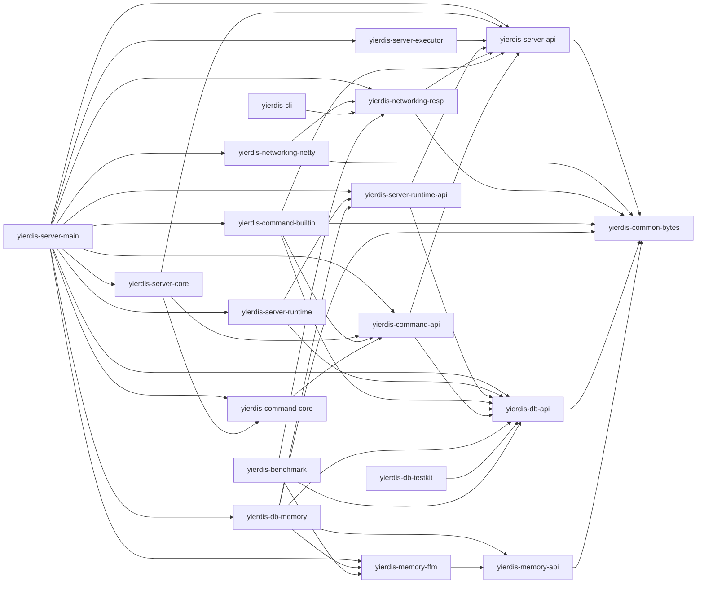

# 模块架构

本文说明 Yierdis 的 Maven 模块和依赖方向。重点不是列目录，而是说明哪些模块拥有协议、命令、执行、DB、memory 和组装职责。

## 一眼看懂的依赖方向

下面的箭头表示当前 POM 中的仓库内部 production 直接依赖方向：左侧模块依赖右侧模块。这里不列测试 scope 依赖，也不列 Netty、picocli、slf4j、logback、JUnit 等第三方依赖。

这条方向图说明：实现模块依赖 API 模块，适配模块依赖协议和 bytes 基础层，最外层 `yierdis-server-main` 依赖各车道完成最终组装。

## 聚合模块

这些模块主要是 parent / aggregator，本身不承担运行时语义：

- `yierdis-parent`
- `yierdis-common`
- `yierdis-memory`
- `yierdis-networking`
- `yierdis-server`
- `yierdis-command`
- `yierdis-db`

它们的作用是统一版本、统一构建配置、统一模块分组。

## bytes 基础层

`yierdis-common-bytes` 提供中立 bytes 抽象，被 protocol、server 和 memory 共享。

`yierdis-networking-netty` 则把这些抽象接到 Netty，集中处理 `ByteBuf` 相关适配。这样上层代码就不必把 Netty 当成核心依赖。

## memory 车道

memory 车道负责 native memory contract 和 FFM backend，不拥有 DB 语义，也不依赖 command / server。

### `yierdis-memory-api`

这里定义的是能力接口，不是具体分配器实现：

- `NativeHandle`
- `NativeAllocator`
- `NativeObjectView`
- `NativeObjectKind` / `NativeHandleDomain`
- `NativeDefrag*`
- `NativeEpoch*`
- `NativeAllocatorStats`
- `NativeAllocationLatencyHistogram`
- `NativeDefragOptions`
- `NativeReallocPolicy`

## protocol 车道

protocol owns wire shape and reply encoding, not DB semantics.

### `yierdis-networking-resp`

这个模块只描述 RESP 的请求、回包和客户端 codec。它可以依赖 bytes 和 server API，但不能反向依赖 command、storage 或 server-main 的组装逻辑。

### `yierdis-networking-netty`

这个模块只负责把 RESP 放进 Netty pipeline。它拥有 `RespRequestDecoder`、ingress admission 和 `RetainedRespExecutionRequest`，但不能拥有命令语义或 DB 访问逻辑。

## execution 和 server 车道

`yierdis-server-api` 定义执行契约，例如 `ExecutionRequest`、`RedisReplyWriter` 和 `Session`。它是 command 和 protocol 之间的稳定接口层。

`yierdis-server-core` 提供 `DefaultYierdisEngine` 之类的执行入口。

`yierdis-server-executor` 负责队列、预算、背压和 owner thread 调度。

`yierdis-server-main` 负责最终组装，是真正的 composition root。生产启动路径在这里选择默认 DB backend：按 maxmemory scope 构造 `YierdisDbEngineFactory`，global scope 额外构造 instance-level `YierdisFfmMemoryRuntime("instance")`，再通过 `YierdisInstanceConfig` 注入 runtime。

`YierdisInstance.create(config)` 是 strict runtime 入口，要求调用方已经提供 `DbEngineFactory`。需要兼容 embedded/test 默认组装时，应显式调用 `YierdisInstance.createWithDefaults(config)`，避免 runtime 的生产入口偷偷决定默认 DB backend。

## command 车道

command owns parsing and command semantics, not Netty.

### `yierdis-command-core`

这里放命令注册、查表、解析和分发的核心实现。它应该只看执行契约和 DB 能力接口，不应该知道 Netty pipeline。

### `yierdis-command-builtin`

这里放内建命令实现，例如 `StringCommands`。它们实现的是命令语义，不是协议编码；真正的 DB 写入会通过 `DbWrites` 进入 `YierdisStringOps` 和 `YierdisDbMutationExecutor`。

`yierdis-command-builtin` 不直接依赖 `yierdis-command-core`。它通过 `yierdis-command-api` 暴露 command module / command spec，最终由 `yierdis-server-main` 把 builtin module 和 command core 组装到一起。

## DB 车道

DB owns storage behavior, not RESP.

### `yierdis-db-api`

这个模块提供 `DbEngine`、`DbReads`、`DbWrites`、`KeyHandle` 等能力接口。命令层通过这些接口读写数据，而不是直接摸 storage implementation。

### `yierdis-db-memory`

这里实现真实存储、TTL、memory ledger、key lifecycle 和 native-backed payload 管理。它负责 storage behavior，但不负责网络协议。

## CLI 和 benchmark

`yierdis-cli` 和 `yierdis-benchmark` 都是外部消费者，主要通过 RESP codec 和 TCP 连接和服务端交互。

它们不该绕过 server 内核去碰 DB，否则就失去验证真实 request path 的意义。

## architecture tests

architecture tests protect dependency direction.

它们主要防几类退化：

- command 模块不能直接依赖 storage implementation
- storage 不能反向依赖 command / server
- server-main 可以组装各层，但其它层不能依赖 app server
- RESP 仍然是唯一 active public protocol lane

## 改模块边界前先看什么

如果要改依赖方向，先读这几类文件：

- 本页开头的依赖方向图
- [`core-logic-index.md`](./core-logic-index.md)
- [`glossary.md`](./glossary.md)
- [`native-memory-runtime.md`](./native-memory-runtime.md)
- [`native-allocator-and-handles.md`](./native-allocator-and-handles.md)

再去看 architecture tests，确认边界约束没有被破坏。
