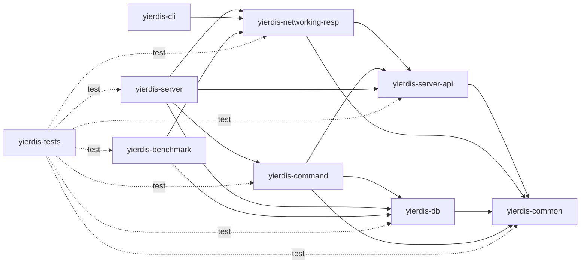

# 模块架构

本文说明 Yierdis 当前九个 Maven leaf module 的职责和依赖方向。目录用于表达领域归属，只有根 `pom.xml` 和九个 leaf POM 参与 reactor。

## 依赖方向

箭头表示左侧模块直接依赖右侧模块。实线是 production scope，虚线是 `yierdis-tests` 的 test scope；第三方依赖未列出。



根 `yierdis-parent` 统一版本、Java 25 编译器和插件配置。`yierdis-common`、`yierdis-networking`、`yierdis-server`、`yierdis-command` 和 `yierdis-db` 的上层目录没有中间 POM。

## 九个模块

### `yierdis-common`

保存跨层复用的小型值类型和 bytes、memory、command 基础契约，不依赖其他仓库模块。

### `yierdis-networking-resp`

保存 RESP wire model、客户端 codec、inline parser 和 `RespReplyWriter`。它依赖中立 bytes 类型与 server execution API，不包含 Netty pipeline 或 DB 语义。

### `yierdis-server-api`

定义 transport-neutral 执行契约，包括 `ExecutionRequest`、`CommandSession`、`PreparedCommand`、`CommandResult`、`RedisReply`、`RedisReplyRenderer` 和 `RedisReplyWriter`。

### `yierdis-server`

拥有进程入口、配置、embedded runtime、executor、连接 session、Netty transport 和最终组装。`YierdisServerBootstrap` 直接创建 `YierdisInstance`，通过 `CommandRegistries.dispatcher(...)` 注册默认命令与 server-only 命令，再把 `dispatcher::prepare` 接到 `CommandExecutor`。

Netty decoder、admission、reply reservation、chunk allocation、顺序写回和 channel lifecycle 都在本模块；RESP 编码本身仍由 `yierdis-networking-resp` 提供。

### `yierdis-command`

在一个 artifact 内保存命令契约、registry/dispatcher、事务命令和内建命令。包边界仍区分 `command.api`、`command.kernel` 与 `command.defaults`，但它们不再拥有独立 Maven 生命周期。

命令只构造语义 `RedisReply`，通过 `DbEngine` 的 typed ops 访问数据，不依赖 Netty 或 DB internal 实现。

### `yierdis-db`

在一个 artifact 内保存 storage API、单机内存 DB、TTL/maxmemory、JDK FFM backend 和 stable native handle。`storage.api` 是 command/runtime 使用的契约包；`storage.memory` 与 `memory.foreign` 是实现包。

DB 不依赖 command、server 或 RESP。DB 专用测试 helper 位于 `yierdis-db/yierdis-db/src/test/java`，不发布 testkit artifact。

### `yierdis-cli`

提供项目自带 RESP 客户端与命令行入口。production 只依赖 `yierdis-networking-resp`。

### `yierdis-benchmark`

提供端到端 RESP benchmark 和显式隔离的进程内 storage benchmark。前者验证真实 TCP/RESP 路径；后者直接依赖 `yierdis-db`，只用于测量单 owner DB hot path 与内存占用。

### `yierdis-tests`

承载跨模块行为和架构测试。其仓库模块依赖均为 test scope，不提供 production API。

## 运行时主链

```text
Netty / RESP
  -> ExecutionRequest
  -> CommandExecutor
  -> CommandDispatcher
  -> PreparedCommand
  -> DbEngine typed ops
  -> CommandResult / RedisReply
  -> RedisReplyRenderer / RespReplyWriter
  -> Netty write-back
```

依赖和运行时边界应保持：

- Netty I/O 线程只解码、提交和写回，不访问 DB。
- command 不直接依赖 storage internal，也不调用 `RedisReplyWriter`。
- DB 不反向依赖 command、server 或 RESP。
- `yierdis-server` 是唯一 composition root；普通命令语义留在 `yierdis-command`。
- `EngineSession` 只保存连接级状态，`CommandDispatcher` 由 bootstrap 组装。
- RESP 是当前唯一 active public protocol lane。

修改模块边界前，同时查看 [`core-logic-index.md`](./core-logic-index.md)、[`request-execution-flow.md`](./request-execution-flow.md) 和各 leaf POM，并运行架构测试。
