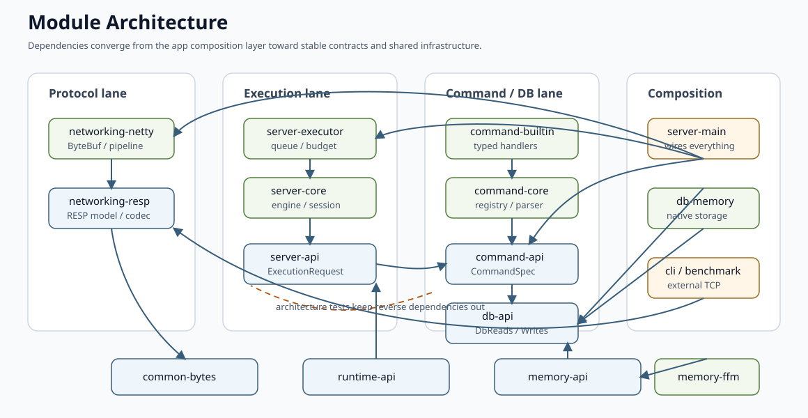

# Module Architecture

本文说明 Yierdis 的 Maven 模块是怎么拆的、依赖方向是什么、以及代码层和测试层如何一起守住这些边界。

## 一眼看懂的依赖关系

可以先把项目看成几组核心关系：



- `yierdis-common-bytes` 是公共 bytes 抽象，被 memory、db、execution 和 protocol 复用
- `yierdis-memory-api` 提供 off-heap 和 stable native allocator contract，`yierdis-memory-ffm` 是它的 JDK 25 FFM backend
- `yierdis-db-api` 定义 DB 能力边界，`yierdis-db-memory` 提供具体存储实现
- `yierdis-server-api` 定义执行契约，`yierdis-server-core` 和 `yierdis-server-executor` 依赖它
- `yierdis-command-api` 定义命令注册契约，`yierdis-command-core` 和 `yierdis-command-builtin` 依赖它
- `yierdis-networking-resp` 负责 RESP limits、request model、reply writer、execution adapter 和 client codec
- `yierdis-networking-netty` 负责 Netty 适配，同时承载 `yier.bubu.redis.bytes.netty.*` 和 `yier.bubu.redis.protocol.resp.netty.*`
- `yierdis-server-main` 是最外层组装模块，把 server / command / db / networking / runtime 拼起来
- `yierdis-cli` 和 `yierdis-benchmark` 主要依赖 RESP codec 和外部 TCP 路径，而不是 server 内核

理解这些关系时，最重要的判断不是“谁依赖谁”本身，而是“谁负责线上协议、谁负责执行契约、谁负责 DB、谁负责最后的组装”。

## Package Ownership

Java package names mirror module ownership. Active production package families are:

- `yier.bubu.redis.app.server`
- `yier.bubu.redis.app.client`
- `yier.bubu.redis.app.bench`
- `yier.bubu.redis.execution.api`
- `yier.bubu.redis.execution.engine`
- `yier.bubu.redis.execution.executor`
- `yier.bubu.redis.bytes`
- `yier.bubu.redis.bytes.netty`
- `yier.bubu.redis.storage.api`
- `yier.bubu.redis.storage.api.result`
- `yier.bubu.redis.storage.memory`
- `yier.bubu.redis.command.api`
- `yier.bubu.redis.command.kernel`
- `yier.bubu.redis.command.defaults`
- `yier.bubu.redis.runtime.api`
- `yier.bubu.redis.runtime.embedded`
- `yier.bubu.redis.memory.api`
- `yier.bubu.redis.memory.foreign`
- `yier.bubu.redis.protocol.resp`
- `yier.bubu.redis.protocol.resp.netty`

## 聚合模块

下面几个模块主要是 parent / aggregator，本身不是运行时代码：

- `yierdis-parent`
- `yierdis-common`
- `yierdis-memory`
- `yierdis-networking`
- `yierdis-server`
- `yierdis-command`
- `yierdis-db`

它们的作用主要是：

- 统一模块结构
- 统一版本和构建配置
- 让依赖分组更容易理解

## bytes 基础层

### `yierdis-common-bytes`

提供中立的 bytes 抽象，被 protocol 和 core 两边共享。

它的角色是：

- 避免上层逻辑过早绑定到 Netty
- 为 `BytesView`、`BytesSlice`、`BytesSink` 这类接口提供公共基础

### `yierdis-networking-netty`

负责把中立的 bytes 抽象接到 Netty，同时承载 `yier.bubu.redis.bytes.netty.*` 和 `yier.bubu.redis.protocol.resp.netty.*`。

它存在的意义是：

- Netty 适配层集中
- core / protocol 的非 Netty 代码不需要知道 `ByteBuf`

## memory 车道

memory 车道负责 native memory contract 和 FFM backend，不拥有 DB 语义，也不依赖 command / server。

### `yierdis-memory-api`

这个模块定义两组能力：

- 连续 bytes off-heap contract：`OffHeapAllocator`、`OffHeapBuf`、`OffHeapSlice`
- stable native object allocator contract：`NativeHandle`、`NativeAllocator`、`NativeObjectView`、`NativeAllocatorStats`、`NativeDefrag*`、`NativeEpoch*`

`NativeHandle` 是跨 DB memory 层的 64-bit stable identity，包含 domain、kind、slot id、generation 和 flags。它不是 physical address。

### `yierdis-memory-ffm`

这个模块提供 JDK FFM backend：

- `YierdisFfmMemoryRuntime` 管理 FFM region 和 runtime accounting
- `YierdisStableNativeAllocator` / `YierdisNativeObjectTable` / `YierdisNativePageAllocator` 服务可移动 native object；string payload 由 `StringRoot` 通过 DB 级 shared `NativeAllocator` 分配 `STRING_BYTES` 管理，HLL 复用 string payload
- `YierdisForeignOffHeapAllocator` / `YierdisFfmSlabAllocator` 保留为 legacy / transitional `OffHeapAllocator` / `OffHeapBuf` 连续 bytes buffer 入口
- `YierdisNativeEpochManager` 和 quarantine 保护 active read / scan / snapshot / defrag

DB implementation 可以依赖 memory API 和 FFM backend；command、protocol 和 server API 不能直接依赖这些 allocator 实现细节。

完整 allocator 语义见 [`native-allocator-and-handles.md`](./native-allocator-and-handles.md)。

## protocol 车道

protocol 车道只负责“线上协议长什么样”，不负责命令执行语义。

### `yierdis-networking-resp`

放 RESP 的 Netty-free 内容，主要包名为 `yier.bubu.redis.protocol.resp.*`：

- `RespProtocolLimits`
- `RespProtocolVersion`
- `RespCommandRequest`
- `RespExecutionAdapter`
- `RespReplyWriter` / `RespReplyWriterFactory`
- `RespClientCodec`

它可以依赖 `yierdis-common-bytes` 和 `yierdis-server-api`，但不依赖 command、storage、runtime、server/app 或 Netty。

### `yierdis-networking-netty`

负责 `yier.bubu.redis.protocol.resp.netty.*`：

- `RespRequestDecoder`
- `RespCommandAdapter`
- `RespProtocolError`
- `RespProtocolErrorReplyHandler`

它是 protocol 车道中唯一真正碰 Netty 的模块。它只把 Netty pipeline 接到 RESP model / adapter，不拥有命令解析、DB 访问或 runtime 组装。

## core 车道

core 车道负责“命令和 DB 怎么对话”，而不是“线上怎么发包”。

### `yierdis-server-api`

这是执行契约层，放的是 transport-agnostic 的命令执行语义对象（包名为 `yier.bubu.redis.execution.api.*`），例如：

- `ExecutionRequest`
- `ExecutionRecord`
- `ReplyWriter`
- `Session`

它的作用是把命令执行从 protocol DTO 里抽出来。

### `yierdis-db-api`

这是 command-facing DB 能力边界，包名为 `yier.bubu.redis.storage.api.*` 和 `yier.bubu.redis.storage.api.result.*`，放的是：

- `DbEngine`
- `DbReads`
- `DbWrites`
- `MemoryOps`
- `KeyHandle`
- 各种 `*ReadOps` / `*WriteOps`
- `BulkStringValue` / `BulkStringSequence` / `BulkStringMapPairs`
- `MaxmemoryCoordinator` / `MaxmemoryParticipant` / `RuntimeDbEngine`

它的意义是：

- 命令层只依赖稳定的能力接口
- 不直接依赖 `YierdisDb` 具体实现
- TTL / maxmemory 等 storage pressure path 可以通过 API 级 `KeyHandle` 表达 key identity
- 集合读结果可以通过 result sink 流式写回，不需要命令层知道具体 value/off-heap 结构
- runtime 可以通过 maxmemory SPI 协调多个 DB，而不是依赖 storage implementation

### `yierdis-server-runtime-api`

这是 embedded runtime contract 边界，包名为 `yier.bubu.redis.runtime.api.*`，放的是：

- `YierdisInstanceConfig`
- `YierdisChangeEvent`
- `YierdisChangeSink`

它的意义是：

- server / embedded users 直接依赖实例配置 API
- command / storage implementation 通过 `runtime.api` 中的 change-tracking SPI 协作
- runtime API 源码只由 `yierdis-server-runtime-api` 拥有

## server 组装层

`yierdis-server-main` 是 application composition root。它负责：

- 参数解析
- 创建 DB/runtime/executor
- 注册 command modules
- 创建 `RespReplyWriterFactory`
- 组装 Netty pipeline

请求主链路可以压成：

```text
RESP bytes
  -> RespRequestDecoder
  -> RespCommandAdapter
  -> YierdisFastCommandHandler
  -> CommandExecutor
  -> YierdisEngine
  -> YierdisFastCommandProcessor
  -> ReplyWriter
  -> RespReplyWriter
```

## CLI / Benchmark

`yierdis-cli` 和 `yierdis-benchmark` 都是外部 TCP 消费者：

- CLI 使用 `RespClientCodec` 做一问一答请求
- benchmark 使用 RESP writer / reader 跑吞吐和延迟 workload
- smoke 脚本优先用 `redis-cli`，本机没有时回退到 Java CLI

这两个模块不能绕过 server 内核直接访问 DB，否则就失去了验证真实 request path 的意义。

## 架构护栏

架构测试主要守住几类边界：

- command 模块不直接依赖 storage implementation
- storage implementation 不反向依赖 command/server
- server-main 作为组装层可以依赖各层，但其它层不能依赖 app server
- RESP 是唯一 active public protocol lane
- retired protocol 模块和包名不能回到 production source / Maven graph

代表测试：

- `ArchitectureBoundaryTest`
- `ArchitecturePolicyResourceTest`
- `RespBoundaryGuardTest`

如果你改模块边界，先跑：

```bash
mvn -pl yierdis-tests/yierdis-architecture-tests -am test -Dsurefire.failIfNoSpecifiedTests=false
```

## 一句话总结

Yierdis 的模块设计重点，不是“按包名分目录”，而是：

- protocol 负责线上 RESP
- execution API 负责命令语义契约
- command / DB 通过能力接口协作
- server-main 负责最终组装
- architecture tests 把这些依赖方向固定住
