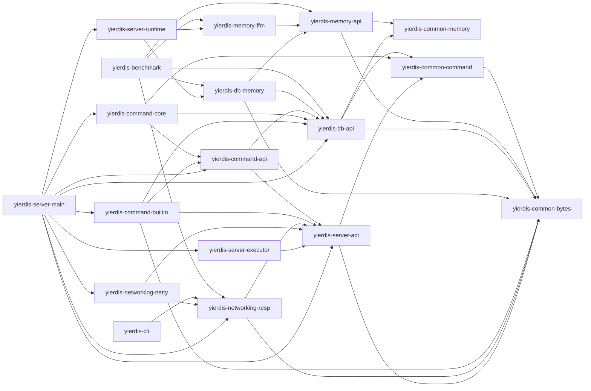

# 模块架构

本文说明 Yierdis 的 Maven 模块和依赖方向。重点不是列目录，而是说明哪些模块拥有协议、命令、执行、DB、memory 和组装职责。

## 一眼看懂的依赖方向

下面的箭头表示当前 POM 中的仓库内部 production 直接依赖方向：左侧模块依赖右侧模块。这里不列测试 scope 依赖，也不列 Netty、picocli、slf4j、logback、JUnit 等第三方依赖。



这条方向图说明：实现模块依赖 API 模块，适配模块依赖协议和 bytes 基础层，最外层 `yierdis-server-main` 依赖各车道完成最终组装。

## Maven 聚合

根 `yierdis-parent` 是唯一 parent / aggregator，直接列出所有 leaf module。每个 leaf POM
直接继承根 POM；`yierdis-common`、`yierdis-memory`、`yierdis-networking`、`yierdis-server`、
`yierdis-command` 和 `yierdis-db` 只是源码目录，不再各自拥有中间 POM。

根 POM 统一版本、编译器和插件配置，源码目录继续表达领域归属，但不再制造没有独立构建语义的
Maven project。

## bytes 基础层

`yierdis-common-bytes` 提供中立 bytes 抽象，被 protocol、server 和 memory 共享。

`yierdis-networking-netty` 则把这些抽象接到 Netty，集中处理 `ByteBuf` 相关适配。这样上层代码就不必把 Netty 当成核心依赖。

## memory 车道

memory 车道负责 native memory contract 和 FFM backend，不拥有 DB 语义，也不依赖 command / server。

### `yierdis-memory-api`

这里定义的是能力接口，不是具体分配器实现：

- `NativeHandle`
- `NativeAllocator`
- `NativeObjectView`
- `NativeObjectKind` / `NativeHandleDomain`
- `NativeDefrag*`
- `NativeEpoch*`
- `NativeAllocatorStats`
- `NativeAllocationLatencyHistogram`
- `NativeDefragOptions`
- `NativeReallocPolicy`

## protocol 车道

protocol owns wire shape and reply encoding, not DB semantics.

### `yierdis-networking-resp`

这个模块只描述 RESP 的请求、回包和客户端 codec。它可以依赖 bytes 和 server API，但不能反向依赖 command、storage 或 server-main 的组装逻辑。

### `yierdis-networking-netty`

这个模块只负责把 RESP 放进 Netty pipeline。它拥有 `RespRequestDecoder`、ingress admission 和 `RetainedRespExecutionRequest`，但不能拥有命令语义或 DB 访问逻辑。

## execution 和 server 车道

`yierdis-server-api` 定义执行契约，例如 `ExecutionRequest`、`CommandSession`、`PreparedCommand`、`CommandResult`、`RedisReply` 和 `RedisReplyRenderer`。`RedisReplyWriter` 只作为 renderer 面向 RESP 编码实现的输出端口；命令实现不依赖它。

`yierdis-server-executor` 负责队列、预算、背压、owner thread 调度、回复容量预留和结果集中渲染。它执行的主链是：

```text
CommandExecutor
  -> CommandDispatcher.prepare(session, request)
  -> CommandSpec.handler().parse(CommandArgs)
  -> CommandInvocation.prepare(session)
  -> PreparedCommand
  -> reserve -> validate -> execute(context)
  -> CommandResult -> RedisReplyRenderer
```

`yierdis-server-main` 负责最终组装，是真正的 composition root。具体的 `EngineSession` 也位于这里：它是每条连接的 command session owner，持有 DB 选择、客户端 metadata、认证、RESP 协商和事务队列状态，但稳定接口仍由 `yierdis-server-api` 中的 `CommandSession` 定义。`ServerCommandComposition` 在这里把 builtin、server commands、registry 和 `CommandDispatcher` 组装到一起，bootstrap 再把 `dispatcher::prepare` 接到 `CommandExecutor`，并把 server 配置映射成 `YierdisInstanceConfig`。

`YierdisInstance.create(config)` 是固定的 runtime 组合入口：它直接使用 `YierdisFfmStableMemoryBackend` 和 `YierdisDbEngineFactory` 创建各 DB；每个 DB 得到独立 backend，maxmemory scope 只决定预算协调方式。

## command 车道

command owns parsing and command semantics, not Netty.

### `yierdis-command-core`

这里放 `CommandRegistry`、`CommandDispatcher` 和事务控制命令。registry 在 composition 阶段接收 `CommandSpec`，sealed 后只读查表；dispatcher 负责请求检查、arity、事务策略、handler 解析和 invocation 准备，不知道 Netty pipeline。

事务 active 时，queueable 命令只调用 `CommandSpec.handler().parse(CommandArgs)` 做 preflight，不调用 `CommandInvocation.prepare(session)`；回复容量预留成功后才 retain 请求并入队。`EXEC` replay 再经同一 dispatcher 准备子 `PreparedCommand`，并拥有这些子命令及 retained requests 的关闭责任。

### `yierdis-command-builtin`

这里放内建命令实现，例如 `StringCommands`。它们实现的是命令语义，不是协议编码；handler 产生 `CommandInvocation`，准备后执行得到 `CommandResult`，真正的 DB 写入会通过 `DbWrites` 进入 `YierdisStringOps` 和 `YierdisDbMutationExecutor`。

命令只构造语义 `RedisReply`。bulk、byte sequence 和 byte map 结果携带流式 emitter 与 retained source byte 计费信息，实际 source 由对应 `PreparedCommand` 持有；执行器中的 `RedisReplyRenderer` 同步消费结果后，executor 才关闭 prepared command。命令不会直接调用 `RedisReplyWriter`，`QUIT` 的连接关闭语义同样由 `CommandResult.closeAfterReply(...)` 携带。

`yierdis-command-builtin` 不直接依赖 `yierdis-command-core`。它通过 `yierdis-command-api` 暴露 command module / command spec，最终由 `yierdis-server-main` 把 builtin module 和 command core 组装到一起。

## DB 车道

DB owns storage behavior, not RESP.

### `yierdis-db-api`

这个模块提供 `DbEngine`、`DbReads`、`DbWrites`、`KeyHandle` 等能力接口。命令层通过这些接口读写数据，而不是直接摸 storage implementation。

### `yierdis-db-memory`

这里实现真实存储、TTL、memory ledger、key lifecycle 和 native-backed payload 管理。它负责 storage behavior，但不负责网络协议。

## CLI 和 benchmark

`yierdis-cli` 和 `yierdis-benchmark` 的默认 RESP 模式都是外部消费者，通过 RESP codec 和 TCP 与服务端交互。

默认 RESP 模式不该绕过 server 内核去碰 DB，否则就失去验证真实 request path 的意义。`yierdis-benchmark storage` 是显式隔离的诊断入口，允许 benchmark app 依赖 `yierdis-db-memory`，用于测量单 owner DB hot path 和 heap/native footprint；它的结果不代表真实 request path。

## 统一测试模块

`yierdis-tests` 承载跨模块行为测试和少量 API 形状检查。DB 专用 helper 位于
`yierdis-db-memory/src/test/java`，不再通过独立 testkit artifact 发布。

依赖方向主要由 Maven 模块图和 Java 编译器约束。模块关系应保持：

- command 模块不能直接依赖 storage implementation
- command 实现不能直接依赖 `RedisReplyWriter`，回复必须由 `CommandResult` 进入集中 renderer
- storage 不能反向依赖 command / server
- server-main 可以组装各层，但其它层不能依赖 app server
- `CommandDispatcher` 由 server-main composition root 持有，`EngineSession` 只保留连接 session 职责
- RESP 仍然是唯一 active public protocol lane

## 改模块边界前先看什么

如果要改依赖方向，先读这几类文件：

- 本页开头的依赖方向图
- [`core-logic-index.md`](./core-logic-index.md)
- [`glossary.md`](./glossary.md)
- [`native-memory-runtime.md`](./native-memory-runtime.md)
- [`native-allocator-and-handles.md`](./native-allocator-and-handles.md)

再去看 architecture tests，确认边界约束没有被破坏。
