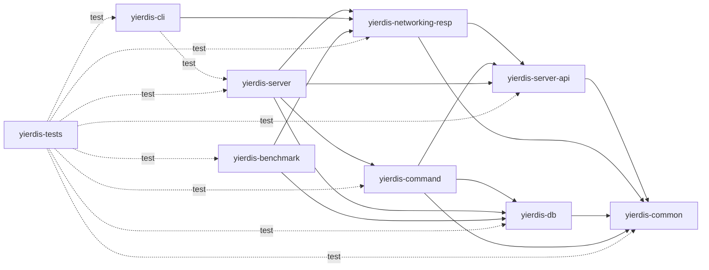

# 模块架构

Yierdis 当前有九个 Maven leaf module。目录只用于表达领域归属；参与 reactor 的是根 `pom.xml` 和九个 leaf POM，依赖方向一律以各 leaf `pom.xml` 的 `<dependencies>` 为准（本节末尾给出逐条清单，便于对照）。

## 依赖方向

箭头表示左侧模块直接依赖右侧模块：实线是 production scope，虚线是 test scope；第三方依赖（Netty、HdrHistogram、SLF4J/Logback、JUnit）未画出。



四条容易读错、但 pom 里确实如此的关系：

- `yierdis-networking-resp` 依赖 `yierdis-server-api`：`RespReplyWriter` 实现的是 `server-api` 里的 `RedisReplyWriter`，并使用 `ReplyReservationSink` 与 `ReplyShapes`。所以 RESP 编码不依赖 server 或 Netty。
- `yierdis-server` 同时依赖 `server-api`、`db`、`command`、`networking-resp` 四个内部模块，它是唯一把四方拼起来的模块。
- `yierdis-cli` 的 production 依赖只有 `yierdis-networking-resp`；它对 `yierdis-server` 的依赖是 **test scope**，用于集成测试，不进入发布产物。
- `yierdis-tests` 对其它八个模块的依赖 **全部是 test scope**，它不提供 production API。

根 `yierdis-parent` 集中管理版本、Java 25 编译器和插件配置。`yierdis-common`、`yierdis-networking-resp`、`yierdis-server`、`yierdis-command` 和 `yierdis-db` 的上层目录没有中间 POM（`yierdis-server` 的 `<relativePath>` 是 `../../pom.xml`）；`yierdis-server-api` 和 `yierdis-server` 以 `yierdis-server/` 为公共目录，但各自是独立 leaf module，没有中间聚合 POM。

### 以 pom 为准的依赖清单

| 模块 | production 依赖（内部） | test-scope 依赖（内部） | 第三方（production） |
| --- | --- | --- | --- |
| `yierdis-common` | 无 | 无 | 无 |
| `yierdis-networking-resp` | `common`, `server-api` | 无 | 无 |
| `yierdis-server-api` | `common` | 无 | 无 |
| `yierdis-server` | `server-api`, `db`, `command`, `networking-resp` | 无 | `netty-handler`, `slf4j-api`, `logback-classic` |
| `yierdis-command` | `server-api`, `db`, `common` | 无 | 无 |
| `yierdis-db` | `common` | 无 | 无 |
| `yierdis-cli` | `networking-resp` | `server` | 无 |
| `yierdis-benchmark` | `db`, `networking-resp` | 无 | `HdrHistogram` |
| `yierdis-tests` | 无 | `benchmark`, `cli`, `common`, `server-api`, `server`, `command`, `db`, `networking-resp` | `junit`（parent 继承，test scope） |

## 九个模块

### `yierdis-common`

保存跨层复用的小型值类型和 bytes、memory、command 基础契约，不依赖其他仓库模块。

### `yierdis-networking-resp`

保存 RESP wire model、客户端 codec、inline parser 和 `RespReplyWriter`。依赖中立 bytes 类型与 server execution API（`RedisReplyWriter`、`ReplyReservationSink`），不包含 Netty pipeline 或 DB 语义。Netty 类型的编解码适配不在这里，而在 `yierdis-server` 的 `protocol.resp.netty` 包。

### `yierdis-server-api`

定义 transport-neutral 执行契约，包括 `ExecutionRequest`、`CommandSession`、`PreparedCommand`、`CommandResult`、`RedisReply`、`RedisReplyRenderer` 和 `RedisReplyWriter`。只依赖 `yierdis-common`。

### `yierdis-server`

拥有进程入口、配置、embedded runtime、executor、连接 session、Netty transport 和最终组装。`YierdisServerBootstrap` 直接创建 `YierdisInstance`，通过 `CommandRegistries.dispatcher(...)` 注册默认命令（`DefaultCommandModules.create(...)`）、事务命令（`TransactionCommands`）和 server-only 命令（`ServerCommandModule`），再把 `dispatcher::prepare` 接到 `CommandExecutor`。

Netty decoder、admission、reply reservation、chunk allocation、顺序写回和 channel lifecycle 都在本模块；RESP 编码本身仍由 `yierdis-networking-resp` 提供。它还是唯一同时依赖四个内部模块的 composition root。

### `yierdis-command`

在一个 artifact 内保存命令契约、registry/dispatcher、事务命令和内建命令。包边界仍区分 `command.api`、`command.kernel` 与 `command.defaults`，但三者不再有独立的 Maven 生命周期。

命令只构造语义 `RedisReply`，通过 `DbEngine` 的 typed ops 访问数据，不依赖 Netty 或 DB internal 实现。它依赖 `server-api` 和 `db`，不依赖 `yierdis-server`。

### `yierdis-db`

在一个 artifact 内保存 storage API、单机内存 DB、TTL/maxmemory、JDK FFM backend 和 stable native handle。`storage.api` 是 command/runtime 使用的契约包；`storage.memory` 与 `memory.foreign` 是实现包。

DB 只依赖 `yierdis-common`，不依赖 command、server 或 RESP。DB 专用测试 helper 位于 `yierdis-db/src/test/java`，不发布 testkit artifact。

### `yierdis-cli`

提供项目自带 RESP 客户端与命令行入口（`yier.bubu.redis.app.client.YierdisCli` 为 shade 后的 main class）。production 只依赖 `yierdis-networking-resp`；`yierdis-server` 是 test scope，仅用于集成测试。

### `yierdis-benchmark`

提供端到端 RESP benchmark 和显式隔离的进程内 storage benchmark（main class `yier.bubu.redis.app.bench.YierdisBench`，含 `storage` 子命令）。前者验证真实 TCP/RESP 路径；后者直接依赖 `yierdis-db`，只用于测量单 owner DB hot path 与内存占用。

### `yierdis-tests`

承载跨模块行为和架构测试。其仓库模块依赖均为 test scope，不提供 production API。

## 运行时主链

```text
Netty / RESP
  -> ExecutionRequest
  -> CommandExecutor
  -> CommandDispatcher
  -> PreparedCommand
  -> DbEngine typed ops
  -> CommandResult / RedisReply
  -> RedisReplyRenderer / RespReplyWriter
  -> Netty write-back
```

依赖和运行时边界应保持：

- Netty I/O 线程只解码、提交和写回，不访问 DB。
- command 不直接依赖 storage internal，也不调用 `RedisReplyWriter`。
- DB 不反向依赖 command、server 或 RESP。
- `yierdis-server` 是唯一 composition root；普通命令语义留在 `yierdis-command`。
- `EngineSession` 只保存连接级状态，`CommandDispatcher` 由 bootstrap 组装。
- RESP 是当前唯一 active public protocol lane。

修改模块边界前，同时查看 [`development-navigation.md`](./development-navigation.md)、[`request-execution-flow.md`](./request-execution-flow.md) 和各 leaf POM，并运行架构测试。