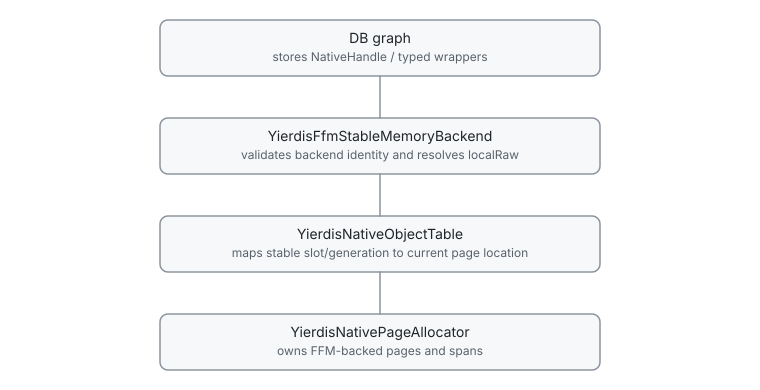
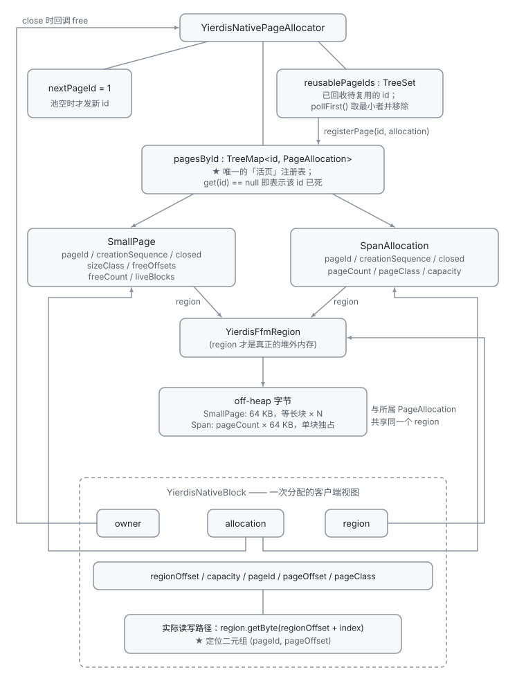
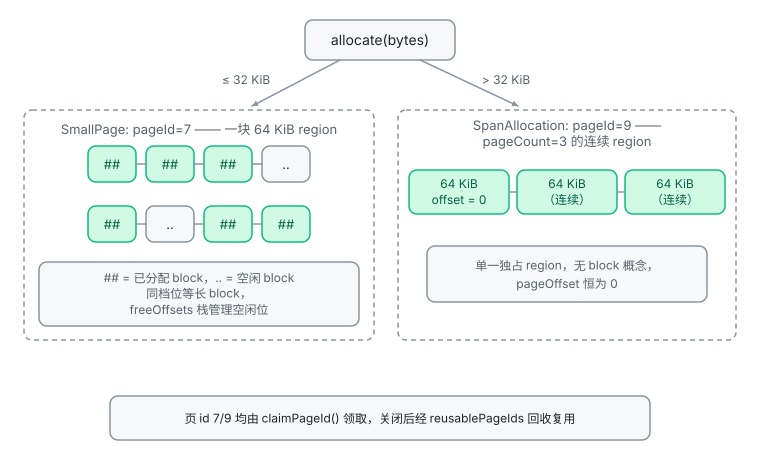
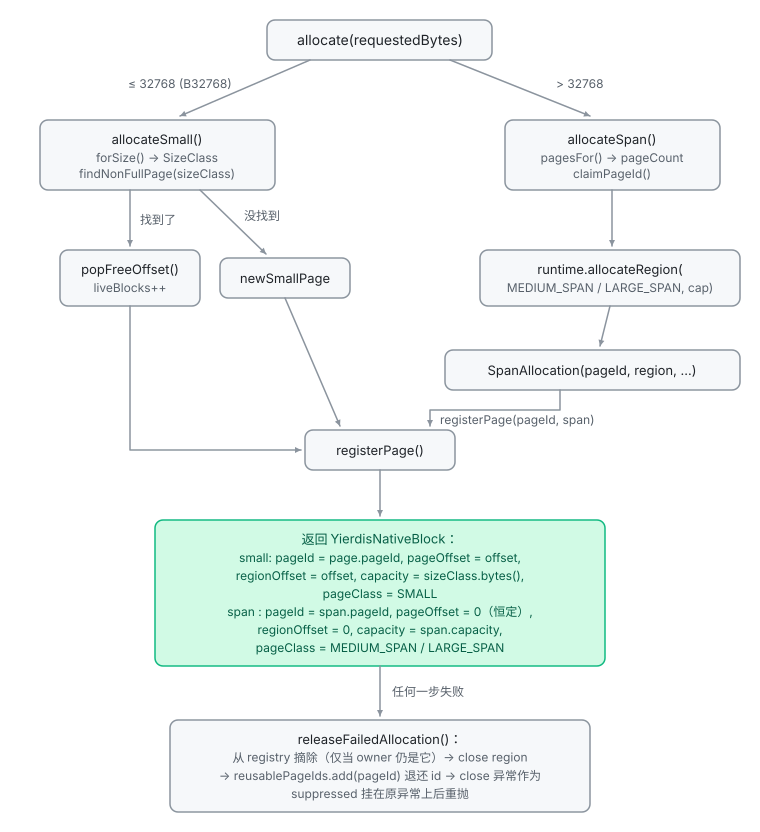
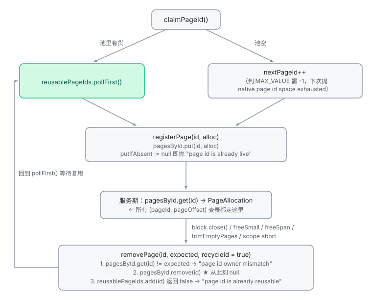
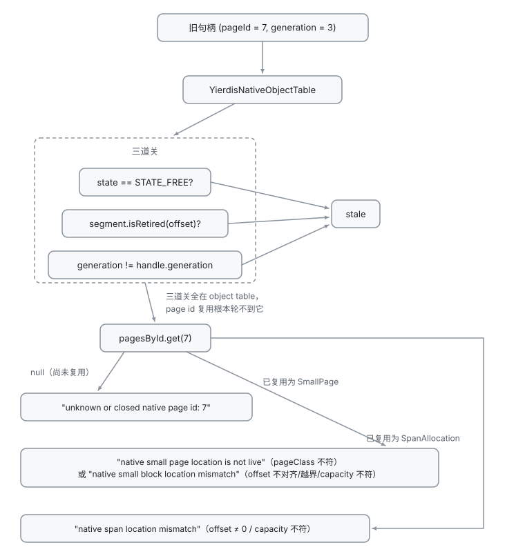
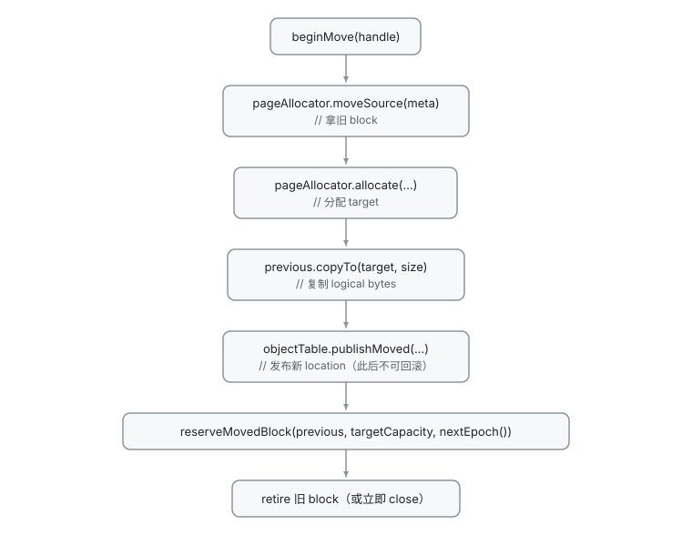

# Stable Memory Backend 与 Handles

本文覆盖 stable handle、object table、page allocation、pin/epoch/quarantine、realloc 和 active defrag。FFM runtime/region ownership 见 [`native-memory-runtime.md`](./native-memory-runtime.md)；这层对外的最终统计口径见 [`configuration-and-operations.md`](./configuration-and-operations.md#生产环境加固与验收操作)。

建议按"对象是什么 → 谁调用谁 → 不这样做会出什么问题"的顺序读：§1–§2 是合同，§3–§4 是对象结构（§4 额外给出 page registry 的结构全景、两条分配路径与 page id 完整生命周期），§5–§9 每一节都对应一类真实的失效场景（use-after-free、地址漂移、回滚不彻底、ABA、搬迁收益为零）。

## 1. 这一层为什么存在

DB graph 里存的是 key 字节、field、member、listpack 块这类数据，生命周期跨越无数次 mutation。如果直接把 FFM `MemorySegment` 当引用存进 graph，会同时撞上三个问题：

1. **地址不能长期持有**：`reallocate` 换块、defrag 搬迁、page 被复用之后，旧地址会指向别人的数据。
2. **释放不能立即生效**：读路径可能正处于一次有界 resolve 中（`NativeObjectView`、cursor scan、上层 callback），立刻 `free` 就是 use-after-free。
3. **失败不能就地回滚**：一次 mutation 可能已经分配了十几个对象才失败，需要一个物理层面的"撤销到某一点"能力，而不是只把账本改回去。

生产实现 `YierdisFfmStableMemoryBackend` 因此切成三层，每层只解决一个问题：



调用方只在有界操作内 resolve handle，用完即 close 短生命周期的 `NativeObjectView`。physical page、offset、capacity 和 segment 都是 backend 私有状态。

**为什么不把 location 规则交给各 DB 自己维护**：那样每个 DB 都要复制一遍搬迁/失效逻辑，且没法给 defrag 提供统一安全网。把规则收进 object table 的 generation 字段，代价是所有位置变化都要多一次 table 写入——换来的是"删/搬/复用"的语义只有一处。

## 2. 公共 handle 与私有 localRaw

公共 API 是：

```java
public record NativeHandle(long allocatorId, long localRaw)
```

- `allocatorId` 标识创建 handle 的 backend，由 `StableMemoryBackendIds` 进程内单调发放、永不复用。
- `localRaw` 是只允许所属 backend 解释的不透明值。
- 只有两个分量都为 `0` 时才是 `NativeHandle.NULL`。
- `realloc` 和 defrag 不改变两个分量；`free` 之后该 identity 失效（generation 递增，见 §3）。

FFM backend 私有的 `YierdisLocalHandleCodec` 才把 `localRaw` 编成 64 bit：

| 位段 | 字段 | 宽度 |
|---|---|---|
| bits 63..60 | `domain` | 4 bits |
| bits 59..56 | `kind` | 4 bits |
| bits 55..16 | `slotId` | 40 bits |
| bits 15..4 | `generation` | 12 bits |
| bits 3..0 | `flags` | 4 bits |

对应的位移常量是 `DOMAIN_SHIFT = 60`、`KIND_SHIFT = 56`、`SLOT_SHIFT = 16`、`GENERATION_SHIFT = 4`，掩码为 `SLOT_MASK = (1L << 40) - 1L`、`GENERATION_MASK = (1L << 12) - 1L`、`FOUR_BIT_MASK = 0x0fL`。

为什么这样切：

- `slotId` 是全局槽位索引，40 位可覆盖约 1.1×10¹² 个槽，位宽不是本层的实际瓶颈；
- `generation` 与 `kind`/`domain` 放高位，是为了让"跨 backend、错 kind、错 domain、未知 slot、generation 不匹配"这五类错误的判定可以纯位运算完成；
- `flags` 4 位目前恒为 0（所有写入路径都传 0，且没有任何校验），保留位只在 `localHandleFor` 里原样回填——这是预留而非在用字段。

DB/API 调用方不得复制这套 codec，也不得把 `localRaw` 当作完整 handle。`EntryHandle`、`ValueHandle` 和 `KeyHandle` 必须保留 paired identity。

## 3. Object table：稳定身份的权威表

`YierdisNativeObjectTable` 是 `localRaw` 到当前 location metadata 的权威表。每个 FFM segment 含 `SLOTS_PER_SEGMENT = 4_096` 个槽，每槽 `META_BYTES = 36`：

| 偏移 | 常量 | 内容 | 宽度 |
|---|---|---|---|
| 0 | `PAGE_OFFSET_OFFSET` | 页内/span 内偏移 | 4 B |
| 4 | `SIZE_OFFSET` | logical size | 4 B |
| 8 | `PAGE_ID_OFFSET` | 所属 page id | 4 B |
| 12 | `PACKED_METADATA_OFFSET` | 打包字段（见下） | 4 B |
| 16 | `ALLOC_EPOCH_OFFSET` | 分配时的 epoch | 8 B |
| 24 | `FREE_EPOCH_OFFSET` | 释放时的 epoch | 8 B |
| 32 | `PIN_COUNT_OFFSET` | pin 计数 | 4 B |

**capacity 不在槽里**：它由 `capacityResolver.resolveCapacity(...)` 从 page/span descriptor 反查。理由是最小档对象只有 16 B，再塞 4 B capacity 是纯浪费，而 descriptor 本来就是权威值。

打包的 32-bit word（`PACKED_METADATA_OFFSET`）按位切分，只用了低 30 位：

| 字段 | 位段 | 掩码 |
|---|---|---|
| `state` | [2:0] | `STATE_MASK = 0x07` |
| `pageClass` | [5:3] | `PAGE_CLASS_MASK = 0x07` |
| `flags` | [9:6] | `FLAGS_MASK = 0x0f` |
| `kind` | [13:10] | `KIND_MASK = 0x0f` |
| `domain` | [17:14] | `DOMAIN_MASK = 0x0f` |
| `generation` | [29:18] | `GENERATION_MASK = 0x0fff` |

`pageClass` 与 generation 同时放进槽里而不是只放在 handle 里，是因为读取一个 handle 时 backend 必须能独立判定"这个槽现在是否还属于这个 handle"——如果只信 handle 自带的 generation，就无法发现 object table 已经把它复用掉了。

状态常量与语义：

| 常量 | 值 | 语义 |
|---|---|---|
| `STATE_FREE` | 0 | 槽空闲 |
| `STATE_ALLOCATED` | 1 | 正常存活 |
| `STATE_PINNED` | 2 | 存活且 pin 计数非零相关 |
| `STATE_MOVING` | 3 | 正在搬迁（`beginMove` 之后、`publishMoved` 之前） |
| `STATE_FREED_QUARANTINED` | 4 | 已 free 但被 pin/epoch 拖住，延迟归还 |

**generation 与 ABA 防范**：`INITIAL_GENERATION = 1`，槽位每次被释放时递增；涨到 `MAX_GENERATION = 0x0fff` 后该槽**永久 retire**，不再回 free stack。

- 为什么必须 retire：12 位 generation 会回绕，回绕后的旧 handle 会恰好命中复用该槽的新对象，这就是 ABA。retire 是把"无法再安全复用"这件事变成物理事实。
- 代价：单个槽位寿命约 4095 次复用（generation 从 1 递增到 0x0fff）。达到这个量级需要长期高频 churn，正常压测很难触发，但一旦触发，object table 会持续向新 segment 增长，只能靠进程重启回收。
- 段内的实现：`YierdisNativeObjectSegment` 用 `int[] freeStack = new int[SLOTS_PER_SEGMENT]` 保存空闲偏移，`freeCount` 计栈深，`long[] retiredBitmap` 标记 retired 槽，`long[] occupiedBitmap` 标记仍占用的槽。`nextOccupiedSlot` 按 word 在 occupied bitmap 上找下一个占用偏移，并跳过 `occupiedCount == 0` 的段，因此空闲洞不再被逐槽访问；返回值仍是更大的 slot id。`releaseOffset(offset)` 对 retired 槽直接抛 `IllegalStateException("retired slot cannot be released")`，栈满抛 `"segment free stack overflow"`。

**slot 分配策略**：分配时先扫现有 segments 的 free stack，不够再追加 segment；table 用一个按实际长度增长的 segment array 承载。`AUTOMATIC_MAX_SLOTS = Integer.MAX_VALUE` 是默认上限。

object table 承担的职责：

- 校验 allocator/domain/kind/slot/generation；
- resolve 当前 page location；
- pin/unpin 与 quarantined release；
- realloc/defrag 的 `beginMove`、`publishMoved`、`abortMove`；
- cursor 遍历（`firstOccupiedSlot` / `nextOccupiedSlot` / `occupiedMeta`）、统计与 scope rollback。

## 4. Pages、spans 与 size class

`YierdisNativePageAllocator` 用 `NavigableMap<Integer, PageAllocation> pagesById`（`TreeMap`）按 page id 保存 `SmallPage` 或 `SpanAllocation`，另有 `NavigableSet<Integer> reusablePageIds`（`TreeSet`）保存已脱离 registry 待复用的 id。没有第二套 native page directory。

本节按"registry 是什么 → 块怎么切 → id 怎么流转 → 统计口径"的顺序展开。§4.1 回答 page id 到底关联什么，§4.5 回答 id 复用为什么安全。

### 4.1 page id 关联的是什么

**page id 本身不携带任何信息**，它只是 `pagesById` 的 key，且不参与寻址。真正被它关联的是**一块堆外物理区域**：


`PageAllocation` 是二者的抽象基类，四个字段各有明确职责：

```java
private abstract static class PageAllocation {
    final int pageId;              // 反向指针：free/close 路径据此回查 registry 并校验 owner
    final long creationSequence;   // 出生序号：allocation scope abort 据此识别"scope 内新建页"
    final YierdisFfmRegion region; // 真正持有内存的 region
    boolean closed;                // 关闭后不得再被分配路径或查找命中
}
```

两个实现决定了 id 关联的物理形态完全不同：

| 实现 | id 关联的物理范围 | 关键字段 |
|---|---|---|
| `SmallPage` | 恰好一个 `PAGE_BYTES` 的 region，内部切成 `blockCount` 个**等长**小块 | `sizeClass`、`int[] freeOffsets`、`freeCount`、`liveBlocks` |
| `SpanAllocation` | `pageCount` 个连续页的**单一独占** region | `pageCount`、`pageClass`（`MEDIUM_SPAN`/`LARGE_SPAN`）、`capacity` |

结构全景：



（`SmallPage` 与 `SpanAllocation` 都 extends 抽象基类 `PageAllocation { pageId, creationSequence, region, closed }`；上图把基类字段展开进两个实现，以便对照阅读。）

**定位是二维的 `(pageId, pageOffset)`**，不是单看 id。`resolveCapacity(pageId, pageOffset, pageClassOrdinal)`（object table 实现 `CapacityResolver` 的唯一方法）就靠这个元组反查容量：进 `SmallPage` 分支时校验 `pageOffset % sizeClass.bytes() == 0` 且不越页；进 `SpanAllocation` 分支时**要求 `pageOffset == 0`**。

> **容易踩的语义陷阱**：`(pageId, pageOffset)` 里的 `pageId` 并不是"第几页"。对 `SmallPage` 它是"页句柄 + 页内偏移"；对 `SpanAllocation` 它是**整个独占区的句柄**，而 offset 恒为 0。

`(pageId, pageOffset, capacity, pageClass)` 这组定位信息被原样存进 object table 槽位（见 §3 的 `PAGE_ID_OFFSET` / `PAGE_OFFSET_OFFSET` 与 packed word 里的 `pageClass`），读回时组装成 `YierdisNativeObjectMeta`；`blockAt(...)` 再用它反查回 `YierdisNativeBlock`。注意 `capacity` 不在槽里——它每次都由 `resolveCapacity` 现算，槽只保存定位信息。

**id 的这套设计之所以能安全复用**：因为 id 不携带信息，把 id 从 registry 摘掉就足以让所有旧引用失效，不需要额外的失效标记。

### 4.2 size class 档位

page 固定 `PAGE_BYTES = 64 * 1024`。请求不超过 `MAX_SMALL_BYTES = B32768.bytes = 32_768` 时按单一 size class 进 small page，共 23 档（`YierdisNativeSizeClass` 的 `B16`…`B32768`）：

```text
16, 24, 32, 48, 64, 96, 128, 192,
256, 384, 512, 768, 1024, 1536, 2048,
3072, 4096, 6144, 8192, 12288, 16384,
24576, 32768
```

档位是 4/3 与 3/2 交替的几何级数：越小的对象档差越细（16→24 只差 8 B），这是为了让 tiny 对象的内部碎片可控。`forSize(int)` 在热路径遍历 `CACHED_VALUES` 而不是 `enum.values()`——后者每次调用都克隆数组。

**small page 内的 free-offset 栈**（`SmallPage`）：

- `int[] freeOffsets = new int[blockCount]`，`blockCount = PAGE_BYTES / sizeClass.bytes()`；
- 构造时按 `i` 从 `blockCount - 1` 递减到 0 压栈（`freeOffsets[freeCount++] = i * sizeClass.bytes()`），因此**新页首次分配拿到的 offset 恒为 0**，其后依次递增；
- 分配 = `freeOffsets[--freeCount]`，释放 = `pushFreeOffset(offset)`，另有 `liveBlocks` 计存活块数。

之所以能这么简单，是因为**同页同档位，所有块等长**——任意空槽都能装下任何请求。代价是内部碎片：一个 17 KB 的值落在 24576 档，每块浪费约 7 KB。替代方案是变长块 + 分裂/合并，那会让 free 变成 O(空闲块数) 且需要处理拼接；本层选择"固定档位"是有意的取舍。

**span**：请求超过 32 KB 时走连续 region allocation，页数由 `pagesFor(bytes)` 向上取整（`((long) bytes + PAGE_BYTES - 1) / PAGE_BYTES`）。取整后的字节数必须放进 `int`。32767 页（2GiB - 64KiB）是最后一档合法请求；再多 1 字节会取整到 32768 页，也就是 2GiB，放不进 `int`。所以第一个被拒绝的请求是 2GiB - 65535（2147418113），不是 2GiB + 1。拒绝时抛 `IllegalArgumentException`，消息含 `too large`，不会落到 `Math.multiplyExact` 的 `ArithmeticException`。

- `MEDIUM_SPAN`：不超过 `MEDIUM_MAX_BYTES = 1024 * 1024`（1 MiB）；
- `LARGE_SPAN`：超过 1 MiB。

span 没有页内 free slot 概念，`summarizePages()` 里它的 committed 与 used 都等于 `capacity`。

三项相关指标的口径：

- `retainedMovedBlockBytes` 是 `retiredBlocks` 里旧块的容量和。这些块还没 `close`，small page 仍把它们算进 `liveBlocks`，span 仍把整段算进 used。它们不在 `freeBytes` 里。
- `quarantineBytes` = `retainedMovedBlockBytes` + 仍处于 `FREED_QUARANTINED` 的对象容量。两边是不同的块：一个是搬迁后留下的旧位置，一个是已经 `free` 但 pin 或 epoch 还没放开的对象。`quarantinedObjects == 0` 时，`quarantineBytes` 只来自退役块。
- `externalFragmentationBytes` 等于 page `freeBytes`（已提交但未占用的字节）。不再减去 `retainedMovedBlockBytes`，因为那些字节已经在 used 里，再减会把真实的页内空洞压低。

**物理布局全景**（把 §4.1 的对象结构图落到真实字节上，帮助建立空间直觉）：



这张图与 §4.1 的 registry 结构图互补：那张回答"对象怎么引用内存"，这张回答"内存本身长什么样"。small page 的空闲/占用分布会随分配与释放动态变化（图示为某一时刻的快照）；span 的 `pageCount` 个页只是容量记账单位，物理上是**一块整 region、一个 pageId**，不像图中三格那样各自独立注册。

### 4.3 两条分配路径

`allocate(requestedBytes)` 按 `MAX_SMALL_BYTES` 一分为二，两条路径的 id 获取时机和 `pageOffset` 语义都不同：



两条路径都有两点值得注意：

- **只有 `newSmallPage` / `allocateSpan` 会调 `claimPageId()`**。`findNonFullPage` 命中已有页时不领新 id。
- `findNonFullPage` / `findWarmPage` 只查该 size class 的 `TreeMap`（非满页、空页各一份），不再遍历整个 `pagesById`。`findNonFullPage` 用 `firstEntry` 取 page id 最小的非满页。`findWarmPage` 也从最小空页开始；若那一页就是调用方要排除的页，则取 `higherEntry`。填充顺序因此仍可预测，也和 page id 复用取最小值相配合。

### 4.4 warm page 保留规则

一个 small page 被释放到 `liveBlocks == 0` 时不立刻关页，而是 `findWarmPage(sizeClass, page)` 找同档位的另一个空页：

- 没找到 → 保留，作为该档位的 warm page（每档位至多一个）；
- 找到 → 关掉其中一个。但 `createdInActiveScope(page) && !createdInActiveScope(warmPage)` 时**关新页**，代码注释写明原因是"abort 只回收 scope 新建页，临时 warm page 不能淘汰命令前的基线页"。

这条规则固定了两个不变量：每 size class 至多 1 个 warm empty page（`trimEmptyPages` 回收其余），以及 abort 之前就存在的基线页不会被 scope 内的临时对象挤掉。

`closeSmallPage` 有前置条件：`page.closed` 或 `liveBlocks != 0` 都直接抛 `IllegalStateException("only an empty live small page can be closed")`——它只服务于 §4.5 的回收路径，不能被随手调用。

### 4.5 page id 的领取、回收与复用

#### 领取：`claimPageId()`

```java
private int claimPageId() {
    // 复用集合只接收已脱离 registry 的 ID；旧句柄仍由 object-table generation 判为 stale。
    Integer reusable = reusablePageIds.pollFirst();
    if (reusable != null) {
        return reusable;
    }
    if (nextPageId <= 0) {
        throw new NativeCapacityExceededException("native page id space exhausted");
    }
    int pageId = nextPageId;
    nextPageId = pageId == Integer.MAX_VALUE ? -1 : pageId + 1;
    return pageId;
}
```

四个细节：

1. **poll 出来的是 `Integer`（page id 本身），不是队列**。方法名带 `poll`，但接收者是 `TreeSet`；`NavigableSet.pollFirst()` 的语义是"按集合自身排序规则取出第一个元素并删除它"。这里没有 FIFO 队列，只有**取数值最小者**——`TreeSet` 用 `Integer` 的自然序，比较走数值而非字符串。
2. **判空是必需的**。返回类型是包装类型 `Integer`，空集合时返回 `null` 而非抛异常，所以必须 `if (reusable != null)`；判空失败才走 `nextPageId` 递增分支。
3. **耗尽信号靠哨兵值**。`nextPageId` 初始为 1，递增到 `Integer.MAX_VALUE` 后置 -1，下次进来 `nextPageId <= 0` 即抛 `NativeCapacityExceededException("native page id space exhausted")`。
4. **复用是必需的，不是优化**。id 空间上限就是 `int`，没有回收机制的话长期运行必然耗尽。

#### 回收：三处写入 `reusablePageIds`

只有已从 registry 摘除的 id 才会进复用集合：

| 写入点 | 触发场景 |
|---|---|
| `removePage(pageId, expected, true)` | `freeSpan` / `closeSmallPage` 正常回收 |
| `releaseFailedAllocation(pageId, …)` | 分配中途失败，领取的 id 退还未使用状态 |
| `restoreAllocationScope(checkpoint)` | abort 回滚后整表替换为快照 |

#### 完整生命周期



`removePage` 的三步顺序不可调换：**先摘表，再入复用集合**。反过来的话，会有一个窗口让 `claimPageId()` 把仍能查到描述符的 id 发出去，两个描述符共用同一 id，随后 `registerPage` 的 `"page id is already live"` 与 `removePage` 的 `"page id owner mismatch"` 会开始随机报错。同理，`releaseFailedAllocation` 也必须先摘表（且只在 owner 仍是它时才摘）才能退还 id。

#### 复用为什么安全：两层职责分离

id 复用本身**不承担** ABA 防护。安全性来自两道互不依赖的关卡：



| 层 | 职责 | 拦什么 |
|---|---|---|
| object table 的 `generation` | 句柄新鲜度 | 一切拿旧 handle 走 `resolve` 的路径 |
| `pagesById` + `blockAt` 校验 | 地址解析有效性 | 绕过 object table 的直接定位请求 |

分层清晰是刻意设计：**generation 管句柄新鲜度，`pagesById` 管地址解析**，两者互不依赖，所以 id 空间可以安全地长期周转。代码注释把这条前提写得很直白：*"复用集合只接收已脱离 registry 的 ID；旧句柄仍由 object-table generation 判为 stale"*——**page id 复用是安全的，前提是 object table 的 generation 机制没有被绕过**（见 §9 不变量 2）。

唯一的理论风险是 generation 耗尽后的槽位 retire（§3），但那是**槽位**维度的上限，与 page id 维度正交。

#### `pollFirst()` 的 API 语义与通用惯用法

`pollFirst()` 不是 `Set` 接口方法，而是来自 `NavigableSet`（`TreeSet` 是其标准实现）——这正是选择 `TreeSet` 而非 `HashSet` 做复用集合的原因：需要"取最小者"的可导航语义。"poll"与"remove"/"first"的边界必须分清：

| 方法 | 集合为空时 | 集合非空时 |
|---|---|---|
| `pollFirst()` | 返回 **`null`**（不抛异常） | 移除并返回最小元素 |
| `removeFirst()` / `pop()` | 抛 `NoSuchElementException` | 移除并返回最小元素 |
| `first()` / `getFirst()` | 抛 `NoSuchElementException` | 只读取，不移除 |

三个补充点：

1. **复杂度**：`TreeSet` 基于红黑树，`pollFirst()` 是 O(log n)——定位最小元素、删除并重平衡。取最小者恰好是 O(log n) 而非 O(n)，这是有序树相对无序集合在"取极值"场景的结构性优势。
2. **为什么接收变量是 `Integer` 而非 `int`**：空集合返回 `null`，若用 `int` 接收会在拆箱时抛 `NullPointerException`。`claimPageId()` 用 `Integer reusable` 承接、判空后再隐式拆箱为 `int` 返回，这是"poll 类 API + 包装类型 + 判空"的标准三件套。
3. **并发形态**：`TreeSet` 非线程安全，本文件没有内置锁（`YierdisNativePageAllocator` 里没有任何 `synchronized`/`Lock`），互斥由调用层保证。若并发场景需要同样的"取最小者"语义，对应物是 `ConcurrentSkipListSet.pollFirst()`——同样以 `null` 表达池空，不抛异常。

这套"先复用后新增"的写法是**资源池 / ID 池分配的通用惯用法**：连接 ID、事务号、槽位编号等"耗尽代价高、需回收周转"的标识都可以套用同一个骨架——`池.poll()` 命中即复用，`null` 才走单调计数器兜底，计数器耗尽抛容量异常；释放侧把彻底脱离活跃结构的 ID `add()` 回池。本实现多出的一层约束是"最小者优先"：它与 `findNonFullPage` 在 size class 索引上取最小 page id（§4.3）相互配合，让 small page 的填充与 id 周转都保持紧凑、可预测。

### 4.6 统计口径

（`summarizePages()`）：small page 记 `committed += PAGE_BYTES`、`used += liveBlocks * sizeClass.bytes()`、`smallFreeBytes += freeCount * sizeClass.bytes()`；span 记 `committed = used = capacity`，并把 `span.pageCount` 累加进 `liveMediumPages` / `liveLargePages`。这两项是页数，span 描述符数在 `liveSpanDescriptors`。

block（`YierdisNativeBlock`）对外只暴露 backend 所需的 capacity、page identity/class 和 byte access。requested size、page count、size class 等 test-only 镜像不留在 block 中；真实信息由 registry descriptor 和 object table 决定。

## 5. 释放安全：pin / epoch / quarantine / retired

这一节回答的问题是：**一个 block 什么时候才能真正归还给操作系统/复用**。

三种保护粒度：

- **pin**：object 粒度。`pin(handle)` 增加槽位 `PIN_COUNT`；`resolve(handle, mode)` 返回的 `NativeObjectView` 自己持有一次 retain，close 时释放；`resolvePinned(...)` 只允许 read-only，借用调用方已持有的 pin。
- **epoch**：批量观察窗口。`beginEpoch()` 返回 `NativeEpochScope` 并登记进 `activeEpochScopes`。SCAN 的 discovery→replay 就是典型用户：整个窗口内允许观察旧位置。
- **quarantine / retired**：延迟归还的容器。被 free 但仍被 pin 或仍有活跃 epoch 可能观察旧位置的对象进入 `FREED_QUARANTINED`；搬迁后发布新位置的旧 block 进入 `retiredBlocks`。

free 路径的判定（`freeLocal`）：

```java
boolean delayRelease = meta.pinCount() > 0 || !canReclaim(freeEpoch);
objectTable.free(localRaw, freeEpoch, delayRelease);
if (delayRelease) {
    reclaimEligibleQuarantine();   // 顺带尝试回收别的可回收对象
    ...
    return;
}
releaseAllocation(meta);           // 立即归还 block 与 ledger
```

搬迁路径的判定（`reserveMovedBlock`）：`canReclaim(retiredEpoch)` 为真时直接 `block.close()`，只把容量差记入 `reservedBytes`；为假时整块容量记入 `reservedBytes` 并 append 到 `retiredBlocks`。`reallocate` 和 `moveLiveObject` 都是先发布新位置，再登记旧块。登记失败时新块保持已发布，由对象表在后续 `free` 时回收。旧块会再试一次：能回收就关闭，否则补进 `retiredBlocks`。这次补救再失败时，异常压进原失败，旧块可能仍未登记。

`canReclaim` 的完整语义：

```java
private boolean canReclaim(long retiredEpoch) {
    if (retiredEpoch <= 0L) {
        return activeEpochScopes.isEmpty();
    }
    // 后启动的 scope 不会引用退役前的位置，因此不应阻塞这次回收。
    return activeEpochScopes.stream().noneMatch(scope -> scope.epoch <= retiredEpoch);
}
```

为什么"后启动的 scope 不阻塞回收"是正确的：一个 scope 只能观察到它**开启时仍然存在**的位置。退役点之后才开的 scope 不可能拿到退役前的地址，所以不构成风险。

这条判断写错的两个方向都有具体后果：

- 写成 `scope.epoch >= retiredEpoch`（方向反了）→ 仍在读旧位置的 view 被回收 → use-after-free；
- 写成"任何 active scope 都阻塞"→ 一个长生命周期 epoch 会让所有回收永久卡住，`reservedBytes` 单调上涨，表现为"对象都删了内存不降"。

回收触发点：`reclaimEligibleQuarantine()` 内部依次 `reclaimEligibleFreedObjects()`（只遍历 quarantine 槽位集合，仍按 `pinCount == 0` 和 `meta.freeEpoch()` 判）与 `reclaimEligibleMovedBlocks()`；`defragCycle` 结束时也会调一次。最后一个 pin/epoch 关闭时同样会尝试回收。stable handle 仍能表示逻辑 identity，但 freed/quarantined handle 不能作为新的普通 resolve 入口。pin 与 quarantine 各有一份槽位集合，成员数就是遍历成本。

## 6. Allocation scope：mutation 回滚的物理基础

`NativeAllocationScope` 是"一次 mutation 的物理事务边界"。`beginAllocationScope()` 会做三件事：

1. 取一次 `memoryUsage()` baseline，供 `growth()` 计算增量；
2. 在 page allocator 上打 `AllocationScopeCheckpoint`，记录 `creationSequence`、`nextPageId` 和 `reusablePageIds` 快照；
3. 在 object table 上打 checkpoint，记录 segment 数 baseline。

同一时刻只允许一个 scope：重复 `beginAllocationScope()` 抛 `IllegalStateException("native allocation scope is already active")`。

生命周期：

- allocation 自动加入 scope（`scope.track`）；
- explicit free 从 scope 移除（`untrackScopedHandle`）；
- `promote()` 把存活 handles 转交给 committed graph，并释放两处 checkpoint 引用；
- `abort()` 或未 promoted 的 close 逆序释放剩余 handles，然后依次 `pageAllocator.restoreAllocationScope(checkpoint)` → `objectTable.restoreAllocationScopeCheckpoint(checkpoint)`；
- terminal operations 幂等。

`restoreAllocationScope` 的动作顺序是有约束的，不能调换：

```java
// 1) 校验并关闭 scope 新建的页
for (PageAllocation allocation : pagesById.values()) {
    if (allocation.creationSequence < checkpoint.creationSequence) continue;
    if (!(allocation instanceof SmallPage page) || page.liveBlocks != 0) {
        throw new IllegalStateException("allocation scope left a live native page");
    }
    createdEmptyPages.add(page);
}
for (SmallPage page : createdEmptyPages) closeSmallPage(page);
// 2) 之后才能恢复 id 复用集合与计数器
reusablePageIds.clear();
reusablePageIds.addAll(checkpoint.reusablePageIds);
nextPageId = checkpoint.nextPageId;
nextCreationSequence = checkpoint.creationSequence;
```

代码注释给出了理由：*"scope 新页已全部消失，此时恢复快照才不会让可复用 ID 指向仍存活的描述符。"* 如果先恢复 id 集合再关页，`claimPageId` 可能在同一个 scope 内把仍被引用的 id 发出去，造成两个描述符共用 id，随后 `pagesById` 的所有者校验（`"page id is already live"` / `"page id owner mismatch"`）会开始随机报错。"allocation scope left a live native page" 则说明有对象漏 free——这是 abort 路径上最值得关注的一条失败信息。

**为什么 abort 必须做物理回滚**：新建页、新建 segment、`nextPageId`/`nextCreationSequence` 的推进都发生在 prepare 阶段。只回滚 ledger 会让物理状态永久偏移，`trimEmptyPages`、`stats()` 与后续 ID 复用都会漂移。

**`growth()` 保留峰值**（包括 transient growth），不是最终值：一次 prepare 可能先分配后释放（例如 packed→HT 升级），只有峰值才是 admission 需要覆盖的量。

**明确不承诺的事**：scope open 无复制、abort 无分配、其它 allocation-free 形状。验收只看 ownership、rollback 和保守 accounting。相关预估值由 `estimateAllocationScopeBookkeepingBytes(int expectedAllocationCount)` 与 `estimateAdditionalGrowth(int... requestedBytes)` 提供。

## 7. Realloc

`reallocate(handle, newSize, policy)` 保持完整 `NativeHandle` 不变，`reallocateLocal` 有三条路径：

1. **pinned 直接拒绝**：`meta.pinCount() > 0` → `NativeMemoryException("native object is pinned")`。
2. **容量够，原位更新**：`newSize <= meta.capacity()` → 只调 `objectTable.updateLocation(...)`（pageId/pageOffset/pageClass 原样保留），`logicalUsedBytes` 加上差值，`reallocInPlaceCount++`。
3. **容量不足，搬迁**：`pageAllocator.moveSource(meta)` → 分配 target → `previous.copyTo(next, oldSize)` 保留旧 prefix → `objectTable.updateLocation(...)` 发布新位置 → `reserveMovedBlock(previous, next.capacity(), nextEpoch())` → `reallocMovedCount++`；若此时有 active scope，额外 `recordGrowth()`。

失败边界很清楚：

- 复制、metadata 校验或 publication 之前的任何失败，都会关闭未发布的 target 并让 handle 继续解析到旧 block——**旧数据必须完好**；
- publication 之后不再假装旧状态仍可回滚。

`reallocate(handle, newSize)` 没有 policy 参数。容量足够时原地更新，容量不足时分配新块并复制旧 prefix。

## 8. Active defrag

`defragCycle(NativeDefragOptions options)` 从 `objectTable.firstOccupiedSlot()` 起沿 `nextOccupiedSlot` 遍历。游标读段内 occupied bitmap，跳过空闲洞，顺序仍是 slot id 升序：

- 跳过 `STATE_FREED_QUARANTINED`；
- 跳过既非 `STATE_ALLOCATED` 也非 `STATE_PINNED` 的槽（`STATE_MOVING` 因此不会被二次搬迁）；
- 对象的 `pinCount() > 0` 时计 `skippedPinnedObjects` 并跳过；
- 受 `maxObjects`、`timeBudgetNanos`、`maxMoveBytes` 三重预算约束，结束时调 `reclaimEligibleQuarantine()`。

预算检查顺序是 **object → time → pinned → byte**。object、time、byte 三种预算停在当前对象时都把该对象计入 `skippedBudgetObjects`。pinned 对象计入 `skippedPinnedObjects` 后继续扫描。

单次搬迁（`moveLiveObject`）的完整序列：



handle、kind、logical size 和 DB graph identity 全程不变——**defrag 的安全性正建立在"file 身份与物理位置彻底分离"之上**：搬迁只改 object table 里的 pageId/pageOffset/capacity，DB graph 里的 `NativeHandle` 一个字节都没动。

安全性的第二半在 `reserveMovedBlock`：新位置发布后，旧 block 只有在 `canReclaim(nextEpoch())` 为真时才能立刻 close，否则必须留在 `retiredBlocks` 里等 epoch 关窗。这条链把"搬迁"和"并发观察"隔开了。

`publishMoved` 之前抛异常会执行 `abortMove()` 并 `close()` target，对象回到旧位置；统计上记 `failedMoves`。

搬迁和 trim 分两个计数。`moveLiveObject` 按 `retiredBytes / PAGE_BYTES` 累加 `defragRetiredBlockPages`（`retiredBytes = previous.capacity()`），这是退役 block 覆盖的页数；真正把页还回去发生在 quarantine/epoch 允许之后。`trimEmptyPages(...)` 把本次回收量累加进 `defragTrimReclaimedPages`。

另一个已知边界：`defragCycle` **没有"搬迁是否有收益"的启发式**，对每个合格对象都会分配新 block 并复制。也就是说当内存已经紧凑时，defrag 仍然是纯粹的复制开销，只能靠 budget 限制规模。

## 9. 改动时必须守住的不变量

改这层任何代码前，先确认以下不变量没有被破坏：

1. **handle 的 `(allocatorId, localRaw)` 在 realloc/defrag 期间绝不改变**；只有 free 会通过 generation 递增使其失效。
2. **任何位置变化都必须经过 object table**。绕过它直接改 page/offset，会让 generation 校验失去意义，同时 page id 复用立刻变成 ABA 风险。
3. **槽位复用的前提是 generation 未耗尽**；retired 槽不可释放、不可复用。
4. **回收判定只能走 `canReclaim`**（pin 判定走 `pinCount()`），不要新增"直接 close"的旁路。
5. **abort 必须同时回滚 page allocator 与 object table**，且 `restoreAllocationScope` 里"先关页、后恢复 id 集合"的顺序不可调换。
6. **`capacity` 的唯一来源是 descriptor**；slot 里的 4 B capacity 是不存在的字段，不要"补上"。
7. **block 不携带 test-only 镜像**（requested size、page count 等）；需要时从 registry/table 取。

## 10. 统计字段口径

读 `NativeAllocatorStats` 时按这些名字。`reallocate` 不接收 policy 参数。

| 字段 | 位置 | 说明 |
|---|---|---|
| `emptySmallPages` | `YierdisNativePageAllocator.stats()` | 空 small page 的页数。统计里没有另一列 `freePages` |
| `liveMediumPages` / `liveLargePages` | 同上 | 累加的是页数，不是 span 描述符数 |
| `defragRetiredBlockPages` | `moveLiveObject` | 退役 block 覆盖的页数 |
| `defragTrimReclaimedPages` | `trimEmptyPages` | trim 实际回收的页数 |
| `staleHandleFreeDetections` | `requireLiveMetaForFree` | free 时命中 stale 句柄就自增，包含不是 double-free 的情况 |
| `skippedBudgetObjects` | `defragCycle` | object、time、byte 三种预算停在当前对象时都计入 |
| handle `flags` 恒 0 | `YierdisLocalHandleCodec` / object table | 会被解码并由 `localHandleFor` 回填，但所有写入路径都传 0，也没有校验 |

## 11. 与 DB 层的交界

DB graph 保存完整 paired handles：

- `ENTRY_RECORD` 为 72 bytes；key/value handle 各 16 bytes，其后是 hash、type、encoding、flags、deadline、version 和 LRU/LFU。
- collection root record 为 16 bytes，保存 root 自己的完整 handle identity。
- `EntryRecord.version` 是递增 mutation version，用于 prepared/stale candidate 校验，不是 accounting estimate。
- key、entry、string、collection root/node/payload 各有自己的 `NativeObjectKind`；4 个 handle domain 为 `STORAGE_OBJECT`、`ENTRY_OBJECT`、`KEY_BYTES`、`TYPE_ROOT`。

Java adapter/topology 可以放在 heap，但必须单独计量，并由唯一 owner 释放。ZSet borrowed member index 等结构只借用 canonical member handle，不能重复 free payload。realloc/defrag traversal 只移动 backend-owned native objects，不改变 adapter 对 stable handles 的引用。

**mutation 与 accounting 的连接方式**：增长型 mutation 先 reserve upper bound，再 `beginAllocationScope()` 并 prepare；prepare 后用 scope 实测的 `NativeAllocationGrowth.effectiveBytes()` 加上 staged non-native growth 调 `ledger.reconcile(...)`。成功顺序是 commit、scope promote、logical ledger settle、release superseded、optional trim。也就是说 **§6 的 scope 是 ledger 之所以能"先预留、后收窄"的物理依据**——没有 scope 的实测峰值，reservation 只能一直按最坏上界挂着。

`NativeAllocatorStats` 的字段分组：logical used bytes、reserved block capacity、committed page/region bytes、internal/external fragmentation、live/pinned/quarantined objects、realloc/defrag counters、object-kind counts。runtime/allocator usage 是 DB maxmemory snapshot 的组成部分，不替代 ingress 或 outbound reply 的独立容量账户。