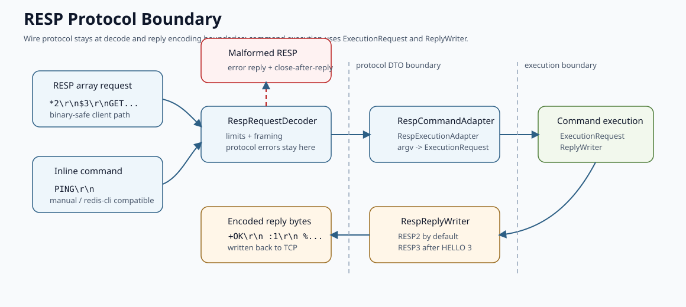

# Protocol Reference

本文说明 Yierdis 的公开 TCP 协议：客户端在线上发送 Redis RESP 请求，服务端默认写回 RESP2；同一连接执行 `HELLO 3` 后，后续回包会切到基础 RESP3 形态。

这篇文档重点回答三个问题：

- 客户端应该如何组织请求字节；
- 协议层如何把请求交给命令执行层；
- RESP2 / RESP3 回包、握手兼容和坏包断连分别怎么处理。

如果你想先建立项目整体视角，可以先看 [`project-overview.md`](./project-overview.md) 和 [`request-execution-flow.md`](./request-execution-flow.md)。

## 协议边界



Yierdis 把 Redis RESP 作为唯一公开协议入口，但它不是 Redis 的 drop-in replacement。

可以稳定依赖的是：

- 请求使用 RESP array/multibulk，inline command 只作为兼容和调试入口；
- 连接默认使用 RESP2 回包；
- `HELLO 2` / `HELLO 3` 可以切换当前连接的回包版本；
- `CLIENT SETINFO`、`CLIENT SETNAME`、`CLIENT GETNAME` 和 `AUTH` 提供最小客户端握手兼容；
- malformed RESP 会尽量返回 `-ERR Protocol error...`，然后关闭连接。

不应该从这篇文档推出的是：

- Yierdis 支持完整 Redis 命令集；
- RESP3 协商代表完整 RESP3 客户端生态兼容；
- `CLIENT`、`AUTH`、ACL、复制、集群或 Pub/Sub 已经按 Redis 完整语义实现。

命令语义以项目当前实现为准。协议层只负责“线上字节怎么进出”，不负责补齐 Redis 全量行为。

## 请求格式

### RESP array

正常 Redis 客户端会发送 RESP array。数组里的每个元素都是 bulk string：

- `argv[0]` 是命令名；
- `argv[1..]` 是命令参数；
- 参数是二进制安全的 byte array。

`GET a` 的完整请求字节是：

```text
*2\r\n$3\r\nGET\r\n$1\r\na\r\n
```

`SET a 1` 的完整请求字节是：

```text
*3\r\n$3\r\nSET\r\n$1\r\na\r\n$1\r\n1\r\n
```

日常使用时不需要手写这些字节，直接使用 Redis 客户端或 `redis-cli` 即可：

```bash
redis-cli -p 6378 SET a 1
redis-cli -p 6378 GET a
```

服务端 `RespRequestDecoder` 对 array 请求的约束是：

- multibulk header 必须是 `*<argc>\r\n`；
- `argc` 必须是非负整数，并且不能超过协议参数上限；
- 每个参数必须是 `$<len>\r\n<body>\r\n`；
- bulk length 必须是非负整数，并且不能超过 bulk 上限；
- bulk body 后必须紧跟 `\r\n`。

### Inline command

如果请求不是以 `*` 开头，`RespRequestDecoder` 会按 Redis inline command 尝试解析。它主要用于手工调试和基础兼容：

```text
PING\r\n
SET a 1\r\n
```

inline command 以 CRLF 结束，按空白切分参数，并支持单引号、双引号和部分反斜杠转义。它不适合承载任意二进制参数；需要二进制安全时应该使用 RESP array。

空白 inline 行会被忽略，不会生成命令请求。

## 协议上限

默认上限由 `RespProtocolLimits` 定义：

| 项目 | 默认值 | 服务端参数 |
| --- | ---: | --- |
| bulk string body | 512 MiB | `--protocolMaxBulkBytes` |
| 单条请求参数数量 | 1,048,576 | `--protocolMaxArgs` |
| inline/header 行长度 | 1 MiB | `--protocolMaxLineBytes` |

这组参数会在 server 启动时传给 `YierdisServerChannelInitializer`，再进入 `RespRequestDecoder`。

超过上限属于协议错误。服务端会写 RESP error reply，并关闭当前连接。这个策略刻意偏保守，因为超过上限后继续在同一连接上重同步请求边界并不可靠。

## 从 RESP 到执行请求

协议层不会直接执行命令。请求进入 server 后会经过这条桥：

```text
Netty ByteBuf
  -> RespRequestDecoder
  -> RespCommandRequest
  -> RespCommandAdapter
  -> RespExecutionAdapter
  -> ByteArrayExecutionRequest
```

边界分工如下：

- `RespRequestDecoder` 只理解 RESP / inline 字节、协议上限和协议错误；
- `RespCommandRequest` 是协议 DTO，保存 argv 和 retained bytes；
- `RespCommandAdapter` 是 Netty pipeline 中的适配 handler；
- `RespExecutionAdapter` 把 RESP argv 转成 transport-agnostic 的 `ExecutionRequest`；
- 命令层只依赖 `ExecutionRequest` 和 `ReplyWriter`，不直接拼 RESP 字节。

这条边界很重要：命令实现关心的是“第几个参数是什么”，不是“线上协议前缀应该写 `$` 还是 `%`”。

相关源码：

- [`RespRequestDecoder.java`](../../yierdis-networking/yierdis-networking-netty/src/main/java/yier/bubu/redis/protocol/resp/netty/RespRequestDecoder.java)
- [`RespCommandAdapter.java`](../../yierdis-networking/yierdis-networking-netty/src/main/java/yier/bubu/redis/protocol/resp/netty/RespCommandAdapter.java)
- [`RespExecutionAdapter.java`](../../yierdis-networking/yierdis-networking-resp/src/main/java/yier/bubu/redis/protocol/resp/RespExecutionAdapter.java)

## 回包格式

### 默认 RESP2

连接刚建立时使用 RESP2。常见回包形态如下：

```text
+OK\r\n
:1\r\n
$5\r\nhello\r\n
$-1\r\n
*2\r\n$1\r\na\r\n$1\r\nb\r\n
-ERR wrong number of arguments for 'get' command\r\n
```

`ReplyWriter` 到 RESP2 的主要映射是：

| 语义 API | RESP2 输出 |
| --- | --- |
| `simpleString("OK")` | `+OK\r\n` |
| `integer(1)` | `:1\r\n` |
| `bulkString(bytes)` | `$<len>\r\n<body>\r\n` |
| `nullValue()` | `$-1\r\n` |
| `nullArray()` | `*-1\r\n` |
| `arrayHeader(n)` | `*<n>\r\n` |
| `mapHeader(pairs)` | flat array，长度为 `pairs * 2` |
| `setHeader(n)` / `pushHeader(n)` | array |
| `booleanValue(true/false)` | integer `1` / `0` |
| `doubleValue(v)` | bulk string |
| `error(message)` | `-ERR ...\r\n` 或已有 Redis error prefix |

RESP2 是 `redis-cli`、Jedis、Lettuce 和 go-redis 的默认兼容目标。

### HELLO 和 RESP3

`HELLO` 用来协商当前连接的回包版本：

```bash
redis-cli -p 6378 HELLO 3
```

支持的形式是：

```text
HELLO
HELLO 2
HELLO 3
HELLO 2 SETNAME <name>
HELLO 3 SETNAME <name>
```

执行成功后，`EngineSession.respVersion()` 会更新为请求的版本，`RespReplyWriter` 后续根据 session 版本编码回包。

`HELLO` 返回 5 个字段：

| 字段 | 含义 |
| --- | --- |
| `server` | 固定为 `yierdis` |
| `version` | 当前构建版本 |
| `proto` | 当前连接协商后的 RESP 版本 |
| `mode` | 固定为 `standalone` |
| `role` | 固定为 `master` |

在 RESP2 下，`HELLO` reply 是 flat array；在 RESP3 下，reply 是 map。例如 `HELLO 3` 的响应以 `%5\r\n` 开头，且包含 `proto: 3`。

RESP3 下 `RespReplyWriter` 会使用这些基础类型：

| 语义 API | RESP3 输出 |
| --- | --- |
| `nullValue()` / `nullArray()` | `_\r\n` |
| `mapHeader(pairs)` | `%<pairs>\r\n` |
| `setHeader(n)` | `~<n>\r\n` |
| `pushHeader(n)` | `><n>\r\n` |
| `attributeHeader(pairs)` | attribute frame，prefix 是 `|` |
| `booleanValue(true/false)` | `#t\r\n` / `#f\r\n` |
| `doubleValue(v)` | `,<value>\r\n` |
| `bigNumberAscii(v)` | `(<value>\r\n` |
| `verbatimString(format, data)` | `=<len>\r\n<format>:<data>\r\n` |
| `blobError(message)` | `!<len>\r\n<message>\r\n` |

没有 RESP3 专属形态的语义仍按通用 RESP 表达，例如 simple string、integer、bulk string 和 array。

需要注意：

- `HELLO 2` 可以把同一连接切回 RESP2；
- 请求 `HELLO 4` 这类不支持版本会返回 `-NOPROTO unsupported protocol version`；
- `HELLO ... AUTH ...` 固定返回 no-password-configured 错误，因为项目没有认证配置面；
- `HELLO` 在 `MULTI` 中被禁止；
- RESP3 只表示回包编码协商，不表示完整 Redis RESP3 能力面。

## 客户端握手兼容

为了让常见 Redis 客户端更容易完成初始化握手，Yierdis 接受几个很小的兼容命令：

| 命令 | 行为 |
| --- | --- |
| `CLIENT SETINFO ...` | 返回 `OK`，不持久化 lib metadata |
| `CLIENT SETNAME <name>` | 记录当前连接名，返回 `OK` |
| `CLIENT GETNAME` | 返回当前连接名，未设置时返回 null |
| `AUTH ...` | 固定返回 Redis 风格 no-password-configured 错误 |

这些命令只解决基础握手和连接名状态，不代表完整 `CLIENT` 子命令集合、Redis ACL 或用户管理已经实现。

相关源码：

- [`ServerCommandModule.java`](../../yierdis-server/yierdis-server-main/src/main/java/yier/bubu/redis/app/server/ServerCommandModule.java)
- [`CoreConnectionCommands.java`](../../yierdis-command/yierdis-command-builtin/src/main/java/yier/bubu/redis/command/defaults/connection/CoreConnectionCommands.java)

## 协议错误和断连

malformed RESP 没有可靠的重同步点。Yierdis 的策略是：

1. 尽量写出 RESP error reply；
2. 标记 `close-after-reply`；
3. flush 后关闭连接。

这样可以避免坏请求后面的残留字节被错误地解释成下一条请求，导致请求和响应错配。

常见协议错误包括：

- multibulk header 非法；
- array 参数数量超过上限；
- array 元素不是 bulk string；
- bulk length 非法或超过上限；
- bulk body 没有以 `\r\n` 结束；
- inline command 行太长或格式非法；
- inline 参数数量超过上限。

协议错误由 `RespRequestDecoder` 产出 `RespProtocolError`，再由 `RespProtocolErrorReplyHandler` 写回。写回使用正常 `ReplyWriter`，因此错误本身仍是合法 RESP reply。

相关源码：

- [`RespProtocolError.java`](../../yierdis-networking/yierdis-networking-netty/src/main/java/yier/bubu/redis/protocol/resp/netty/RespProtocolError.java)
- [`RespProtocolErrorReplyHandler.java`](../../yierdis-networking/yierdis-networking-netty/src/main/java/yier/bubu/redis/protocol/resp/netty/RespProtocolErrorReplyHandler.java)

## 客户端侧 helper

仓库内置 CLI 和 benchmark 复用 `RespClientCodec`：

- `RespClientCodec.writeCommand(...)`
- `RespClientCodec.encodeCommand(...)`
- `RespClientCodec.readReply(...)`

`yierdis-cli` 使用真实 TCP 和真实 RESP。它保持一问一答模型，不做 pipelining；如果发生 timeout 或 reply parse failure，会主动关闭连接，避免迟到 reply 和下一条请求错配。

相关文档见 [`client-and-bench-internals.md`](./client-and-bench-internals.md)。

## 建议阅读的测试

如果你要改协议相关代码，优先看这些测试：

| 测试 | 重点 |
| --- | --- |
| `RespClientCodecTest` | client 侧 RESP command 编码和 reply 解析 |
| `RespRequestDecoderTest` | server 侧 RESP array、inline、协议上限和错误处理 |
| `RespReplyWriterTest` | RESP2 / RESP3 reply 编码 |
| `RespReplyWriterFactoryTest` | writer 如何从 session 获取当前 RESP version |
| `RespProtocolVersionTest` | RESP version 枚举和非法版本处理 |
| `RespProtocolLimitsTest` | 默认协议上限 |
| `RespHandshakeIntegrationTest` | `HELLO 2/3`、`SETNAME`、`AUTH` 和 `CLIENT` 兼容 |
| `RespProtocolErrorIntegrationTest` | malformed RESP 返回错误并关闭连接 |
| `RedisCliCompatibilityTest` | `redis-cli` 基础兼容 smoke |

## 总结

可以把 Yierdis 的协议模型记成一句话：

客户端发 Redis RESP array，服务端把 argv 转成 `ExecutionRequest` 执行；连接默认回 RESP2，`HELLO 3` 后回基础 RESP3；坏 RESP 会收到协议错误并断连。
