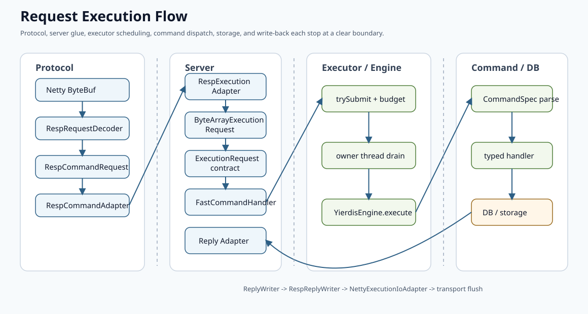

# Request Execution Flow

本文说明一条请求如何从网络入口进入 engine，再到命令解析、DB 读写和回包。

## 全局主链

当前官方主链是：



```text
Netty ByteBuf
  -> RespRequestDecoder
  -> RespCommandRequest
  -> RespCommandAdapter
  -> ExecutionRequest
  -> YierdisFastCommandHandler
  -> CommandExecutor.trySubmit(connection, request)
  -> owner thread
  -> YierdisEngine.execute(session, request, replyWriter)
  -> YierdisFastCommandProcessor
  -> CommandSpec<T>.parse(...)
  -> typed command handler
  -> DbEngine / DbReads / DbWrites
  -> yierdis-db-memory storage
  -> ReplyWriter
  -> NettyExecutionIoAdapter
  -> transport flush
```

这里最重要的边界是：

- protocol 只负责把网络数据解成协议 DTO；
- server 只负责连接、协议适配和 I/O glue；
- `yierdis-server-executor` 只负责排队、背压、closing 和 owner-thread 调度；
- engine 是命令执行入口；
- command 层负责 `CommandSpec<T>` 查找、解析、事务判定和 typed handler 分发；
- DB/storage 负责真实数据结构、TTL、maxmemory 和内存生命周期。

## 启动阶段

`YierdisServerBootstrap.startInternal()` 在真正接收请求前完成组装：

1. 根据 runtime config 创建 `YierdisInstance`。
2. 从 instance 拿到 `YierdisInstanceRuntimeAccess`、maintenance hook 和 observability。
3. 创建 `NettyServerInfoProvider`，绑定 runtime observability。
4. 创建 `DefaultYierdisEngine`，把 DB router、server info、slow governor、maintenance 和 server-local command module 交给 engine。
5. 创建 `CommandExecutor<NettyExecutionConnection>`，把 `commandEngine::execute` 作为唯一命令执行函数交给 executor。
6. `executor.start()` 在 owner thread 上调用 `runtimeAccess.bindToCurrentThread()`，固定 DB 访问线程。
7. Netty pipeline 开始接收外部请求。

因此 server bootstrap 是 composition root，不是命令语义的所有者。它可以接线，但不应该直接构造或调用 `YierdisFastCommandProcessor`。

## 连接状态

每个 channel 初始化时，`YierdisServerChannelInitializer` 会创建或获取一个 `NettyExecutionConnection`。

`NettyExecutionConnection` 是 server 侧连接根对象，拥有：

- Netty `Channel`；
- 一个 `EngineSession`；
- 一个 `ExecutionConnectionContext`。

这三类状态必须分开理解。

`EngineSession` 是 engine-owned 业务会话态，保存：

- 当前 DB index；
- transaction state；
- client id/name；
- authenticated 标记；
- `discardTransaction()` 关闭清理语义。

它还可以暴露一个只读 `ConnectionStatsView` 供 `INFO/STATS` 使用。真实 pending、backpressure 和计数器仍由 `ExecutionConnectionContext` 持有，`EngineSession` 只绑定 supplier，不拥有这些调度状态。

`ExecutionConnectionContext` 是 executor-local 调度状态，保存：

- pending command count；
- pending retained bytes；
- closing flag；
- input-disabled-by-executor flag；
- executor stats；
- fair scheduling queue state。

它不拥有 DB index、事务队列、client name 或认证状态。

## Pipeline

连接上的 pipeline 顺序是：

1. `writeBufferBackpressure`
2. `respRequestDecoder`
3. `respCommandAdapter`
4. `protocolErrorReply`
5. `commandHandler`

`RespRequestDecoder` 只产出协议请求或协议错误事件。`RespCommandAdapter` 把协议请求转换成 `ExecutionRequest`。`YierdisFastCommandHandler` 不执行命令，只调用 `CommandExecutor.trySubmit(...)`。

## ExecutionRequest

`ExecutionRequest` 是 protocol 和 command 之间的公共请求模型。

它的作用是：

- 让命令层不依赖 protocol DTO；
- 让 direct execution 和 transaction replay 使用同一份请求语义；
- 为队列和事务快照提供统一的 retained-bytes 生命周期。

旧的 `Command` 兼容入口已经不再是生产执行路径。生产执行只接受 `ExecutionRequest`。

## Executor

`CommandExecutor` 及其协作者位于 `yierdis-server/yierdis-server-executor`，不依赖 Netty，也不依赖 `yierdis-command-builtin`。

提交阶段由 `CommandExecutorSubmitter` 和 `ExecutorBacklogBudget` 负责：

- 检查 executor 是否运行；
- 检查全局 queue slot；
- 检查 queued bytes；
- 记录连接 pending / pendingBytes；
- 在达到高水位时通过 `ExecutorBackpressureController` 关闭输入。

执行阶段由 `CommandExecutorDrainLoop` 和 `CommandExecutorExecutionSupport` 负责：

1. 在 owner thread 上取出任务。
2. 如果连接已经 closing，跳过副作用并释放请求。
3. 通过 `ReplyWriterFactory` 创建 writer。
4. 调用 `CommandExecutionEngine.execute(session, request, writer)`。
5. 如果 writer 请求 close-after-reply，调用 `connection.markClosing()`。
6. 通过 `ExecutionIoAdapter` 写出 buffered reply。
7. 释放请求、slot 和 bytes 预算。
8. pending 降到低水位后恢复输入。

注意：executor 不再创建 `CommandContext`。它只把 `Session`、`ExecutionRequest` 和 `ReplyWriter` 交给 engine seam。

## Engine

`YierdisEngine` 的执行入口是：

```java
void execute(Session session, ExecutionRequest request, ReplyWriter out);
```

实际 server 传入的 `Session` 是 `EngineSession`。`DefaultYierdisEngine` 在内部创建 `CommandContext(session, out)`，再委托当前命令处理实现 `YierdisFastCommandProcessor`。

这一层的意义是把外部主链固定成：

```text
executor schedules; engine executes.
```

后续即使继续重构 `YierdisFastCommandProcessor`、事务实现或命令注册细节，server 和 executor 也不需要重新知道这些内部结构。

## CommandSpec 和命令分发

`YierdisFastCommandProcessor` 当前仍是 command 层的执行实现。它负责：

- 用 `ExecutionRequest` 查找 `CommandSpec<T>`；
- 在事务入队前运行同一个 parser；
- 把 parse error 映射成统一错误回复；
- 将解析结果交给 typed handler；
- 处理运行时异常和 change event gate。

命令注册只能走 `CommandSpec<T>`：

```text
CommandSpec<T> = descriptor + parser + typed handler + MULTI policy
```

server-local 命令也一样使用 typed spec；普通 server handler、executor、protocol、runtime 和 storage 都不应该重新解析命令参数。

## PING

`PING` 是最短路径：

1. `RespRequestDecoder`
2. `RespCommandAdapter`
3. `YierdisFastCommandHandler`
4. `CommandExecutor`
5. `YierdisEngine`
6. `YierdisFastCommandProcessor`
7. `CommandSpec<ExecutionRequest>.parse(...)`
8. `CoreConnectionCommands.ping(...)`
9. `ReplyWriter.simpleString("PONG")`
10. `NettyExecutionIoAdapter` 写回

它不访问 DB，主要验证协议适配、提交、owner-thread 执行和回包链路。

## SET

`SET` 更适合理解 DB 写路径：

1. `StringCommands.set(...)` 由 typed parser 解析 `NX/XX/GET/EX/PX/EXAT/PXAT/KEEPTTL`。
2. `CommandSupport.dbWrites(ctx)` 按 `EngineSession.dbIndex()` 通过 `YierdisDbRouter` 选 DB。
3. `YierdisStringOps.set(...)` 估算写入上界并构造 mutation。
4. `YierdisDbMutationExecutor.execute(...)` 先 reserve memory，再执行 mutation，最后 commit 或 rollback。
5. `YierdisDbKeyLifecycle.computeWithHandle(...)` 处理 keyspace、旧值释放、TTL、LRU touch 和内存记账。
6. `YierdisStringOps` 写入 `StringRoot`，再用 `EntryRecord` 记录 encoding、`ValueHandle`、TTL 和估算字节数。

这里的 `EntryHandle` / `ValueHandle` 都是 `NativeHandle` raw value 的包装，不是 native physical address。`EntryTable` 的 entry metadata 通过 production stable allocator 存储；对象移动、`realloc` 或 defrag 只更新 allocator object table，不要求命令路径重写 DB 引用。`ValueHandle` 当前主要由各 type root 解析，不等同于 object table slot。

命令层只看到 `DbReads/DbWrites` 能力接口，不直接改 `YierdisDb` 内部结构。

## 事务

事务状态现在属于 `EngineSession.transaction()`。

入队阶段：

```text
YierdisEngine.execute(...)
  -> YierdisFastCommandProcessor
  -> lookup CommandSpec
  -> parse request before queueing
  -> EngineSession.transaction.tryEnqueue(snapshot)
  -> QUEUED
```

`tryEnqueue(...)` 会使用 `ByteArrayExecutionRequest.copyOf(request)` 保存快照。这样原请求即使在 executor finally 中被释放，事务队列里的命令仍然独立存活。

`EXEC` 阶段：

```text
EXEC
  -> EngineSession.transaction.drain()
  -> TransactionCommands.exec(...)
  -> replay through YierdisFastCommandProcessor internal execution path
  -> same parser, handler, DB routing, error mapping, and change tracking rules
```

事务不是额外 IR。它排队和重放的都是 `ExecutionRequest` 快照。

## 变更事件

变更事件是 command processor 在命令成功执行后发出的 best-effort hook，当前用于
embedded/AOF/replication 风格扩展点。相关契约在 `yierdis-server-runtime-api`：

- `YierdisChangeEvent`
- `YierdisChangeSink`

事件载荷不是 DB 内部 diff，而是 `ExecutionRecord(dbIndex, request)`。这意味着消费端
看到的是“可重放的命令快照”，不会拿到 `EntryRecord`、`ValueHandle` 或 type root
这样的内部对象。

发射条件有三条：

1. 当前 processor 的 `YierdisChangeSink` 不是 `NOOP`。
2. 命令执行成功，没有在 parser、wrong-type、DB command error 或 handler 运行时错误处提前返回。
3. 本次命令造成真实变化，表现为 `CommandContext.changedAny()` 为 true。

第三条不是按命令名硬编码。DB/ops 写路径会返回 `MutationOutcome` 或带
`MutationOutcome` 的 `WriteResult<T>`；命令 handler 通过 `CommandSupport.recordMutation(...)`
把 value/TTL/keyspace 的真实变化记录到 `CommandContext`。例如 `SET key value NX`
因为 key 已存在而没有生效时，虽然它是写命令，仍不会发事件。

事务 replay 复用同一个 processor，所以 queued command 在 `EXEC` 中逐条执行时也走同一套
change gate。`EXEC` 自身只负责 drain 和数组回包，不代表整批事务只有一个合并事件。

`YierdisChangeSink.onChange(...)` 是 best-effort：sink 抛出的异常会被吞掉，不影响已经成功
写出的命令回复，也不会回滚 DB mutation。

## TTL 和 Maxmemory

storage pressure path 使用 key handle，而不是在热路径上把 key 统一物化为 heap `byte[]`。

当前规则：

- API 层有 `yier.bubu.redis.storage.api.KeyHandle`；
- DB 内部有 `yier.bubu.redis.storage.memory.internal.key.KeyHandle`，并实现 API handle；
- `MaxmemoryCandidate` 保存 `KeyHandle keyHandle`；
- TTL cleanup 通过 `randomKeyHandle()` 采样；
- maxmemory eviction 通过 `forEachKeyHandle(...)` / `randomKeyHandle()` 选择 victim。

heap `byte[]` 仍允许出现在协议边界、显式 materialization、测试和 client-facing 结果里，但不应该重新成为 TTL/maxmemory 压力路径的默认 key identity。

## 错误、关闭和背压

协议错误优先由 decoder 转成可回复的协议错误事件。无法安全恢复帧边界时，连接会关闭。

内部错误或 `QUIT` 会通过 `NettyExecutionConnection.markClosing()` 进入 closing。该方法先切换 `ExecutionConnectionContext` 的 closing flag，成功后丢弃 `EngineSession` 上的事务，避免已入队但未执行命令继续产生副作用。

背压由 executor 决定，Netty 只提供 `autoRead` 和 channel writability 这些机械开关。相关对象是：

- `CommandExecutorSubmitter`
- `ExecutorBacklogBudget`
- `ExecutorBackpressureController`
- `CommandExecutorDrainLoop`
- `ExecutionConnectionContext`
- `NettyExecutionIoAdapter`

## 建议先看的测试

- `yierdis-server/yierdis-server-core/src/test/java/yier/bubu/redis/execution/engine/DefaultYierdisEngineTest.java`
- `yierdis-server/yierdis-server-core/src/test/java/yier/bubu/redis/execution/engine/EngineSessionTest.java`
- `yierdis-server/yierdis-server-executor/src/test/java/yier/bubu/redis/execution/executor/CommandExecutorTest.java`
- `yierdis-server/yierdis-server-executor/src/test/java/yier/bubu/redis/execution/executor/ExecutionConnectionContextTest.java`
- `yierdis-server/yierdis-server-main/src/test/java/yier/bubu/redis/app/server/YierdisServerBootstrapCommandWiringTest.java`
- `yierdis-server/yierdis-server-main/src/test/java/yier/bubu/redis/app/server/TransactionQueueCleanupTest.java`
- `yierdis-tests/yierdis-integration-tests/src/test/java/yier/bubu/redis/integration/command/TransactionCommandTest.java`
- `yierdis-tests/yierdis-architecture-tests/src/test/java/yier/bubu/redis/ArchitectureBoundaryTest.java`

## 推荐打开的文件

- `yierdis-server/yierdis-server-main/src/main/java/yier/bubu/redis/app/server/YierdisServerBootstrap.java`
- `yierdis-server/yierdis-server-main/src/main/java/yier/bubu/redis/app/server/YierdisServerChannelInitializer.java`
- `yierdis-server/yierdis-server-main/src/main/java/yier/bubu/redis/app/server/NettyExecutionConnection.java`
- `yierdis-networking/yierdis-networking-netty/src/main/java/yier/bubu/redis/protocol/resp/netty/RespCommandAdapter.java`
- `yierdis-server/yierdis-server-main/src/main/java/yier/bubu/redis/app/server/YierdisFastCommandHandler.java`
- `yierdis-server/yierdis-server-executor/src/main/java/yier/bubu/redis/execution/executor/CommandExecutor.java`
- `yierdis-server/yierdis-server-executor/src/main/java/yier/bubu/redis/execution/executor/CommandExecutorExecutionSupport.java`
- `yierdis-server/yierdis-server-core/src/main/java/yier/bubu/redis/execution/engine/YierdisEngine.java`
- `yierdis-server/yierdis-server-core/src/main/java/yier/bubu/redis/execution/engine/EngineSession.java`
- `yierdis-command/yierdis-command-core/src/main/java/yier/bubu/redis/command/kernel/YierdisFastCommandProcessor.java`
- `yierdis-command/yierdis-command-api/src/main/java/yier/bubu/redis/command/api/CommandSpec.java`
- `yierdis-db/yierdis-db-memory/src/main/java/yier/bubu/redis/storage/memory/YierdisDbMaxmemorySupport.java`
- `yierdis-db/yierdis-db-memory/src/main/java/yier/bubu/redis/storage/memory/internal/expire/YierdisDbExpirationSupport.java`

如果你想继续理解模块边界，接着看 [`module-architecture.md`](./module-architecture.md)。
