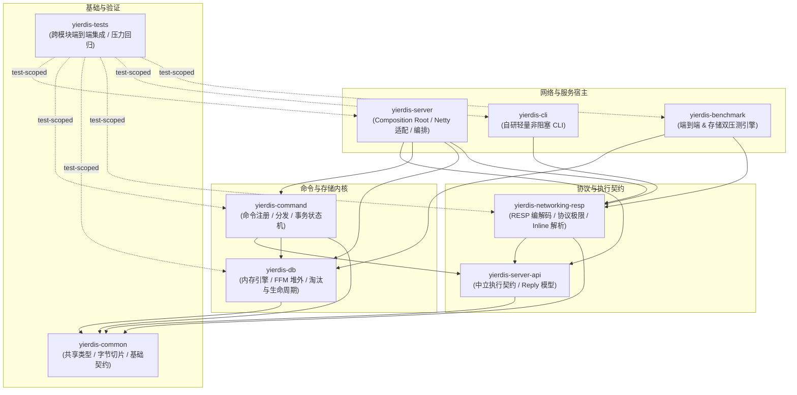
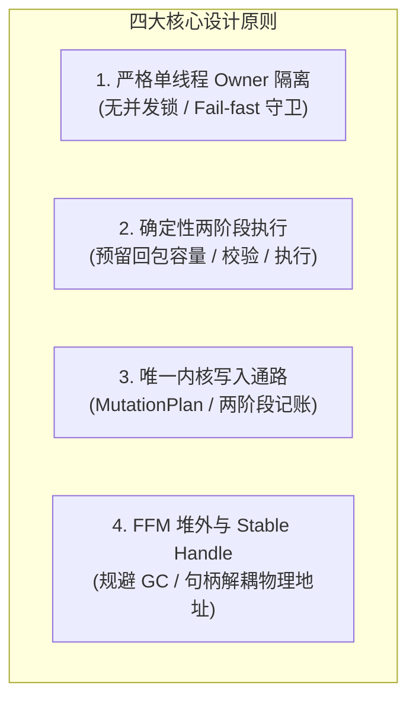

# 源码阅读指南

面向希望深入理解 Yierdis 系统设计、核心架构与内部执行机制的工程师。本文提供从全局认知建立到代码级穿透的完整阅读路线。

---

## 0. 阅读前置与工程全景

### 0.1 环境前置要求与 IDE 调试准备
- **Java 版本**：强依赖 **JDK 25**（本项目重度使用 Java 25 的 Foreign Function & Memory (FFM) API）。
- **本地环境命令**（非交互式 Shell 或脚本前缀）：
  ```bash
  JAVA_HOME=/usr/lib/jvm/java-25-openjdk-amd64 PATH=/usr/lib/jvm/java-25-openjdk-amd64/bin:$PATH mvn test
  ```
- **IDE 配置**：
  - IntelliJ IDEA / VS Code 请确保 Project SDK / Language Level 设为 **25**。
  - 编译器选项会自动读取父 POM 的 `<maven.compiler.release>25</maven.compiler.release>` 与 Lombok 处理器配置 `<proc>full</proc>`。

### 0.2 九大 Maven 模块依赖拓扑与职责边界

Yierdis 严格遵循单向依赖与分层隔离原则。阅读源码时请牢记下述依赖方向（以各模块 `pom.xml` 为准，箭头由依赖方指向被依赖方）：



**核心依赖护栏约束**：
- `yierdis-db` **绝不依赖** `yierdis-server`、`yierdis-command` 或 `yierdis-networking-resp`，是纯净的内存存储内核。
- `yierdis-command` **不依赖 Netty**，仅依赖 `server-api` 的中立契约与 `db` 的 typed ops。
- `yierdis-server` 是唯一的系统组装根（Composition Root）。

---

## 1. 四大核心心智模型

读代码前，先建立以下四个核心心智模型，有助于理解代码中的各种约束和抽象设计：



### 1.1 严格单线程 Owner 隔离模型
- **现象**：在 `yierdis-db` 模块中几乎找不到 `synchronized`、`ReentrantLock` 或并发容器。
- **原理**：Netty I/O EventLoop 仅负责网络收发包与协议解码。所有 DB 访问、状态修改均交由唯一的 `command owner thread`（由 [`CommandExecutor.java`](../../yierdis-server/yierdis-server/src/main/java/yier/bubu/redis/execution/executor/CommandExecutor.java) 绑定）调度执行。非 Owner 线程直接访问 DB 会立即触发 fail-fast 异常。
- **推论**：读写均无锁竞争开销，但要求耗时逻辑绝不能阻塞 Owner 线程。

### 1.2 确定性两阶段执行与回复容量预留
- **现象**：命令不是直接 `execute()` 并写出响应，而是先解析为 [`PreparedCommand.java`](../../yierdis-server/yierdis-server-api/src/main/java/yier/bubu/redis/execution/api/PreparedCommand.java)。
- **原理**：链路固定为 `reserve -> validate -> execute -> render`。在执行具体写操作之前，必须先按 `reservationShape()` 向系统申请回复缓冲区配额；配额满足且状态校验通过后才真正执行 DB 变更。
- **推论**：杜绝了“数据已写入 DB，但回包缓冲区 OOM 无法通知客户端”的半成功与协议破损状态。

### 1.3 唯一的内核写入通路与内存账本
- **现象**：任何数据增删改（包括普通写入、Lazy Expire、Active Expire、Maxmemory 驱逐、`FLUSHDB`、增量 Rehash）绝不直接操作数据结构底层指针。
- **原理**：全部写入操作必须构造 `MutationPlan`，通过 [`YierdisDbKernel.java`](../../yierdis-db/src/main/java/yier/bubu/redis/storage/memory/YierdisDbKernel.java) 统一提交。写前按上界预扣内存账本（Ledger），写后按实际消耗收窄并最终结算。

### 1.4 JDK 25 FFM 堆外内存与 Stable Handle
- **现象**：键值存储在堆外 Native 内存中，但 Java 代码中引用的并不是直接的裸指针或连续内存地址（如 `long address`）。
- **原理**：基于 Java 25 的 Foreign Function & Memory (FFM) API，系统通过 Stable Handle（稳定逻辑句柄）抽象出对象标识。
- **推论**：底层内存分配器在进行跨段搬迁、整理碎片（Defrag）或扩容时，只需更新句柄与物理内存的映射，上层持有的 Handle 保持稳定不变，彻底杜绝悬垂指针。

---

## 2. 面向目标的分类阅读路线

根据你的学习目标与时间，推荐选择以下定制路径：

| 学习目标 | 建议耗时 | 推荐精读模块与顺序 | 核心关注源码 |
| :--- | :--- | :--- | :--- |
| **A. 架构全景速通** | 30 分钟 | 引导组装 → 请求主链路 → 命令分发 | [`YierdisServerBootstrap.java`](../../yierdis-server/yierdis-server/src/main/java/yier/bubu/redis/app/server/YierdisServerBootstrap.java) → [`CommandExecutor.java`](../../yierdis-server/yierdis-server/src/main/java/yier/bubu/redis/execution/executor/CommandExecutor.java) → [`CommandDispatcher.java`](../../yierdis-command/src/main/java/yier/bubu/redis/command/kernel/CommandDispatcher.java) |
| **B. 高性能网络与并发** | 2 小时 | Netty Ingress → 请求 Lease → 背压流控 → 回复写回 | [`RespRequestDecoder.java`](../../yierdis-server/yierdis-server/src/main/java/yier/bubu/redis/protocol/resp/netty/RespRequestDecoder.java) → [`ExecutorBackpressureController.java`](../../yierdis-server/yierdis-server/src/main/java/yier/bubu/redis/execution/executor/ExecutorBackpressureController.java) → [`ConnectionReplySequencer.java`](../../yierdis-server/yierdis-server/src/main/java/yier/bubu/redis/app/server/ConnectionReplySequencer.java) |
| **C. 存储内核与 FFM 堆外** | 4 小时 | 两阶段内核 → 开放寻址表与 EntryTable → Native 页面分配与 Handle | [`YierdisDbKernel.java`](../../yierdis-db/src/main/java/yier/bubu/redis/storage/memory/YierdisDbKernel.java) → [`NativeKeyDirectory.java`](../../yierdis-db/src/main/java/yier/bubu/redis/storage/memory/internal/keyspace/NativeKeyDirectory.java) → [`YierdisNativeObjectTable.java`](../../yierdis-db/src/main/java/yier/bubu/redis/memory/foreign/YierdisNativeObjectTable.java) → [`YierdisFfmStableMemoryBackend.java`](../../yierdis-db/src/main/java/yier/bubu/redis/memory/foreign/YierdisFfmStableMemoryBackend.java) |
| **D. 命令扩展与功能共建** | 1 小时 | 命令规范定义 → 语法校验 → 准备闭包 → 隔离测试 | [`CommandSpec.java`](../../yierdis-command/src/main/java/yier/bubu/redis/command/api/CommandSpec.java) → [`DefaultCommandModules.java`](../../yierdis-command/src/main/java/yier/bubu/redis/command/defaults/DefaultCommandModules.java) → [`development-navigation.md`](./development-navigation.md) |

---

## 3. 源码六阶段深度精读路线


### 阶段一：服务引导与自顶向下跟踪一条请求（Bootstrap & Request Execution Flow）

从服务如何初始化配置开始，跟踪一条简单的 `SET a 1` 或 `PING`：请求如何从 Socket 字节流流入、经过线程切换执行、再格式化写回。

* **核心调用链路**：
  ```text
  YierdisServer.main -> YierdisServerFileConfig (解析 yierdis.conf)
    -> YierdisServerBootstrap.start (装配 Netty EventLoop 与 CommandExecutor)
  Netty Socket Inbound
    -> RespRequestDecoder (解析 RESP Frame, InboundMemoryBudget 准入检查)
    -> ByteArrayExecutionRequest (封装参数, lease 内存租约)
    -> NettyExecutionRequestIngress -> CommandExecutor (切入 Owner 线程排队)
    -> CommandDispatcher.prepare(...)
    -> PreparedCommand.reserve(...) -> execute(...)
    -> RedisReplyRenderer (渲染语义结果)
    -> RespReplyWriter (编码为 RESP 字节) -> Netty Write-back
  ```
* **核心源码文件**：
  1. [`YierdisServerFileConfig.java`](../../yierdis-server/yierdis-server/src/main/java/yier/bubu/redis/app/server/args/YierdisServerFileConfig.java)：配置文件与启动参数解析器。
  2. [`YierdisServerBootstrap.java`](../../yierdis-server/yierdis-server/src/main/java/yier/bubu/redis/app/server/YierdisServerBootstrap.java)：系统 Composition Root，组装管道与多 EventLoop。
  3. [`RespRequestDecoder.java`](../../yierdis-server/yierdis-server/src/main/java/yier/bubu/redis/protocol/resp/netty/RespRequestDecoder.java)：Netty 入站解码器，重点看分配缓冲区前的 Inbound 准入限制。
  4. [`ByteArrayExecutionRequest.java`](../../yierdis-server/yierdis-server-api/src/main/java/yier/bubu/redis/execution/api/ByteArrayExecutionRequest.java)：请求参数所有权模型（`takeOwnership` / `retain` / `copyOf`）。
  5. [`CommandExecutor.java`](../../yierdis-server/yierdis-server/src/main/java/yier/bubu/redis/execution/executor/CommandExecutor.java)：核心调度器，观察线程切换点与 Owner 线程绑定的过程。
  6. [`RedisReplyRenderer.java`](../../yierdis-server/yierdis-server-api/src/main/java/yier/bubu/redis/execution/api/RedisReplyRenderer.java) & [`RespReplyWriter.java`](../../yierdis-networking-resp/src/main/java/yier/bubu/redis/protocol/resp/RespReplyWriter.java)：语义结果向具体 RESP 协议（RESP2/RESP3）序列化的过程。
* **配套专题文档**：[`request-execution-flow.md`](./request-execution-flow.md)、[`bytes-and-fast-paths.md`](./bytes-and-fast-paths.md)。

---

### 阶段二：命令抽象、分发与事务机制（Command & Transaction）

理解 Redis 风格命令的解耦抽象，以及为什么事务没有使用简单的嵌套执行。

* **关键设计点**：
  - **参数解析与执行分离**：[`CommandSpec.java`](../../yierdis-command/src/main/java/yier/bubu/redis/command/api/CommandSpec.java) 的 Handler 仅负责将 `CommandArgs` 解析为准备函数 `Function<CommandSession, PreparedCommand>`，绝对不持有连接上下文或 DB 实例。
  - **事务排队（`MULTI`/`EXEC`）**：在事务状态下收到命令时，并不直接创建绑定特定 DB/Session 的执行命令，而是仅通过 Handler 执行语法与参数 preflight 检查，并保存 retained request；在 `EXEC` 时才由 Dispatcher 重新 replay、统一预留并执行。
  - **架构护栏测试保障**：查看 [`CommandParseIsolationTest.java`](../../yierdis-command/src/test/java/yier/bubu/redis/command/kernel/CommandParseIsolationTest.java)，验证 Handler parse 严禁访问 DB 服务的强约束机制。
* **核心源码文件**：
  1. [`CommandRegistry.java`](../../yierdis-command/src/main/java/yier/bubu/redis/command/kernel/CommandRegistry.java) & [`CommandDispatcher.java`](../../yierdis-command/src/main/java/yier/bubu/redis/command/kernel/CommandDispatcher.java)：命令注册表与分发器。
  2. [`DefaultCommandModules.java`](../../yierdis-command/src/main/java/yier/bubu/redis/command/defaults/DefaultCommandModules.java)：默认八大家族命令（String, List, Hash, Set, ZSet, HLL, Keyspace, TTL）的注册装配入口。
  3. [`StringCommands.java`](../../yierdis-command/src/main/java/yier/bubu/redis/command/defaults/string/StringCommands.java)：典型命令族实现，重点观察 `SET` 和 `GET` 的 `PreparedCommand` 构建。
  4. [`EngineSession.java`](../../yierdis-server/yierdis-server/src/main/java/yier/bubu/redis/execution/engine/EngineSession.java)：每连接的状态隔离（DB 选择、事务队列等）。
* **配套专题文档**：[`commands-and-data-model.md`](./commands-and-data-model.md)、[`command-parsing-and-dispatch.md`](./command-parsing-and-dispatch.md)、[`transaction-and-replay.md`](./transaction-and-replay.md)。

---

### 阶段三：DB 存储引擎与多数据结构（Storage & Collections）

进入 `yierdis-db` 模块，理解内存中键空间组织以及各数据类型的物理存储方式。

* **关键设计点**：
  - **键空间索引**：[`NativeKeyDirectory.java`](../../yierdis-db/src/main/java/yier/bubu/redis/storage/memory/internal/keyspace/NativeKeyDirectory.java) 采用开放寻址哈希表（Open Addressing with Linear Probing），内置平滑的渐进式 Rehash 步长与墓碑（Tombstone）复用机制。`SCAN` 族游标委托 [`OpenAddressingTopology.scan`](../../yierdis-db/src/main/java/yier/bubu/redis/storage/memory/internal/hash/OpenAddressingTopology.java) 的反向二进制本位槽推进；`MIGRATED_SCAN_SHADOW` 只服务删除/反查路径，不再给 SCAN 补扫。
  - **紧凑 Entry 布局**：[`EntryTable.java`](../../yierdis-db/src/main/java/yier/bubu/redis/storage/memory/internal/entry/EntryTable.java) 将每个 Key 对应的元数据打包成 72 字节的 `ENTRY_RECORD`（包含 Key/Value Handle、类型、编码、TTL deadline、LRU/LFU 时钟）。
  - **两阶段写入与账本**：在写入变更前计算上界内存预扣（Reserve Upper Bound），执行后收窄，提交后结账。
  - **多数据结构族落地**：各类数据操作通过 Typed Ops 实现，在保证堆外连续存储的同时封装了数据编码。
* **核心源码文件**：
  1. [`YierdisDb.java`](../../yierdis-db/src/main/java/yier/bubu/redis/storage/memory/YierdisDb.java)：单库入口，装配 typed ops 门面。
  2. [`YierdisDbKernel.java`](../../yierdis-db/src/main/java/yier/bubu/redis/storage/memory/YierdisDbKernel.java)：统一的写路径内核调度。
  3. [`NativeKeyDirectory.java`](../../yierdis-db/src/main/java/yier/bubu/redis/storage/memory/internal/keyspace/NativeKeyDirectory.java)：键目录与拓扑结构。
  4. [`EntryTable.java`](../../yierdis-db/src/main/java/yier/bubu/redis/storage/memory/internal/entry/EntryTable.java)：72 字节元数据结构与字段偏移。
  5. **各数据类型操作实现**：
     - [`YierdisStringOps.java`](../../yierdis-db/src/main/java/yier/bubu/redis/storage/memory/YierdisStringOps.java)：字符串与 Bitmap 操作。
     - [`YierdisHashOps.java`](../../yierdis-db/src/main/java/yier/bubu/redis/storage/memory/YierdisHashOps.java)：哈希字典结构。
     - [`YierdisListOps.java`](../../yierdis-db/src/main/java/yier/bubu/redis/storage/memory/YierdisListOps.java)：列表存储。
     - [`YierdisSetOps.java`](../../yierdis-db/src/main/java/yier/bubu/redis/storage/memory/YierdisSetOps.java) & [`YierdisZSetOps.java`](../../yierdis-db/src/main/java/yier/bubu/redis/storage/memory/YierdisZSetOps.java)：集合与有序集合。
     - [`YierdisHllOps.java`](../../yierdis-db/src/main/java/yier/bubu/redis/storage/memory/YierdisHllOps.java)：HyperLogLog 基数统计。
* **配套专题文档**：[`db-internals.md`](./db-internals.md)、[`db-design-analysis.md`](./db-design-analysis.md)、[`commands-and-data-model.md`](./commands-and-data-model.md)。

---

### 阶段四：硬核底座——JDK 25 FFM 堆外内存运行时（Native Memory Runtime）

深入探索 Java 25 的 `java.lang.foreign` API 在高性能存储引擎中的实践。

* **关键设计点**：
  - **物理隔离与 Handle 抽象**：为什么不直接在内存中传递裸物理地址？为了支持底层的内存紧凑化（Compaction）和碎片整理（Defrag），系统引入 `StableMemoryHandle`。物理地址发生变动时，Handle 逻辑映射保持不变。
  - **物理分页分配与 Size-Class**：通过分级 Page Allocator 管理 Native 段，有效抑制内存外碎片并提高分配吞吐。
  - **堆外拷贝边界认知**：区分“用户态内存拷贝”与“内核态上下文切换”。堆外直接传输并不是在所有路径上都等于绝对零拷贝，弄清每一次数据在 Socket、JVM Heap 与 Native Memory 之间的流转成本。
* **核心源码文件**：
  1. [`YierdisFfmStableMemoryBackend.java`](../../yierdis-db/src/main/java/yier/bubu/redis/memory/foreign/YierdisFfmStableMemoryBackend.java)：底层基于 FFM Arena / MemorySegment 的分配器实现。
  2. [`YierdisNativeObjectTable.java`](../../yierdis-db/src/main/java/yier/bubu/redis/memory/foreign/YierdisNativeObjectTable.java)：Stable Handle 与实际物理内存段/偏移量映射的核心数据结构，负责 Handle 生成、解引用与安全回收。
  3. [`YierdisNativePageAllocator.java`](../../yierdis-db/src/main/java/yier/bubu/redis/memory/foreign/YierdisNativePageAllocator.java) & [`YierdisNativeSizeClass.java`](../../yierdis-db/src/main/java/yier/bubu/redis/memory/foreign/YierdisNativeSizeClass.java)：堆外物理页分配器与大小规格分级。
  4. [`YierdisLocalHandleCodec.java`](../../yierdis-db/src/main/java/yier/bubu/redis/memory/foreign/YierdisLocalHandleCodec.java)：句柄结构位运算编解码。
* **配套专题文档**：[`native-memory-runtime.md`](./native-memory-runtime.md)、[`native-allocator-and-handles.md`](./native-allocator-and-handles.md)、[`offheap-copy-behavior.md`](./offheap-copy-behavior.md)。

---

### 阶段五：系统保护与运维韧性（Backpressure & Eviction）

理解高负载与内存吃紧时，系统如何进行过载保护以及优雅退出。

* **核心机制**：
  - **背压控制（Backpressure）**：当 Executor 队列积压超过高水位，或者写回通道未决字节过多时，系统通过 `channel.config().setAutoRead(false)` 暂停从客户端 Socket 读取，待队列水位下降至低水位后再恢复读取。
  - **过期生命周期（TTL）**：结合读时惰性删除（Lazy Expire）与 Maintenance 周期性抽样清除（Active Expire），并施加严格的时间片配额。
  - **内存驱逐（Eviction）**：Maxmemory 达到硬顶后，通过多候选抽样池（Approximate LRU/LFU Pool）选取牺牲者执行淘汰。
  - **优雅停机（Graceful Shutdown）**：停止监听端口、Drain 排队请求、保障已提交变更发出响应、界定“Result-Unknown”边界并释放 Native Arena。
* **核心源码文件**：
  1. [`ExecutorBackpressureController.java`](../../yierdis-server/yierdis-server/src/main/java/yier/bubu/redis/execution/executor/ExecutorBackpressureController.java)：全链路背压控制器，管理读暂停与唤醒。
  2. [`InboundMemoryBudget.java`](../../yierdis-server/yierdis-server/src/main/java/yier/bubu/redis/protocol/resp/netty/InboundMemoryBudget.java) & [`OutboundMemoryBudget.java`](../../yierdis-server/yierdis-server/src/main/java/yier/bubu/redis/app/server/OutboundMemoryBudget.java)：入站请求与出站回包的内存限额账本。
  3. [`YierdisDbDataMaintenance.java`](../../yierdis-db/src/main/java/yier/bubu/redis/storage/memory/YierdisDbDataMaintenance.java)：后台维护任务入口，负责周期性主动过期扫描与增量 Rehash 步进。
  4. [`YierdisDbExpirationSupport.java`](../../yierdis-db/src/main/java/yier/bubu/redis/storage/memory/YierdisDbExpirationSupport.java)：过期判定与主动抽样清理逻辑。
  5. [`YierdisDbMaxmemorySupport.java`](../../yierdis-db/src/main/java/yier/bubu/redis/storage/memory/YierdisDbMaxmemorySupport.java)：近似 LRU/LFU 驱逐算法与牺牲者抽样池。
  6. [`MemoryLedger.java`](../../yierdis-db/src/main/java/yier/bubu/redis/storage/memory/internal/ledger/MemoryLedger.java)：存储层内存用量账本。
* **配套专题文档**：[`executor-and-backpressure.md`](./executor-and-backpressure.md)、[`maxmemory-and-eviction.md`](./maxmemory-and-eviction.md)、[`configuration-and-operations.md`](./configuration-and-operations.md)。

---

### 阶段六：客户端交互与基准测试内核（Client & Benchmarking Runtime）

理解 Yierdis 项目自带的轻量客户端与高吞吐基准测试引擎设计。

* **关键设计点**：
  - **轻量独立 Client**：`yierdis-cli` 仅依赖 `yierdis-networking-resp`，不依赖 Netty，使用极简非阻塞 I/O 驱动 RESP 协议交互。
  - **双压测模式**：
    - **网络端到端压测（Redis Benchmark）**：采用非阻塞 NIO 事件轮询与 Pipelining 流水线，通过 `HdrHistogram` 精准记录端到端 P99 延迟，规避协调遗漏（Coordinated Omission）。
    - **隔离存储微基准测试（Storage Benchmark）**：绕开 TCP/IP 与网络协议栈，直接在当前线程对 `YierdisDb` 执行单 Owner 极限压测，测量底层数据结构 hot path 真实吞吐与精确 RSS 内存开销。
* **核心源码文件**：
  1. [`YierdisCli.java`](../../yierdis-cli/src/main/java/yier/bubu/redis/app/client/YierdisCli.java) & [`YierdisClient.java`](../../yierdis-cli/src/main/java/yier/bubu/redis/app/client/YierdisClient.java)：客户端入口与底层通信实现。
  2. [`YierdisBench.java`](../../yierdis-benchmark/src/main/java/yier/bubu/redis/app/bench/YierdisBench.java)：压测工具统一入口。
  3. [`NioBenchmarkRunner.java`](../../yierdis-benchmark/src/main/java/yier/bubu/redis/app/bench/redis/NioBenchmarkRunner.java)：端到端高并发压测执行器。
  4. [`StorageBenchmarkRunner.java`](../../yierdis-benchmark/src/main/java/yier/bubu/redis/app/bench/storage/StorageBenchmarkRunner.java)：进程内单机 DB 极限压测执行器。
* **配套专题文档**：[`client-and-bench-internals.md`](./client-and-bench-internals.md)。

---

## 4. 动手实战与多场景断点调试指南

建议在 IDE 中以调试模式单步跟踪以下核心测试用例，深入理解内部机制：

### 4.1 场景一：单 Key 基础写入与两阶段预留
- **测试类**：`StringCommandTest`
- **运行命令**：
  ```bash
  JAVA_HOME=/usr/lib/jvm/java-25-openjdk-amd64 PATH=/usr/lib/jvm/java-25-openjdk-amd64/bin:$PATH \
    mvn -pl yierdis-tests -am -Dtest=StringCommandTest test
  ```
- **关键断点序列**：
  1. [`RespRequestDecoder.java`](../../yierdis-server/yierdis-server/src/main/java/yier/bubu/redis/protocol/resp/netty/RespRequestDecoder.java) 的 `decode` 方法：观察入站字节流切分为参数，以及 Inbound 准入内存账本变化。
  2. [`CommandExecutor.java`](../../yierdis-server/yierdis-server/src/main/java/yier/bubu/redis/execution/executor/CommandExecutor.java) 的 `drainLoop`：观察线程如何从 Netty I/O EventLoop 切换为 Command Owner Thread。
  3. [`StringCommands.java`](../../yierdis-command/src/main/java/yier/bubu/redis/command/defaults/string/StringCommands.java) 的 `prepareSet`：观察 `PreparedCommand` 构建与回包尺寸预留。
  4. [`YierdisDbKernel.java`](../../yierdis-db/src/main/java/yier/bubu/redis/storage/memory/YierdisDbKernel.java) 的 `execute(MutationPlan)`：观察预留内存账本、写入 Key 目录与 EntryTable、最终结算。

### 4.2 场景二：事务 `MULTI` / `EXEC` 排队与 Replay
- **测试类**：`TransactionCommandTest`
- **运行命令**：
  ```bash
  JAVA_HOME=/usr/lib/jvm/java-25-openjdk-amd64 PATH=/usr/lib/jvm/java-25-openjdk-amd64/bin:$PATH \
    mvn -pl yierdis-tests -am -Dtest=TransactionCommandTest test
  ```
- **关键断点**：
  - [`CommandDispatcher.java`](../../yierdis-command/src/main/java/yier/bubu/redis/command/kernel/CommandDispatcher.java) 的事务判断分支：观察在 `session.inTransaction()` 状态下，普通命令如何仅完成语法 check 并暂存为 `retained request` 返回 `QUEUED`。
  - `TransactionCommands.java` 的 `EXEC` 准备逻辑：观察在执行 `EXEC` 时，如何统一取出暂存请求并在同一原子事务上下文内重新 replay 派发。

### 4.3 场景三：全链路背压与 `setAutoRead` 抑制
- **测试类**：`CommandExecutorBackpressureTest`
- **运行命令**：
  ```bash
  JAVA_HOME=/usr/lib/jvm/java-25-openjdk-amd64 PATH=/usr/lib/jvm/java-25-openjdk-amd64/bin:$PATH \
    mvn -pl yierdis-server/yierdis-server -am -Dtest=CommandExecutorBackpressureTest test
  ```
- **关键断点**：
  - [`ExecutorBackpressureController.java`](../../yierdis-server/yierdis-server/src/main/java/yier/bubu/redis/execution/executor/ExecutorBackpressureController.java) 的 `pauseReading`：观察队列堆积字节触发高水位时，对 Netty Channel 调用 `config().setAutoRead(false)` 暂停进包。
  - `resumeReading`：观察在任务被 Owner 线程消费且水位回落至低水位后恢复读取。

### 4.4 场景四：内存触顶与近似 LRU 抽样驱逐
- **测试类**：`MaxmemoryEvictionTest`
- **运行命令**：
  ```bash
  JAVA_HOME=/usr/lib/jvm/java-25-openjdk-amd64 PATH=/usr/lib/jvm/java-25-openjdk-amd64/bin:$PATH \
    mvn -pl yierdis-tests -am -Dtest=MaxmemoryEvictionTest test
  ```
- **关键断点**：
  - [`YierdisDbMaxmemorySupport.java`](../../yierdis-db/src/main/java/yier/bubu/redis/storage/memory/YierdisDbMaxmemorySupport.java) 的 `performEviction`：观察当内存超出 `maxmemory` 时，如何从随机采样中构建候选淘汰池（Eviction Pool）并挑选空闲时间最长（IDLE 最久）的 Key 进行两阶段删除。

### 4.5 场景五：渐进式 Rehash 与反向二进制 SCAN 游标
- **测试类**：`HashTableMaintenanceTest`、`NativeByteMapTest`、`ScanCursorContractTest`
- **运行命令**：
  ```bash
  JAVA_HOME=/usr/lib/jvm/java-25-openjdk-amd64 PATH=/usr/lib/jvm/java-25-openjdk-amd64/bin:$PATH \
    mvn -pl yierdis-db,yierdis-tests -am \
    -Dtest=HashTableMaintenanceTest,NativeByteMapTest,ScanCursorContractTest test
  ```
- **关键断点**：
  - [`OpenAddressingTopology.java`](../../yierdis-db/src/main/java/yier/bubu/redis/storage/memory/internal/hash/OpenAddressingTopology.java) 的 `scan`：观察反向二进制游标如何在扩容/双表期继续推进，以及 `visitHomeSlot` 为何只交出本位匹配的 `FILLED`。
  - 同文件的迁移路径：`FILLED` → `MIGRATED_SCAN_SHADOW` 如何保住 old 探测链，供 `invalidateOldShadow` / 反查使用（与 SCAN 发射路径分离）。

---

## 5. 架构护栏测试与设计意图

为了防止后续开发破坏核心架构约束，项目内建了一套特殊的“架构测试护栏”。阅读这些测试有助于理解作者的深层设计约束：

1. [`CommandParseIsolationTest.java`](../../yierdis-command/src/test/java/yier/bubu/redis/command/kernel/CommandParseIsolationTest.java)：
   - **护栏规则**：命令 Handler 在 `parse` 阶段严禁调用 DB 实例或会话状态，只允许生成闭包。测试会注入一旦调用即抛异常的 Mock DB/Provider，确保 parse 与 execute 严格物理隔离。
2. [`YierdisDbArchitectureGuardTest.java`](../../yierdis-db/src/test/java/yier/bubu/redis/storage/memory/YierdisDbArchitectureGuardTest.java)：
   - **护栏规则**：验证 `yierdis-db` 模块内部不包含任何对 Netty、RESP 协议包的逆向依赖，确保存储内核绝对纯粹。
3. [`DbEngineReadWriteBoundaryTest.java`](../../yierdis-db/src/test/java/yier/bubu/redis/storage/memory/DbEngineReadWriteBoundaryTest.java)：
   - **护栏规则**：确保所有的写操作必须构造 `MutationPlan` 走内核写通路，杜绝直接绕开内存账本修改底层数据结构。

---

## 6. 读后自我检验清单

若能对以下各领域的关键设计问题给出清晰推导与源码定位，说明你已真正吃透本项目的核心架构：

### 6.1 线程模型、事件循环与全链路背压
- [ ] **问题 1（无锁并发设计）**：为什么 Yierdis 访问 DB 既不用 `synchronized` 也不用 `ReentrantLock` 甚至不用 CAS？单线程 Owner 模型的最大优势与绝对禁忌是什么？  
  *思考线索*：[`CommandExecutor`](../../yierdis-server/yierdis-server/src/main/java/yier/bubu/redis/execution/executor/CommandExecutor.java) 的线程守卫、DB 访问的 fail-fast 检查、[`request-execution-flow.md`](./request-execution-flow.md)。
- [ ] **问题 2（全链路背压闭环）**：当客户端并发写入速度远超 Owner 线程消费速度，或者客户端读取响应太慢导致写回通道积压时，系统是如何一步步通过 `channel.config().setAutoRead(false)` 抑制上游 Socket 读取的？什么时候才会恢复读取？  
  *思考线索*：`ExecutorBacklogBudget`、`ExecutorBackpressureController`、[`executor-and-backpressure.md`](./executor-and-backpressure.md)。
- [ ] **问题 3（任务挂起与再调度）**：如果一个命令在执行完成准备写出时发现回复槽位（Reply Slot）容量耗尽，它是如何被挂起并在容量可用时重新回到 Owner 线程调度执行的？  
  *思考线索*：`ReplySlot.onCapacityAvailable` 回调机制、[`request-execution-flow.md`](./request-execution-flow.md)。
- [ ] **问题 4（异常边界与 Result-Unknown）**：如果在写操作 `prepared.commit()` 执行之后、写回客户端响应之前进程发生非受控退出，为什么被称为“Result-Unknown”状态？系统在关闭生命周期中如何界定这一边界？  
  *思考线索*：两阶段提交边界、[`configuration-and-operations.md`](./configuration-and-operations.md#生产环境加固与验收操作)。

### 6.2 协议解析与请求生命周期
- [ ] **问题 5（两阶段执行与预留）**：请求执行链中，为什么必须在 `execute` 执行具体业务之前，先调用 `reserve` 预留回包配额？直接执行后按需写出有什么潜在隐患？  
  *思考线索*：[`PreparedCommand.java`](../../yierdis-server/yierdis-server-api/src/main/java/yier/bubu/redis/execution/api/PreparedCommand.java) 的 `reservationShape()`、防回包 OOM 导致的半成功破损、[`request-execution-flow.md`](./request-execution-flow.md)。
- [ ] **问题 6（请求内存租约 Lease）**：`ByteArrayExecutionRequest` 中的 `RequestMemoryLease` 起什么作用？为什么在传递过程中要严格区分 `takeOwnership`、`retain` 与 `copyOf`？提前或延迟释放 lease 分别会导致什么后果？  
  *思考线索*：入站准入内存预算 `InboundMemoryBudget`、[`bytes-and-fast-paths.md`](./bytes-and-fast-paths.md)。
- [ ] **问题 7（协议协商的时序一致性）**：`HELLO 3` 能够协商 RESP3 协议。为什么同一个连接上后续命令的回包 wire 格式版本必须在 prepare 阶段固定，而不能延迟到 execute 产生结果后再动态探测？  
  *思考线索*：`ReplyPlan`、`PreparedCommand.replyProtocolVersion()`、RESP2/RESP3 结构体预留尺寸差异、[`protocol-reference.md`](./protocol-reference.md)。
- [ ] **问题 8（入站防御与硬上限）**：为什么参数长度与个数的硬上限（如 `protocolMaxBulkBytes`、`protocolMaxArgs`）必须在解码器分配字节数组之前执行，而不是留到命令解析层兜底？  
  *思考线索*：[`RespRequestDecoder.java`](../../yierdis-server/yierdis-server/src/main/java/yier/bubu/redis/protocol/resp/netty/RespRequestDecoder.java) 的 Inbound Admission 机制、防止恶意大包打爆 JVM 堆内存。

### 6.3 命令抽象与事务状态机
- [ ] **问题 9（事务排队与 Replay）**：在事务 `MULTI` 状态下收到命令时，为什么只在 parse 阶段调用 Handler 进行 preflight 检查并保存 retained request，而不提前完成会话绑定和 DB 读写准备？在 `EXEC` 时又是如何进行 replay 的？  
  *思考线索*：`TransactionState`、`PreparedExec`、事务执行前连接状态或数据可能发生变化、[`transaction-and-replay.md`](./transaction-and-replay.md)。
- [ ] **问题 10（语义回复解耦）**：为什么普通的 `CommandHandler` 不直接持有 `RedisReplyWriter` 输出字节，而是返回一个语义中间件 `RedisReply`（如 ByteSequence、ByteMap）？这种设计对流式大回复（Streaming Output）和内存释放所有权有什么好处？  
  *思考线索*：[`RedisReplyRenderer.java`](../../yierdis-server/yierdis-server-api/src/main/java/yier/bubu/redis/execution/api/RedisReplyRenderer.java)、流式数据源生命周期延展到消费完成、[`bytes-and-fast-paths.md`](./bytes-and-fast-paths.md)。
- [ ] **问题 11（连接控制命令的流转）**：像 `QUIT` 这样的连接级控制命令，为什么不在其 Handler 内部直接调用 `channel.close()`，而是返回携带意图的 `CommandResult.closeAfterReply`？  
  *思考线索*：保证 RESP `+OK\r\n` 报文先被顺序写出并 Flush 送达客户端，避免 TCP RST 或半包、[`request-execution-flow.md`](./request-execution-flow.md)。

### 6.4 存储引擎与内核机制
- [ ] **问题 12（开放寻址与墓碑机制）**：`NativeKeyDirectory` 采用开放寻址哈希表，在删除 Key 时为什么不能直接将槽位重置为 `EMPTY`，而必须标记为 `TOMBSTONE`？墓碑在什么情况下会被复用，又在什么条件下触发 Compact？  
  *思考线索*：线性探测的冲突探测链连续性、`HashCapacityPolicy`、[`db-internals.md`](./db-internals.md)。
- [ ] **问题 13（SCAN 游标与 Shadow 槽位）**：增量 Rehash 期间，`MIGRATED_SCAN_SHADOW` 现在主要保护哪条路径？当前 `SCAN` 为什么可以不依赖 shadow 补扫仍保证“全程存在的元素至少返回一次”？  
  *思考线索*：反向二进制本位槽扫描、双表同位覆盖 small/large、删除路径的 `invalidateOldShadow`、[`db-internals.md`](./db-internals.md)。
- [ ] **问题 14（内核写通路与两阶段记账）**：为什么所有的变更（包括淘汰和过期）都必须封装为 `MutationPlan` 走 `YierdisDbKernel.execute`？写前“按上界预扣（Reserve Upper Bound）”和写后“收窄结算（Commit）”如何防止 DB 超额占用堆外内存？  
  *思考线索*：`MutationPlan`、`MemoryLedger` 账本、[`db-internals.md`](./db-internals.md)。
- [ ] **问题 15（Rehash 坍缩替换）**：在增量 Rehash 尚未完成时，若突发大量新 Key 插入导致旧表和新表同时顶穿容量阈值，`NativeKeyDirectory` 是如何通过“坍缩替换（`collapsedReplacement`）”自救的？  
  *思考线索*：避免插入槽位耗尽与线性探测死循环、[`db-internals.md`](./db-internals.md)。

### 6.5 JDK 25 FFM 堆外内存与数据结构
- [ ] **问题 16（Stable Handle vs 裸物理指针）**：FFM 堆外内存管理中，`StableMemoryHandle` 相比直接在 Entry 中保存 64 位物理地址（`long memoryAddress`）带来了什么本质好处？它是如何支持零停顿内存碎片整理（Defrag）的？  
  *思考线索*：句柄映射间接层、内存搬迁无需上层感知、[`native-memory-runtime.md`](./native-memory-runtime.md)、[`native-allocator-and-handles.md`](./native-allocator-and-handles.md)。
- [ ] **问题 17（紧凑 Entry 内存布局）**：`EntryTable` 将键元数据紧凑压缩为 72 字节的 `ENTRY_RECORD`。其中 2 个 16 字节的 Handle 和各个 4/8 字节字段分别存放了什么？为什么要精准计算结构体字段偏移常量？  
  *思考线索*：`NativeStorageLayout.ENTRY_RECORD_BYTES`、避免堆内对象头开销、[`db-internals.md`](./db-internals.md)。
- [ ] **问题 18（跨边界内存拷贝认知）**：从 Socket 读入字节到存入 Native Memory，再到被读取并通过 Socket 发送，整个链路中最少经过了几次数据拷贝？为什么说“堆外内存”绝不等于操作系统的“零拷贝（Zero-Copy）”？  
  *思考线索*：用户态堆内/堆外拷贝 vs 内核态上下文切换、`BytesSlice` / `BytesSink` 边界、[`offheap-copy-behavior.md`](./offheap-copy-behavior.md)。
- [ ] **问题 19（Native 分配器与 SizeClass）**：堆外内存为什么不直接对每次分配调用 `Arena.allocate()`，而是设计了 `YierdisNativePageAllocator` 与大小规格类（Size-Class）？  
  *思考线索*：高频小对象分配开销抑制、页级内存对齐与外碎片消除、[`native-allocator-and-handles.md`](./native-allocator-and-handles.md)。

### 6.6 TTL 淘汰、Maxmemory 驱逐与基准测试
- [ ] **问题 20（主动淘汰与时间片预算）**：有了读操作时的惰性过期（Lazy Expire），为什么系统还需要 Maintenance 线程驱动的主动淘汰（Active Expire）？主动淘汰是如何利用 `expireCleanupTimeLimitMillis` 预算保证不会卡死 Owner 线程的？  
  *思考线索*：防冷 Key 堆积造成堆外内存泄漏、时间片配额限制、[`maxmemory-and-eviction.md`](./maxmemory-and-eviction.md#一ttl-与过期生命周期)。
- [ ] **问题 21（近似 LRU/LFU 抽样算法）**：当内存触碰 `maxmemory` 阈值时，Yierdis 和 Redis 为什么没有采用传统的双向链表（Linked List）来实现严格 LRU，而是采用“随机抽样候选池（Approximate Eviction Pool）”？72 字节的 Entry 中是如何复用 `lruOrLfu` 字段的？  
  *思考线索*：双向链表额外的内存指针开销与锁竞争、抽样池逼近真实 LRU 曲线、[`maxmemory-and-eviction.md`](./maxmemory-and-eviction.md)。
- [ ] **问题 22（网络压测 vs 存储压测的隔离价值）**：在性能基准测试中，为什么 `yierdis-benchmark` 既提供了基于 NIO 的网络 RESP 压测，又提供了独立的 `storage` 进程内压测？这两者分别在消除哪些外界干扰？  
  *思考线索*：网络协议栈/序列化/EventLoop 开销 vs 单线程 DB 底层吞吐与纯粹 Native RSS 底噪、[`client-and-bench-internals.md`](./client-and-bench-internals.md)。

---

## 7. 仓库技术文档全景索引

为方便在阅读源码过程中随时查阅理论与背景推导，全量技术文档已收敛为 6 大技术领域（共 21 篇，详见 [`readme.md`](./readme.md) 文档地图）：

- **导读、索引与规范**：[`readme.md`](./readme.md)（文档全景地图）、[`source-reading-guide.md`](./source-reading-guide.md)（本文）、[`project-overview.md`](./project-overview.md)（系统概览、9大模块拓扑与边界）、[`glossary.md`](./glossary.md)（术语字典）。
- **系统架构主线与请求时序**：[`request-execution-flow.md`](./request-execution-flow.md)（请求端到端全时序、Netty 7大 Handler 装配与有界回复）。
- **RESP 协议与命令执行核**：[`protocol-reference.md`](./protocol-reference.md)（RESP2/3 标准与限制）、[`commands-and-data-model.md`](./commands-and-data-model.md)（数据模型与命令映射）、[`command-parsing-and-dispatch.md`](./command-parsing-and-dispatch.md)（分发核预检与 Session/Router 进程内委托）、[`transaction-and-replay.md`](./transaction-and-replay.md)（事务排队与重放状态机）。
- **存储引擎内核与 JDK 25 FFM 堆外内存**：[`db-internals.md`](./db-internals.md)（键空间/哈希表/EntryTable）、[`db-design-analysis.md`](./db-design-analysis.md)（存储引擎深度推导）、[`native-memory-runtime.md`](./native-memory-runtime.md)（堆外运行时全景/JVM约束与选型）、[`native-allocator-and-handles.md`](./native-allocator-and-handles.md)（Slab 分配器与 Stable Handle）、[`offheap-copy-behavior.md`](./offheap-copy-behavior.md)（拷贝路径与内核态边界）。
- **资源治理、流控与客户端**：[`executor-and-backpressure.md`](./executor-and-backpressure.md)（执行器与背压流控）、[`maxmemory-and-eviction.md`](./maxmemory-and-eviction.md)（TTL 过期生命周期、物理限额与驱逐算法）、[`bytes-and-fast-paths.md`](./bytes-and-fast-paths.md)（字节切片与快速路径）、[`client-and-bench-internals.md`](./client-and-bench-internals.md)（自研 Client/压测引擎与 C 对照）。
- **工程运维、加固与开发测试**：[`configuration-and-operations.md`](./configuration-and-operations.md)（配置项字典、运维调优与安全加固）、[`development-navigation.md`](./development-navigation.md)（源码修改引导导航）、[`testing-and-debugging.md`](./testing-and-debugging.md)（测试矩阵与排障指引）、[`docs/adr/`](../adr/)（架构决策记录）。