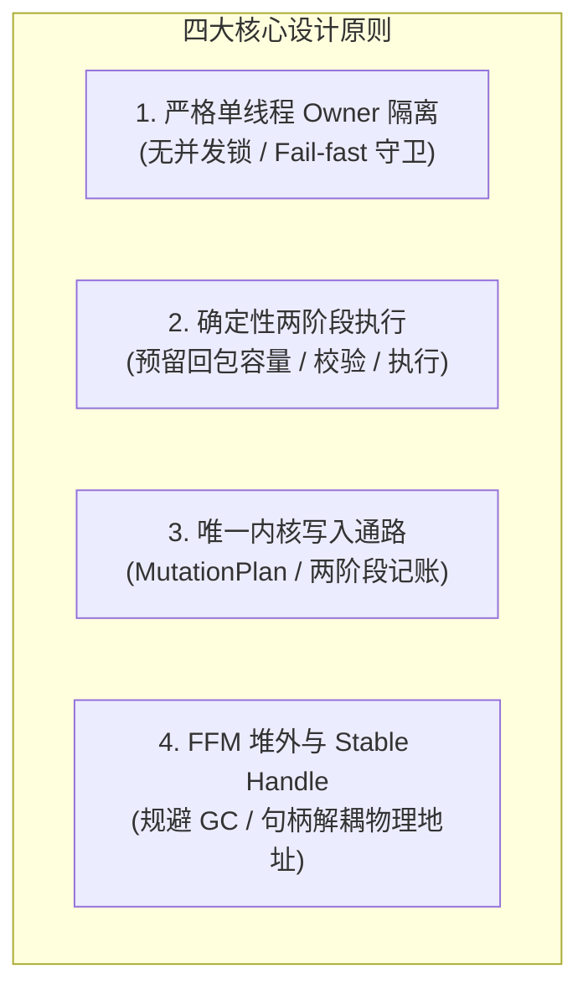

# 源码阅读指南

面向希望深入理解 Yierdis 系统设计、核心架构与内部执行机制的工程师。本文提供从全局认知建立到代码级穿透的完整阅读路线。

---

## 1. 四大核心心智模型

读代码前，先建立以下四个核心心智模型，有助于理解代码中的各种约束和抽象设计：



### 1.1 严格单线程 Owner 隔离模型
- **现象**：在 `yierdis-db` 模块中几乎找不到 `synchronized`、`ReentrantLock` 或并发容器。
- **原理**：Netty I/O EventLoop 仅负责网络收发包与协议解码。所有 DB 访问、状态修改均交由唯一的 `command owner thread`（由 [`CommandExecutor.java`](../../yierdis-server/yierdis-server/src/main/java/yier/bubu/redis/execution/executor/CommandExecutor.java) 绑定）调度执行。非 Owner 线程直接访问 DB 会立即触发 fail-fast 异常。
- **推论**：读写均无锁竞争开销，但要求耗时逻辑绝不能阻塞 Owner 线程。

### 1.2 确定性两阶段执行与回复容量预留
- **现象**：命令不是直接 `execute()` 并写出响应，而是先解析为 [`PreparedCommand.java`](../../yierdis-server/yierdis-server-api/src/main/java/yier/bubu/redis/execution/api/PreparedCommand.java)。
- **原理**：链路固定为 `reserve -> validate -> execute -> render`。在执行具体写操作之前，必须先按 `reservationShape()` 向系统申请回复缓冲区配额；配额满足且状态校验通过后才真正执行 DB 变更。
- **推论**：杜绝了“数据已写入 DB，但回包缓冲区 OOM 无法通知客户端”的半成功与协议破损状态。

### 1.3 唯一的内核写入通路与内存账本
- **现象**：任何数据增删改（包括普通写入、Lazy Expire、Active Expire、Maxmemory 驱逐、`FLUSHDB`、增量 Rehash）绝不直接操作数据结构底层指针。
- **原理**：全部写入操作必须构造 `MutationPlan`，通过 [`YierdisDbKernel.java`](../../yierdis-db/src/main/java/yier/bubu/redis/storage/memory/YierdisDbKernel.java) 统一提交。写前按上界预扣内存账本（Ledger），写后按实际消耗收窄并最终结算。

### 1.4 JDK 25 FFM 堆外内存与 Stable Handle
- **现象**：键值存储在堆外 Native 内存中，但 Java 代码中引用的并不是直接的裸指针或连续内存地址（如 `long address`）。
- **原理**：基于 Java 25 的 Foreign Function & Memory (FFM) API，系统通过 Stable Handle（稳定逻辑句柄）抽象出对象标识。
- **推论**：底层内存分配器在进行跨段搬迁、整理碎片（Defrag）或扩容时，只需更新句柄与物理内存的映射，上层持有的 Handle 保持稳定不变，彻底杜绝悬垂指针。

---

## 2. 源码五阶段精读路线


### 阶段一：自顶向下跟踪一条请求（Request Execution Flow）

从客户端发送一条简单的 `SET a 1` 或 `PING` 开始，弄清楚请求如何从 Socket 字节流流入、经过线程切换执行、再格式化写回。

* **核心调用链路**：
  ```text
  Netty Socket Inbound
    -> RespRequestDecoder (解析 RESP Frame, 准入检查)
    -> ByteArrayExecutionRequest (封装参数, lease 内存租约)
    -> NettyExecutionRequestIngress -> CommandExecutor (切入 Owner 线程排队)
    -> CommandDispatcher.prepare(...)
    -> PreparedCommand.reserve(...) -> execute(...)
    -> RedisReplyRenderer (渲染语义结果)
    -> RespReplyWriter (编码为 RESP 字节) -> Netty Write-back
  ```
* **核心源码文件**：
  1. [`YierdisServerBootstrap.java`](../../yierdis-server/yierdis-server/src/main/java/yier/bubu/redis/app/server/YierdisServerBootstrap.java)：系统 Composition Root，观察组件组装与多 EventLoop 初始化。
  2. [`RespRequestDecoder.java`](../../yierdis-server/yierdis-server/src/main/java/yier/bubu/redis/protocol/resp/netty/RespRequestDecoder.java)：Netty 入站解码器，重点看分配缓冲区前的 Inbound Admission 限制。
  3. [`ByteArrayExecutionRequest.java`](../../yierdis-server/yierdis-server-api/src/main/java/yier/bubu/redis/execution/api/ByteArrayExecutionRequest.java)：请求参数所有权模型（`takeOwnership` / `retain` / `copyOf`）。
  4. [`CommandExecutor.java`](../../yierdis-server/yierdis-server/src/main/java/yier/bubu/redis/execution/executor/CommandExecutor.java)：核心调度器，观察线程切换点与 Owner 线程绑定的过程。
  5. [`RedisReplyRenderer.java`](../../yierdis-server/yierdis-server-api/src/main/java/yier/bubu/redis/execution/api/RedisReplyRenderer.java) & [`RespReplyWriter.java`](../../yierdis-networking-resp/src/main/java/yier/bubu/redis/protocol/resp/RespReplyWriter.java)：语义结果向具体 RESP 协议（RESP2/RESP3）序列化的过程。
* **配套专题文档**：[`request-execution-flow.md`](./request-execution-flow.md)、[`netty-adapter-design.md`](./netty-adapter-design.md)。

---

### 阶段二：命令抽象、分发与事务机制（Command & Transaction）

理解 Redis 风格命令的解耦抽象，以及为什么事务没有使用简单的嵌套执行。

* **关键设计点**：
  - **参数解析与执行分离**：[`CommandSpec.java`](../../yierdis-command/src/main/java/yier/bubu/redis/command/api/CommandSpec.java) 的 Handler 仅负责将 `CommandArgs` 解析为 `Function<CommandSession, PreparedCommand>`，不持有连接上下文。
  - **事务排队（`MULTI`/`EXEC`）**：在事务状态下收到命令时，并不直接创建绑定特定 DB/Session 的执行命令，而是仅通过 Handler 执行语法与参数 preflight 检查，并保存 retained request；在 `EXEC` 时才由 Dispatcher 重新 replay、统一预留并执行。
* **核心源码文件**：
  1. [`CommandRegistry.java`](../../yierdis-command/src/main/java/yier/bubu/redis/command/kernel/CommandRegistry.java) & [`CommandDispatcher.java`](../../yierdis-command/src/main/java/yier/bubu/redis/command/kernel/CommandDispatcher.java)：命令注册表与分发器。
  2. [`StringCommands.java`](../../yierdis-command/src/main/java/yier/bubu/redis/command/defaults/string/StringCommands.java)：典型命令族实现，重点观察 `SET` 和 `GET` 的 `PreparedCommand` 构建。
  3. [`EngineSession.java`](../../yierdis-server/yierdis-server/src/main/java/yier/bubu/redis/execution/engine/EngineSession.java)：每连接的状态隔离（DB 选择、事务队列等）。
* **配套专题文档**：[`command-parsing-and-dispatch.md`](./command-parsing-and-dispatch.md)、[`transaction-and-replay.md`](./transaction-and-replay.md)。

---

### 阶段三：DB 存储引擎与内核机制（Storage & Kernel）

进入 `yierdis-db` 模块，理解内存中键空间与数据实体的组织方式。

* **关键设计点**：
  - **键空间索引**：[`NativeKeyDirectory.java`](../../yierdis-db/src/main/java/yier/bubu/redis/storage/memory/internal/keyspace/NativeKeyDirectory.java) 采用开放寻址哈希表（Open Addressing with Linear Probing），内置平滑的渐进式 Rehash 步长与墓碑（Tombstone）复用机制。特别注意专门为保证 `SCAN` 游标正确性而设计的 `MIGRATED_SCAN_SHADOW` 槽位状态。
  - **紧凑 Entry 布局**：[`EntryTable.java`](../../yierdis-db/src/main/java/yier/bubu/redis/storage/memory/internal/entry/EntryTable.java) 将每个 Key 对应的元数据打包成 72 字节的 `ENTRY_RECORD`（包含 Key/Value Handle、类型、编码、TTL deadline、LRU/LFU 时钟）。
  - **两阶段写入与账本**：在写入变更前计算上界内存预扣（Reserve Upper Bound），执行后收窄，提交后结账。
* **核心源码文件**：
  1. [`YierdisDb.java`](../../yierdis-db/src/main/java/yier/bubu/redis/storage/memory/YierdisDb.java)：单库入口，装配 `StringOps`、`HashOps` 等各数据族接口。
  2. [`YierdisDbKernel.java`](../../yierdis-db/src/main/java/yier/bubu/redis/storage/memory/YierdisDbKernel.java)：统一的写路径内核调度。
  3. [`NativeKeyDirectory.java`](../../yierdis-db/src/main/java/yier/bubu/redis/storage/memory/internal/keyspace/NativeKeyDirectory.java)：键目录与拓扑结构。
  4. [`EntryTable.java`](../../yierdis-db/src/main/java/yier/bubu/redis/storage/memory/internal/entry/EntryTable.java)：72 字节元数据结构与字段偏移。
* **配套专题文档**：[`db-internals.md`](./db-internals.md)、[`db-design-analysis.md`](./db-design-analysis.md)。

---

### 阶段四：硬核底座——JDK 25 FFM 堆外内存运行时（Native Memory Runtime）

深入探索 Java 25 前沿的 `java.lang.foreign` API 在高性能存储引擎中的实践。

* **关键设计点**：
  - **物理隔离与 Handle 抽象**：为什么不直接在内存中传递裸物理地址？为了支持底层的内存紧凑化（Compaction）和碎片整理（Defrag），系统引入 `StableMemoryHandle`。物理地址发生变动时，Handle 逻辑映射保持不变。
  - **堆外拷贝边界认知**：区分“用户态内存拷贝”与“内核态上下文切换”。堆外直接传输并不是在所有路径上都等于绝对零拷贝，弄清每一次数据在 Socket、JVM Heap 与 Native Memory 之间的流转成本。
* **核心源码文件**：
  1. [`YierdisFfmStableMemoryBackend.java`](../../yierdis-db/src/main/java/yier/bubu/redis/memory/foreign/YierdisFfmStableMemoryBackend.java)：底层基于 FFM Arena / MemorySegment 的分配器与 Handle 管理实现。
* **配套专题文档**：[`ffm-primer.md`](./ffm-primer.md)、[`native-memory-runtime.md`](./native-memory-runtime.md)、[`native-allocator-and-handles.md`](./native-allocator-and-handles.md)、[`copy-cost-and-kernel-boundary.md`](./copy-cost-and-kernel-boundary.md)。

---

### 阶段五：系统保护与运维韧性（Backpressure & Eviction）

理解高负载与内存吃紧时，系统如何进行过载保护。

* **核心机制**：
  - **背压控制（Backpressure）**：当 Executor 队列积压超过配额，或者写回通道未决字节过多时，系统通过 `channel.config().setAutoRead(false)` 暂停从客户端 Socket 读取，待队列水位下降后再恢复读取。
  - **过期生命周期（TTL）**：结合读时惰性删除（Lazy Expire）与 Maintenance 周期性抽样清除（Active Expire）。
  - **内存驱逐（Eviction）**：Maxmemory 达到硬顶后，通过多候选抽样（Approximate LRU/LFU Pool）选取牺牲者执行淘汰。
* **配套专题文档**：[`executor-and-backpressure.md`](./executor-and-backpressure.md)、[`ttl-and-expiration-lifecycle.md`](./ttl-and-expiration-lifecycle.md)、[`maxmemory-and-eviction.md`](./maxmemory-and-eviction.md)。

---

## 3. 动手调试建议（断点设置与单步验证）

建议在 IDE 中以调试模式单步跟踪一个测试用例，按顺序观察以下断点：

| 顺序 | 建议断点位置 | 观察重点 |
| --- | --- | --- |
| 1 | [`RespRequestDecoder.java`](../../yierdis-server/yierdis-server/src/main/java/yier/bubu/redis/protocol/resp/netty/RespRequestDecoder.java) 的 `decode` 方法 | 观察原始字节流如何切分为参数，以及 Inbound 准入内存账本的变化。 |
| 2 | [`CommandExecutor.java`](../../yierdis-server/yierdis-server/src/main/java/yier/bubu/redis/execution/executor/CommandExecutor.java) 的 `drainLoop` | 观察当前线程（`Thread.currentThread()`）如何从 Netty I/O EventLoop 切换为 Command Owner Thread。 |
| 3 | [`StringCommands.java`](../../yierdis-command/src/main/java/yier/bubu/redis/command/defaults/string/StringCommands.java) 的 `prepareSet` / `prepareGet` | 观察参数解析、`PreparedCommand` 构建与回包尺寸预留。 |
| 4 | [`YierdisDbKernel.java`](../../yierdis-db/src/main/java/yier/bubu/redis/storage/memory/YierdisDbKernel.java) 的 `execute(MutationPlan)` | 观察两阶段写路径：预留内存账本、写入 Key 目录与 EntryTable、最终结算。 |

**本地运行聚焦测试命令（需 JDK 25）**：
```bash
JAVA_HOME=/usr/lib/jvm/java-25-openjdk-amd64 PATH=/usr/lib/jvm/java-25-openjdk-amd64/bin:$PATH \
  mvn -pl yierdis-tests -am -Dtest=StringCommandTest test
```

---

## 4. 读后自我检验清单

若能对以下各领域的关键设计问题给出清晰推导与源码定位，说明你已真正吃透本项目的核心架构：

### 4.1 线程模型、事件循环与全链路背压
- [ ] **问题 1（无锁并发设计）**：为什么 Yierdis 访问 DB 既不用 `synchronized` 也不用 `ReentrantLock` 甚至不用 CAS？单线程 Owner 模型的最大优势与绝对禁忌是什么？  
  *思考线索*：[`CommandExecutor`](../../yierdis-server/yierdis-server/src/main/java/yier/bubu/redis/execution/executor/CommandExecutor.java) 的线程守卫、DB 访问的 fail-fast 检查、[`request-execution-flow.md`](./request-execution-flow.md)。
- [ ] **问题 2（全链路背压闭环）**：当客户端并发写入速度远超 Owner 线程消费速度，或者客户端读取响应太慢导致写回通道积压时，系统是如何一步步通过 `channel.config().setAutoRead(false)` 抑制上游 Socket 读取的？什么时候才会恢复读取？  
  *思考线索*：`ExecutorBacklogBudget`、`ExecutorBackpressureController`、[`executor-and-backpressure.md`](./executor-and-backpressure.md)。
- [ ] **问题 3（任务挂起与再调度）**：如果一个命令在执行完成准备写出时发现回复槽位（Reply Slot）容量耗尽，它是如何被挂起并在容量可用时重新回到 Owner 线程调度执行的？  
  *思考线索*：`ReplySlot.onCapacityAvailable` 回调机制、[`request-execution-flow.md`](./request-execution-flow.md)。
- [ ] **问题 4（异常边界与 Result-Unknown）**：如果在写操作 `prepared.commit()` 执行之后、写回客户端响应之前进程发生非受控退出，为什么被称为“Result-Unknown”状态？系统在关闭生命周期中如何界定这一边界？  
  *思考线索*：两阶段提交边界、[`production-hardening-operations.md`](./production-hardening-operations.md)。

### 4.2 协议解析与请求生命周期
- [ ] **问题 5（两阶段执行与预留）**：请求执行链中，为什么必须在 `execute` 执行具体业务之前，先调用 `reserve` 预留回包配额？直接执行后按需写出有什么潜在隐患？  
  *思考线索*：[`PreparedCommand.java`](../../yierdis-server/yierdis-server-api/src/main/java/yier/bubu/redis/execution/api/PreparedCommand.java) 的 `reservationShape()`、防回包 OOM 导致的半成功破损、[`request-execution-flow.md`](./request-execution-flow.md)。
- [ ] **问题 6（请求内存租约 Lease）**：`ByteArrayExecutionRequest` 中的 `RequestMemoryLease` 起什么作用？为什么在传递过程中要严格区分 `takeOwnership`、`retain` 与 `copyOf`？提前或延迟释放 lease 分别会导致什么后果？  
  *思考线索*：入站准入内存预算 `InboundMemoryBudget`、[`bytes-and-fast-paths.md`](./bytes-and-fast-paths.md)。
- [ ] **问题 7（协议协商的时序一致性）**：`HELLO 3` 能够协商 RESP3 协议。为什么同一个连接上后续命令的回包 wire 格式版本必须在 prepare 阶段固定，而不能延迟到 execute 产生结果后再动态探测？  
  *思考线索*：`ReplyPlan`、`PreparedCommand.replyProtocolVersion()`、RESP2/RESP3 结构体预留尺寸差异、[`protocol-reference.md`](./protocol-reference.md)。
- [ ] **问题 8（入站防御与硬上限）**：为什么参数长度与个数的硬上限（如 `protocolMaxBulkBytes`、`protocolMaxArgs`）必须在解码器分配字节数组之前执行，而不是留到命令解析层兜底？  
  *思考线索*：[`RespRequestDecoder.java`](../../yierdis-server/yierdis-server/src/main/java/yier/bubu/redis/protocol/resp/netty/RespRequestDecoder.java) 的 Inbound Admission 机制、防止恶意大包打爆 JVM 堆内存。

### 4.3 命令抽象与事务状态机
- [ ] **问题 9（事务排队与 Replay）**：在事务 `MULTI` 状态下收到命令时，为什么只在 parse 阶段调用 Handler 进行 preflight 检查并保存 retained request，而不提前完成会话绑定和 DB 读写准备？在 `EXEC` 时又是如何进行 replay 的？  
  *思考线索*：`TransactionState`、`PreparedExec`、事务执行前连接状态或数据可能发生变化、[`transaction-and-replay.md`](./transaction-and-replay.md)。
- [ ] **问题 10（语义回复解耦）**：为什么普通的 `CommandHandler` 不直接持有 `RedisReplyWriter` 输出字节，而是返回一个语义中间件 `RedisReply`（如 ByteSequence、ByteMap）？这种设计对流式大回复（Streaming Output）和内存释放所有权有什么好处？  
  *思考线索*：[`RedisReplyRenderer.java`](../../yierdis-server/yierdis-server-api/src/main/java/yier/bubu/redis/execution/api/RedisReplyRenderer.java)、流式数据源生命周期延展到消费完成、[`bytes-and-fast-paths.md`](./bytes-and-fast-paths.md)。
- [ ] **问题 11（连接控制命令的流转）**：像 `QUIT` 这样的连接级控制命令，为什么不在其 Handler 内部直接调用 `channel.close()`，而是返回携带意图的 `CommandResult.closeAfterReply`？  
  *思考线索*：保证 RESP `+OK\r\n` 报文先被顺序写出并 Flush 送达客户端，避免 TCP RST 或半包、[`request-execution-flow.md`](./request-execution-flow.md)。

### 4.4 存储引擎与内核机制
- [ ] **问题 12（开放寻址与墓碑机制）**：`NativeKeyDirectory` 采用开放寻址哈希表，在删除 Key 时为什么不能直接将槽位重置为 `EMPTY`，而必须标记为 `TOMBSTONE`？墓碑在什么情况下会被复用，又在什么条件下触发 Compact？  
  *思考线索*：线性探测的冲突探测链连续性、`HashCapacityPolicy`、[`db-internals.md`](./db-internals.md)。
- [ ] **问题 13（SCAN 游标与 Shadow 槽位）**：增量 Rehash 期间，哈希表槽位状态中专门设计的 `MIGRATED_SCAN_SHADOW` 起到了什么关键作用？如果缺少它，客户端在 `SCAN` 遍历时会遇到什么问题？  
  *思考线索*：反向二进制高位反转游标算法、两表并发迁移状态下的槽位映射稳定性、[`db-internals.md`](./db-internals.md)。
- [ ] **问题 14（内核写通路与两阶段记账）**：为什么所有的变更（包括淘汰和过期）都必须封装为 `MutationPlan` 走 `YierdisDbKernel.execute`？写前“按上界预扣（Reserve Upper Bound）”和写后“收窄结算（Commit）”如何防止 DB 超额占用堆外内存？  
  *思考线索*：`MutationPlan`、`MemoryLedger` 账本、[`db-internals.md`](./db-internals.md)。
- [ ] **问题 15（Rehash 坍缩替换）**：在增量 Rehash 尚未完成时，若突发大量新 Key 插入导致旧表和新表同时顶穿容量阈值，`NativeKeyDirectory` 是如何通过“坍缩替换（`collapsedReplacement`）”自救的？  
  *思考线索*：避免插入槽位耗尽与线性探测死循环、[`db-internals.md`](./db-internals.md)。

### 4.5 JDK 25 FFM 堆外内存与数据结构
- [ ] **问题 16（Stable Handle vs 裸物理指针）**：FFM 堆外内存管理中，`StableMemoryHandle` 相比直接在 Entry 中保存 64 位物理地址（`long memoryAddress`）带来了什么本质好处？它是如何支持零停顿内存碎片整理（Defrag）的？  
  *思考线索*：句柄映射间接层、内存搬迁无需上层感知、[`native-memory-runtime.md`](./native-memory-runtime.md)、[`native-allocator-and-handles.md`](./native-allocator-and-handles.md)。
- [ ] **问题 17（紧凑 Entry 内存布局）**：`EntryTable` 将键元数据紧凑压缩为 72 字节的 `ENTRY_RECORD`。其中 2 个 16 字节的 Handle 和各个 4/8 字节字段分别存放了什么？为什么要精准计算结构体字段偏移常量？  
  *思考线索*：[`NativeStorageLayout.ENTRY_RECORD_BYTES`](../../yierdis-db/src/main/java/yier/bubu/redis/storage/memory/internal/entry/EntryTable.java)、避免堆内对象头开销、[`db-internals.md`](./db-internals.md)。
- [ ] **问题 18（跨边界内存拷贝认知）**：从 Socket 读入字节到存入 Native Memory，再到被读取并通过 Socket 发送，整个链路中最少经过了几次数据拷贝？为什么说“堆外内存”绝不等于操作系统的“零拷贝（Zero-Copy）”？  
  *思考线索*：用户态堆内/堆外拷贝 vs 内核态上下文切换、`BytesSlice` / `BytesSink` 边界、[`offheap-copy-behavior.md`](./offheap-copy-behavior.md)、[`copy-cost-and-kernel-boundary.md`](./copy-cost-and-kernel-boundary.md)。

### 4.6 TTL 淘汰与 Maxmemory 驱逐
- [ ] **问题 19（主动淘汰与时间片预算）**：有了读操作时的惰性过期（Lazy Expire），为什么系统还需要 Maintenance 线程驱动的主动淘汰（Active Expire）？主动淘汰是如何利用 `expireCleanupTimeLimitMillis` 预算保证不会卡死 Owner 线程的？  
  *思考线索*：防冷 Key 堆积造成堆外内存泄漏、时间片配额限制、[`ttl-and-expiration-lifecycle.md`](./ttl-and-expiration-lifecycle.md)。
- [ ] **问题 20（近似 LRU/LFU 抽样算法）**：当内存触碰 `maxmemory` 阈值时，Yierdis 和 Redis 为什么没有采用传统的双向链表（Linked List）来实现严格 LRU，而是采用“随机抽样候选池（Approximate Eviction Pool）”？72 字节的 Entry 中是如何复用 `lruOrLfu` 字段的？  
  *思考线索*：双向链表额外的内存指针开销与锁竞争、抽样池逼近真实 LRU 曲线、[`maxmemory-and-eviction.md`](./maxmemory-and-eviction.md)。