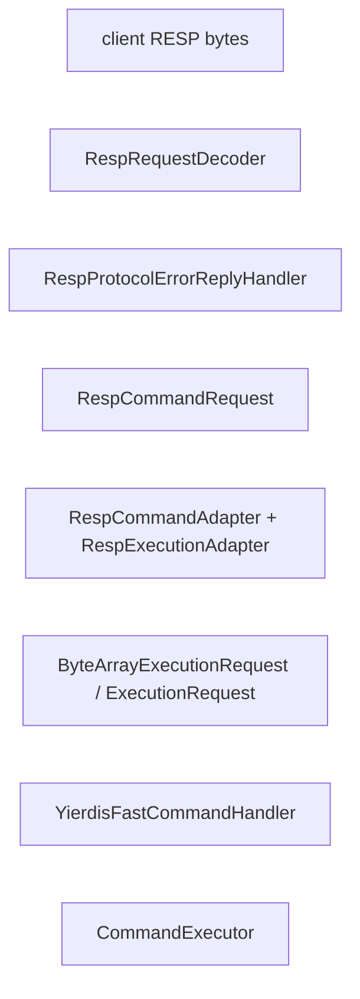

# RESP Protocol Error Layering Implementation Plan

> **For agentic workers:** REQUIRED SUB-SKILL: Use superpowers:subagent-driven-development (recommended) or superpowers:executing-plans to implement this plan task-by-task. Steps use checkbox (`- [ ]`) syntax for tracking.

**Goal:** Make malformed RESP a protocol-layer-only error path by handling `RespProtocolError` before command adaptation, removing the command-layer protocol fallback, simplifying `RespRequestDecoder` to one supported constructor, and updating tests/docs to lock the boundary in place.

**Architecture:** Keep the existing RESP request model and executor closing semantics, but reorder the Netty pipeline to `RespRequestDecoder -> RespProtocolErrorReplyHandler -> RespCommandAdapter -> YierdisFastCommandHandler`. Preserve the existing malformed-RESP behavior of replying once and closing, while narrowing `YierdisFastCommandHandler.exceptionCaught(...)` to internal-error-only handling and removing the unused 4-argument decoder constructor.

**Tech Stack:** Java 25, Maven, Netty, JUnit 4, existing RESP request/reply classes, existing server/executor closing integration.

---

## Scope Check

The approved spec is one subsystem: RESP protocol error layering inside the server/networking path. It touches the Netty pipeline order, protocol error reply handler tests, command handler exception behavior, decoder constructor cleanup, and protocol flow docs, but all changes serve the same protocol-boundary feature and can be implemented as one plan.

The plan intentionally avoids a new protocol exception hierarchy, executor redesign, or broader command-path refactors because those were explicit non-goals in the design.

## File Structure

Modify protocol-layer implementation files:

- `yierdis-networking/yierdis-networking-netty/src/main/java/yier/bubu/redis/protocol/resp/netty/RespRequestDecoder.java`: remove the unsupported 4-argument constructor and dead helper while keeping protocol parsing/error emission unchanged.
- `yierdis-networking/yierdis-networking-netty/src/main/java/yier/bubu/redis/protocol/resp/netty/RespProtocolErrorReplyHandler.java`: keep it as the single normal protocol error reply point and strengthen test coverage around closing behavior.
- `yierdis-networking/yierdis-networking-netty/src/main/java/yier/bubu/redis/protocol/resp/netty/RespCommandAdapter.java`: unchanged behavior, but it becomes downstream of protocol error handling.

Modify server composition / handler files:

- `yierdis-server/yierdis-server-main/src/main/java/yier/bubu/redis/app/server/YierdisServerChannelInitializer.java`: reorder the pipeline so protocol errors are intercepted before command adaptation.
- `yierdis-server/yierdis-server-main/src/main/java/yier/bubu/redis/app/server/YierdisFastCommandHandler.java`: remove protocol-error-specific exception handling so command-layer exceptions always produce internal errors.

Modify tests that lock the boundary:

- `yierdis-networking/yierdis-networking-netty/src/test/java/yier/bubu/redis/protocol/resp/netty/RespProtocolErrorReplyHandlerTest.java`: prove protocol errors do not pass downstream and later inbound messages are dropped once closing starts.
- `yierdis-networking/yierdis-networking-netty/src/test/java/yier/bubu/redis/protocol/resp/netty/RespRequestDecoderTest.java`: keep parsing/error tests and add constructor-surface coverage.
- `yierdis-server/yierdis-server-main/src/test/java/yier/bubu/redis/app/server/YierdisServerBootstrapCommandWiringTest.java`: lock the new pipeline ordering.
- `yierdis-server/yierdis-server-main/src/test/java/yier/bubu/redis/app/server/ClosingSkipSideEffectsIntegrationTest.java`: move protocol-error closing coverage to the protocol handler path and add a regression test proving command-handler exception fallback now returns internal errors.
- `yierdis-server/yierdis-server-main/src/test/java/yier/bubu/redis/app/server/RespProtocolErrorIntegrationTest.java`: keep the end-to-end malformed RESP close behavior intact.

Modify docs:

- `docs/project-docs/request-execution-flow.md`
- `docs/project-docs/configuration-and-operations.md`
- `docs/project-docs/command-parsing-and-dispatch.md`

## Task 1: Reorder The Netty Pipeline Around Protocol Errors

**Files:**
- Modify: `yierdis-server/yierdis-server-main/src/main/java/yier/bubu/redis/app/server/YierdisServerChannelInitializer.java`
- Modify: `yierdis-server/yierdis-server-main/src/test/java/yier/bubu/redis/app/server/YierdisServerBootstrapCommandWiringTest.java`
- Modify: `yierdis-networking/yierdis-networking-netty/src/test/java/yier/bubu/redis/protocol/resp/netty/RespProtocolErrorReplyHandlerTest.java`

- [ ] **Step 1: Write the failing pipeline-order and closing tests**

Add this test to `RespProtocolErrorReplyHandlerTest.java` under the existing `closeAfterReplyRunsCallbackWritesErrorAndClosesChannel()` test:

```java
    @Test
    public void closeAfterReplyDropsLaterInboundMessagesOnceClosingStarts() {
        AtomicInteger downstreamReads = new AtomicInteger();
        TrackingCloseable later = new TrackingCloseable();
        EmbeddedChannel ch = new EmbeddedChannel(
                new RespProtocolErrorReplyHandler(new RespReplyWriterFactory(), ctx -> ctx.pipeline().fireChannelRead(later)),
                new ChannelInboundHandlerAdapter() {
                    @Override
                    public void channelRead(ChannelHandlerContext ctx, Object msg) {
                        downstreamReads.incrementAndGet();
                    }
                }
        );
        try {
            Assert.assertFalse(ch.writeInbound(new RespProtocolError("ERR Protocol error", true)));
            Assert.assertTrue("later inbound message should be closed once protocol closing starts", later.closed);
            Assert.assertEquals("protocol errors must not pass to downstream handlers", 0, downstreamReads.get());
            Assert.assertArrayEquals(ascii("-ERR Protocol error\r\n"), readOutbound(ch));
            Assert.assertFalse(ch.isOpen());
        } finally {
            ch.finishAndReleaseAll();
        }
    }

    private static final class TrackingCloseable implements AutoCloseable {
        private boolean closed;

        @Override
        public void close() {
            closed = true;
        }
    }
```

Update the pipeline-order assertions in `YierdisServerBootstrapCommandWiringTest.java`:

```java
                Assert.assertTrue(decoderIndex > backpressureIndex);
                Assert.assertTrue(decoderIndex > idleTimeoutCloserIndex);
                Assert.assertTrue(protocolErrorIndex > decoderIndex);
                Assert.assertTrue(adapterIndex > protocolErrorIndex);
                Assert.assertTrue(commandHandlerIndex > adapterIndex);
```

- [ ] **Step 2: Run the targeted tests to verify the pipeline-order regression fails**

Run:

```bash
JAVA_HOME=/usr/lib/jvm/java-25-openjdk-amd64 PATH=/usr/lib/jvm/java-25-openjdk-amd64/bin:$PATH \
mvn -pl yierdis-networking/yierdis-networking-netty,yierdis-server/yierdis-server-main -am \
  -Dtest=RespProtocolErrorReplyHandlerTest,YierdisServerBootstrapCommandWiringTest \
  -Dsurefire.failIfNoSpecifiedTests=false test
```

Expected: FAIL in `YierdisServerBootstrapCommandWiringTest` because the current pipeline still places `respCommandAdapter` before `respProtocolErrorReply`.

- [ ] **Step 3: Reorder protocol error handling before command adaptation**

Modify the pipeline block in `YierdisServerChannelInitializer.java` to:

```java
        ch.pipeline()
                .addLast("respRequestDecoder", new RespRequestDecoder(
                        config.protocolMaxBulkBytes(),
                        config.protocolMaxArgs(),
                        config.protocolMaxLineBytes()
                ))
                .addLast("respProtocolErrorReply", new RespProtocolErrorReplyHandler(
                        replyWriterFactory,
                        YierdisServerChannelInitializer::markProtocolErrorClosing
                ))
                .addLast("respCommandAdapter", new RespCommandAdapter())
                .addLast("commandHandler", new YierdisFastCommandHandler(executor, replyWriterFactory));
```

Keep `RespProtocolErrorReplyHandler` logic unchanged in production code for this task; the new test should pass once the pipeline is in the intended order.

- [ ] **Step 4: Run the targeted tests to verify the new order passes**

Run:

```bash
JAVA_HOME=/usr/lib/jvm/java-25-openjdk-amd64 PATH=/usr/lib/jvm/java-25-openjdk-amd64/bin:$PATH \
mvn -pl yierdis-networking/yierdis-networking-netty,yierdis-server/yierdis-server-main -am \
  -Dtest=RespProtocolErrorReplyHandlerTest,YierdisServerBootstrapCommandWiringTest \
  -Dsurefire.failIfNoSpecifiedTests=false test
```

Expected: PASS for both test classes.

- [ ] **Step 5: Commit the pipeline-order change**

Run:

```bash
git add \
  yierdis-networking/yierdis-networking-netty/src/test/java/yier/bubu/redis/protocol/resp/netty/RespProtocolErrorReplyHandlerTest.java \
  yierdis-server/yierdis-server-main/src/main/java/yier/bubu/redis/app/server/YierdisServerChannelInitializer.java \
  yierdis-server/yierdis-server-main/src/test/java/yier/bubu/redis/app/server/YierdisServerBootstrapCommandWiringTest.java
git commit -m "refactor: handle RESP protocol errors before command adaptation"
```

## Task 2: Remove Command-Layer Protocol Error Fallback

**Files:**
- Modify: `yierdis-server/yierdis-server-main/src/main/java/yier/bubu/redis/app/server/YierdisFastCommandHandler.java`
- Modify: `yierdis-server/yierdis-server-main/src/test/java/yier/bubu/redis/app/server/ClosingSkipSideEffectsIntegrationTest.java`

- [ ] **Step 1: Write the failing regression tests for command-handler fallback removal**

Replace the first protocol-error test in `ClosingSkipSideEffectsIntegrationTest.java` with this protocol-layer version:

```java
    @Test
    public void protocolErrorReplyHandlerMarksClosingAndClosesAfterReply() throws Exception {
        DefaultEventExecutorGroup group = new DefaultEventExecutorGroup(1);
        EventExecutor eventExecutor = group.next();

        YierdisInstance instance = TestYierdisInstances.createWithDefaultMemory(YierdisInstanceConfig.builder().build());
        YierdisEngine engine = TestYierdisEngines.forInstance(instance);
        RespReplyWriterFactory replyWriterFactory = new RespReplyWriterFactory();
        CommandExecutor<NettyExecutionConnection> executor = new CommandExecutor<>(
                instance::bindToCurrentThread,
                engine::execute,
                eventExecutor,
                replyWriterFactory,
                new NettyExecutionIoAdapter(),
                new CommandExecutorConfig(16, 0, 256, 128, 0, 0, 128, 10, SchedulingPolicy.FAIR)
        );
        executor.start();

        CountDownLatch blockerStarted = new CountDownLatch(1);
        CountDownLatch unblock = new CountDownLatch(1);
        eventExecutor.submit(() -> {
            blockerStarted.countDown();
            unblock.await();
            return null;
        });
        Assert.assertTrue(blockerStarted.await(1, TimeUnit.SECONDS));

        EmbeddedChannel ch = new EmbeddedChannel(
                protocolErrorHandler(replyWriterFactory),
                new RespCommandAdapter(),
                new YierdisFastCommandHandler(executor, replyWriterFactory)
        );
        try {
            NettyExecutionConnection connection = NettyExecutionConnection.getOrCreate(ch, 16, 1024);
            ch.writeInbound(request("PING"));
            Assert.assertNull("expected no reply while executor is blocked", readOutbound(ch));

            ExecutionConnectionContext context = connection.context();
            Assert.assertEquals(1L, context.statsSnapshot().commandsEnqueued());

            Assert.assertFalse(ch.writeInbound(new RespProtocolError("ERR Protocol error: invalid inline command", true)));
            Assert.assertArrayEquals(
                    ascii("-ERR Protocol error: invalid inline command\r\n"),
                    awaitOutbound(ch, 1000)
            );
            Assert.assertTrue("expected protocol error handler to mark connection closing", context.statsSnapshot().closing());
            ch.runPendingTasks();
            ch.runScheduledPendingTasks();
            Assert.assertFalse("protocol error handler should close after replying", ch.isOpen());

            unblock.countDown();

            awaitCounter(context, c -> c.statsSnapshot().commandsSkippedClosing(), 1L, 1000);
            Assert.assertEquals(0L, context.statsSnapshot().commandsExecuted());
            Assert.assertNull("no command reply should be produced after protocol close begins", readOutbound(ch));
        } finally {
            unblock.countDown();
            executor.shutdownGracefully().join();
            executor.executeOwnerTask(instance::close).join();
            group.shutdownGracefully().syncUninterruptibly();
            ch.finishAndReleaseAll();
        }
    }
```

Add this new regression test below it:

```java
    @Test
    public void commandHandlerTreatsDecoderWrappedProtocolFailuresAsInternalErrors() throws Exception {
        DefaultEventExecutorGroup group = new DefaultEventExecutorGroup(1);
        EventExecutor eventExecutor = group.next();

        YierdisInstance instance = TestYierdisInstances.createWithDefaultMemory(YierdisInstanceConfig.builder().build());
        YierdisEngine engine = TestYierdisEngines.forInstance(instance);
        RespReplyWriterFactory replyWriterFactory = new RespReplyWriterFactory();
        CommandExecutor<NettyExecutionConnection> executor = new CommandExecutor<>(
                instance::bindToCurrentThread,
                engine::execute,
                eventExecutor,
                replyWriterFactory,
                new NettyExecutionIoAdapter(),
                new CommandExecutorConfig(16, 0, 256, 128, 0, 0, 128, 10, SchedulingPolicy.FAIR)
        );
        executor.start();

        EmbeddedChannel ch = new EmbeddedChannel(new YierdisFastCommandHandler(executor, replyWriterFactory));
        try {
            NettyExecutionConnection connection = NettyExecutionConnection.getOrCreate(ch, 16, 1024);

            ch.pipeline().fireExceptionCaught(new DecoderException(
                    new IllegalArgumentException("Protocol error: invalid inline command")
            ));

            Assert.assertArrayEquals(ascii("-ERR internal error\r\n"), awaitOutbound(ch, 1000));
            Assert.assertTrue("expected command handler fallback to mark connection closing", connection.context().statsSnapshot().closing());
            ch.runPendingTasks();
            ch.runScheduledPendingTasks();
            Assert.assertFalse("internal error fallback should close after replying", ch.isOpen());
        } finally {
            executor.shutdownGracefully().join();
            executor.executeOwnerTask(instance::close).join();
            group.shutdownGracefully().syncUninterruptibly();
            ch.finishAndReleaseAll();
        }
    }
```

Add this helper near the bottom of the test class:

```java
    private static RespProtocolErrorReplyHandler protocolErrorHandler(RespReplyWriterFactory replyWriterFactory) {
        return new RespProtocolErrorReplyHandler(replyWriterFactory, ctx -> {
            NettyExecutionConnection connection = NettyExecutionConnection.get(ctx.channel());
            if (connection != null && connection.markClosing()) {
                ctx.channel().config().setAutoRead(false);
            }
        });
    }
```

- [ ] **Step 2: Run the server-main tests to verify the old fallback now fails**

Run:

```bash
JAVA_HOME=/usr/lib/jvm/java-25-openjdk-amd64 PATH=/usr/lib/jvm/java-25-openjdk-amd64/bin:$PATH \
mvn -pl yierdis-server/yierdis-server-main -am \
  -Dtest=ClosingSkipSideEffectsIntegrationTest \
  -Dsurefire.failIfNoSpecifiedTests=false test
```

Expected: FAIL in `commandHandlerTreatsDecoderWrappedProtocolFailuresAsInternalErrors()` because `YierdisFastCommandHandler.exceptionCaught(...)` still replies with `-ERR Protocol error...`.

- [ ] **Step 3: Narrow `YierdisFastCommandHandler.exceptionCaught(...)` to internal errors only**

Replace the current exception handler in `YierdisFastCommandHandler.java` with:

```java
    @Override
    public void exceptionCaught(ChannelHandlerContext ctx, Throwable cause) {
        if (ctx == null) {
            return;
        }

        Throwable root = unwrapDecoderException(cause);
        String logMessage = safeLogMessage(root);
        String remote = String.valueOf(ctx.channel().remoteAddress());
        log.error("Internal error from {}: {}", remote, logMessage, root);

        ByteBuf out = ctx.alloc().buffer();
        try {
            NettyExecutionConnection connection = NettyExecutionConnection.get(ctx.channel());
            if (connection != null && connection.markClosing()) {
                safeDisableAutoRead(ctx);
            }

            RedisReplyWriter writer = newReplyWriter(out, connection);
            writer.internalError("ERR internal error");
            ctx.writeAndFlush(out).addListener(ChannelFutureListener.CLOSE);
            out = null;
        } finally {
            if (out != null) {
                out.release();
            }
        }
    }
```

Keep `unwrapDecoderException(...)` and `safeLogMessage(...)` so the log still records the root cause cleanly, but delete the `protocolError` boolean branch and the protocol-error-specific comments.

- [ ] **Step 4: Run the server-main tests to verify the protocol fallback is gone**

Run:

```bash
JAVA_HOME=/usr/lib/jvm/java-25-openjdk-amd64 PATH=/usr/lib/jvm/java-25-openjdk-amd64/bin:$PATH \
mvn -pl yierdis-server/yierdis-server-main -am \
  -Dtest=ClosingSkipSideEffectsIntegrationTest,RespProtocolErrorIntegrationTest \
  -Dsurefire.failIfNoSpecifiedTests=false test
```

Expected: PASS for both integration test classes.

- [ ] **Step 5: Commit the command-layer fallback removal**

Run:

```bash
git add \
  yierdis-server/yierdis-server-main/src/main/java/yier/bubu/redis/app/server/YierdisFastCommandHandler.java \
  yierdis-server/yierdis-server-main/src/test/java/yier/bubu/redis/app/server/ClosingSkipSideEffectsIntegrationTest.java
git commit -m "refactor: keep RESP protocol errors out of the command handler"
```

## Task 3: Remove The Unsupported Decoder Constructor

**Files:**
- Modify: `yierdis-networking/yierdis-networking-netty/src/main/java/yier/bubu/redis/protocol/resp/netty/RespRequestDecoder.java`
- Modify: `yierdis-networking/yierdis-networking-netty/src/test/java/yier/bubu/redis/protocol/resp/netty/RespRequestDecoderTest.java`

- [ ] **Step 1: Write the failing constructor-surface test**

Add this test near the top of `RespRequestDecoderTest.java`:

```java
    @Test
    public void exposesOnlyTheSupportedThreeArgumentConstructor() {
        java.lang.reflect.Constructor<?>[] constructors = RespRequestDecoder.class.getConstructors();
        Assert.assertEquals("decoder should expose one supported public constructor", 1, constructors.length);
        Assert.assertArrayEquals(
                new Class<?>[]{int.class, int.class, int.class},
                constructors[0].getParameterTypes()
        );
    }
```

- [ ] **Step 2: Run the decoder test to verify it fails before constructor cleanup**

Run:

```bash
JAVA_HOME=/usr/lib/jvm/java-25-openjdk-amd64 PATH=/usr/lib/jvm/java-25-openjdk-amd64/bin:$PATH \
mvn -pl yierdis-networking/yierdis-networking-netty -am \
  -Dtest=RespRequestDecoderTest \
  -Dsurefire.failIfNoSpecifiedTests=false test
```

Expected: FAIL because `RespRequestDecoder` still exposes both the 3-argument and 4-argument constructors.

- [ ] **Step 3: Collapse `RespRequestDecoder` to the supported API**

Replace the constructor block at the top of `RespRequestDecoder.java` with:

```java
    public RespRequestDecoder(int maxBulkBytes, int maxArgs, int maxInlineBytes) {
        this.maxBulkBytes = Math.max(0, maxBulkBytes);
        this.maxArgs = Math.max(0, maxArgs);
        this.maxInlineBytes = Math.max(0, maxInlineBytes);
    }
```

Delete the unused members entirely:

```java
    public RespRequestDecoder(int maxBulkBytes, int maxArgs, int maxInlineBytes, int maxDiscardBytes) {
        this.maxBulkBytes = Math.max(0, maxBulkBytes);
        this.maxArgs = Math.max(0, maxArgs);
        this.maxInlineBytes = Math.max(0, maxInlineBytes);
    }
```

and:

```java
    private static int safeDiscardBytes(int maxBulkBytes, int maxInlineBytes) {
        long sum = (long) Math.max(0, maxBulkBytes) + Math.max(0, maxInlineBytes);
        return sum >= Integer.MAX_VALUE ? Integer.MAX_VALUE : Math.max(1024, (int) sum);
    }
```

No other parser logic should change in this task.

- [ ] **Step 4: Run the protocol-layer tests to verify the API cleanup passes**

Run:

```bash
JAVA_HOME=/usr/lib/jvm/java-25-openjdk-amd64 PATH=/usr/lib/jvm/java-25-openjdk-amd64/bin:$PATH \
mvn -pl yierdis-networking/yierdis-networking-netty -am \
  -Dtest=RespRequestDecoderTest,RespProtocolErrorReplyHandlerTest \
  -Dsurefire.failIfNoSpecifiedTests=false test
```

Expected: PASS for both test classes.

- [ ] **Step 5: Commit the decoder API cleanup**

Run:

```bash
git add \
  yierdis-networking/yierdis-networking-netty/src/main/java/yier/bubu/redis/protocol/resp/netty/RespRequestDecoder.java \
  yierdis-networking/yierdis-networking-netty/src/test/java/yier/bubu/redis/protocol/resp/netty/RespRequestDecoderTest.java
git commit -m "refactor: drop the unused RESP decoder constructor"
```

## Task 4: Update Docs And Run Final Verification

**Files:**
- Modify: `docs/project-docs/request-execution-flow.md`
- Modify: `docs/project-docs/configuration-and-operations.md`
- Modify: `docs/project-docs/command-parsing-and-dispatch.md`

- [ ] **Step 1: Update the protocol error docs to match the final layering**

In `docs/project-docs/request-execution-flow.md`, replace the main flow section and pipeline summary with:

````markdown


`YierdisServerChannelInitializer` 的 pipeline 只做连接级装配，不承载命令语义。顺序是 decode -> protocol error reply -> RESP adapter -> fast command handler。连接级 close 和 protocol error 也在这条 pipeline 上闭环，而不是让 handler 自己猜测 channel 生命周期。

- `RespRequestDecoder`：从 `ByteBuf` 解析 RESP array 或 inline command，产出 `RespCommandRequest` 或协议错误
- `RespProtocolErrorReplyHandler`：统一回写 RESP protocol error，并在需要时标记 closing / close-after-reply
- `RespCommandAdapter`：把 `RespCommandRequest` 转成 `ExecutionRequest`
- `YierdisFastCommandHandler`：接收 `ExecutionRequest`，只调用 `CommandExecutor.trySubmit(...)`
```
````

In `docs/project-docs/configuration-and-operations.md`, replace the protocol-limits paragraph with:

```markdown
解析失败会走 RESP protocol error 路径：`RespRequestDecoder` 只负责 RESP 解析和限制，出错时产出 `RespProtocolError`；`RespProtocolErrorReplyHandler` 统一回协议错误并关闭连接，避免请求和回包错位。这个路径不会进入 `RespCommandAdapter` 或 `YierdisFastCommandHandler` 的命令提交主链。
```

In `docs/project-docs/command-parsing-and-dispatch.md`, replace the protocol-error section and command-handler bullet with:

````markdown
- `YierdisFastCommandHandler` 只负责提交，提交失败时在 I/O 边界直接回 `ERR busy <reason>`，运行时异常时回 `ERR internal error`，不会承担 RESP protocol error 的回包职责。

### 协议错误不在这里处理

RESP frame 级别的 protocol error 发生在 `RespRequestDecoder` / `RespProtocolErrorReplyHandler` 边界，由协议层回错并关闭连接；它不会进入 `RespCommandAdapter`、`ExecutionRequest` 或 command-kernel。
````

- [ ] **Step 2: Run final focused verification across both modules**

Run:

```bash
JAVA_HOME=/usr/lib/jvm/java-25-openjdk-amd64 PATH=/usr/lib/jvm/java-25-openjdk-amd64/bin:$PATH \
mvn -pl yierdis-networking/yierdis-networking-netty,yierdis-server/yierdis-server-main -am \
  -Dtest=RespRequestDecoderTest,RespProtocolErrorReplyHandlerTest,YierdisServerBootstrapCommandWiringTest,RespProtocolErrorIntegrationTest,ClosingSkipSideEffectsIntegrationTest \
  -Dsurefire.failIfNoSpecifiedTests=false test
```

Expected: PASS for all targeted protocol-layer and server-main regression tests.

- [ ] **Step 3: Sanity-check the docs wording against the new boundary**

Run:

```bash
rg -n "decode -> protocol error reply -> RESP adapter|只负责 RESP 解析和限制|不会承担 RESP protocol error|不会进入 RespCommandAdapter" \
  docs/project-docs/request-execution-flow.md \
  docs/project-docs/configuration-and-operations.md \
  docs/project-docs/command-parsing-and-dispatch.md
```

Expected: one or more matches in each file confirming the docs now describe protocol errors as a protocol-layer-only path.

- [ ] **Step 4: Commit the docs and final verification updates**

Run:

```bash
git add \
  docs/project-docs/request-execution-flow.md \
  docs/project-docs/configuration-and-operations.md \
  docs/project-docs/command-parsing-and-dispatch.md
git commit -m "docs: clarify RESP protocol error layering"
```
