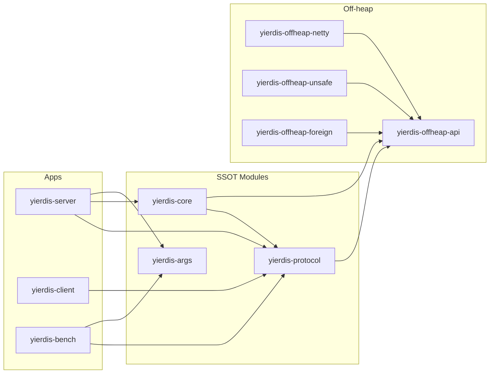
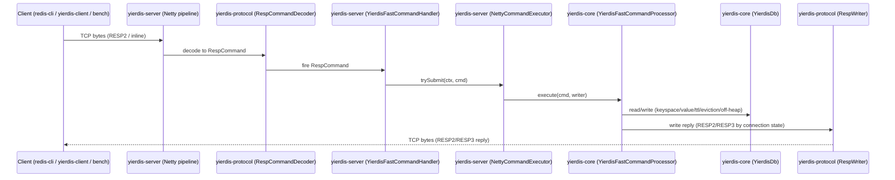

# 架构设计

本文档描述 Yierdis 的模块边界、依赖方向与核心调用链（以代码为准）。

## 模块划分与依赖方向

### 模块职责（SSOT）

- `yierdis-protocol`：RESP 对象模型 + 编解码（SSOT），供 server/client/bench 复用
- `yierdis-core`：DB/Keyspace/Value/TTL/maxmemory/命令处理（SSOT），**不依赖 Netty**
- `yierdis-args`：server 参数模型与校验（picocli，SSOT），供 server/bench 复用
- `yierdis-client`：Netty client + CLI（调试工具），依赖 `yierdis-protocol`
- `yierdis-server`：Netty server bootstrap + pipeline + executor（只做适配与装配）
- `yierdis-bench`：纯 Java benchmark 工具（socket + shared codec），参数与语义尽量对齐 server
- `yierdis-offheap-*`：off-heap API 与后端实现（API 不依赖 Netty；netty/unsafe/foreign 分模块）

### 依赖方向（约束）

- `yierdis-core` / `yierdis-protocol` 不依赖 `io.netty.*`
- `yierdis-offheap-api` 不依赖 `io.netty.*`（Netty 相关 adapter 放在 `yierdis-offheap-netty`）
- `yierdis-server` 依赖 `yierdis-core` / `yierdis-protocol` / `yierdis-args`
- `yierdis-client` / `yierdis-bench` 可依赖 `yierdis-protocol`（可选依赖 `yierdis-args` 复用参数 SSOT）

## 核心调用链（请求/响应）

## Major Architecture Decisions（摘要）

| adr_id | title | date | status | affected_modules | details |
|--------|-------|------|--------|------------------|---------|
| ADR-20260114-01 | protocol/core/args/client 模块拆分与依赖收敛 | 2026-01-14 | ✅ Accepted | yierdis-protocol,yierdis-core,yierdis-args,yierdis-client,yierdis-server,yierdis-bench | 以“协议/核心/参数”为 SSOT，server/bench/client 只做装配与复用 |
| ADR-20260114-02 | offheap-api 去 Netty 依赖 | 2026-01-14 | ✅ Accepted | yierdis-offheap-api,yierdis-offheap-netty | ByteBuf 适配下沉到 netty 模块；API 仅保留 bytes sink/source 抽象 |
