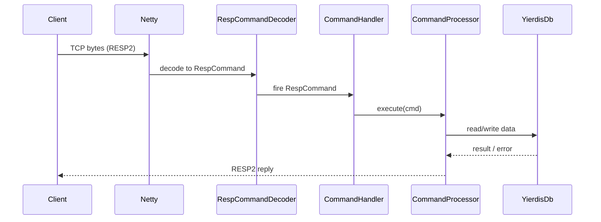

# 架构设计

## Overall Architecture

```mermaid
flowchart TD
    C[Client / redis-cli] -->|RESP2 over TCP| N[Netty Server]
    N --> D[RespCommandDecoder]
    D --> H[YierdisFastCommandHandler]
    H --> P[YierdisFastCommandProcessor]
    P --> DB[YierdisDb]
    DB --> KS[Keyspace + Expires]
    DB --> OH[Off-heap Allocator (optional)]
```

## Tech Stack

- **Backend:** Java 17 / Netty / Maven
- **Protocol:** RESP2
- **Data:** 内存数据结构（可选 off-heap）

## Core Flow



## Major Architecture Decisions

| adr_id | title | date | status | affected_modules | details |
|--------|-------|------|--------|------------------|---------|

