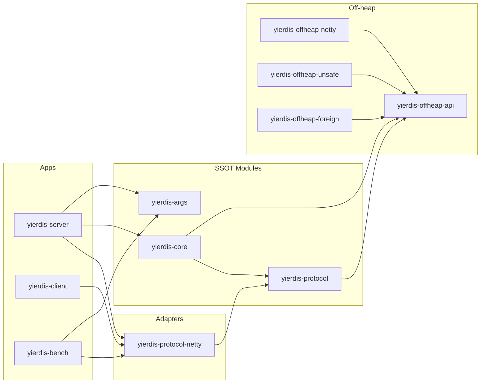
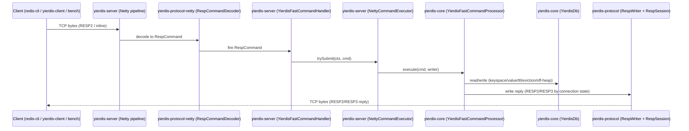

# 架构设计

本文档描述 Yierdis 的模块边界、依赖方向与核心调用链（以代码为准）。

## 模块划分与依赖方向

### 模块职责（SSOT）

- `yierdis-protocol`：RESP 对象模型 + fast-path `RespWriter` + `RespFrame/RespSession` 抽象（SSOT，**Netty-free**）
- `yierdis-protocol-netty`：Netty codec（decoder/encoder）+ `RespFrame/RespSession` 的 Netty 适配实现（adapter，可复用）
- `yierdis-core`：DB/Keyspace/Value/TTL/maxmemory/命令处理（SSOT），**不依赖 Netty**
- `yierdis-args`：server 参数模型与校验（picocli，SSOT），供 server/bench 复用
- `yierdis-client`：Netty client + CLI（调试工具），依赖 `yierdis-protocol-netty`
- `yierdis-server`：Netty server bootstrap + pipeline + executor（只做适配与装配）
- `yierdis-bench`：纯 Java benchmark 工具（socket + shared codec），依赖 `yierdis-protocol-netty`
- `yierdis-offheap-*`：off-heap API 与后端实现（API 不依赖 Netty；netty/unsafe/foreign 分模块）

### 依赖方向（约束）

- `yierdis-core` / `yierdis-protocol` 不依赖 `io.netty.*`
- `yierdis-protocol-netty` **可以**依赖 `io.netty.*`，但只允许向下依赖 `yierdis-protocol`（不得反向渗透）
- `yierdis-offheap-api` 不依赖 `io.netty.*`（Netty 相关 adapter 放在 `yierdis-offheap-netty`）
- `yierdis-server` 依赖 `yierdis-core` / `yierdis-protocol-netty` / `yierdis-args`
- `yierdis-client` / `yierdis-bench` 依赖 `yierdis-protocol-netty`（可选依赖 `yierdis-args` 复用参数 SSOT）

## 核心调用链（请求/响应）

## Major Architecture Decisions（摘要）

| adr_id | title | date | status | affected_modules | details |
|--------|-------|------|--------|------------------|---------|
| ADR-20260114-01 | protocol/core/args/client 模块拆分与依赖收敛 | 2026-01-14 | ✅ Accepted | yierdis-protocol,yierdis-core,yierdis-args,yierdis-client,yierdis-server,yierdis-bench | 以“协议/核心/参数”为 SSOT，server/bench/client 只做装配与复用 |
| ADR-20260114-02 | offheap-api 去 Netty 依赖 | 2026-01-14 | ✅ Accepted | yierdis-offheap-api,yierdis-offheap-netty | ByteBuf 适配下沉到 netty 模块；API 仅保留 bytes sink/source 抽象 |
| ADR-20260115-01 | protocol 拆分 protocol-netty（codec 下沉） | 2026-01-15 | ✅ Accepted | yierdis-protocol,yierdis-protocol-netty,yierdis-server,yierdis-client,yierdis-bench | `yierdis-protocol` 收敛为 Netty-free SSOT；Netty codec/adapters 下沉到 `yierdis-protocol-netty`，降低耦合与泄漏风险 |
| ADR-20260115-02 | core/off-heap 去 Netty PlatformDependent | 2026-01-15 | ✅ Accepted | yierdis-core,yierdis-offheap-unsafe | 通过 `YierdisUnsafeAccess` 统一 Unsafe 读写/copy，避免 core 直接依赖 Netty 的 internal 工具类 |

## 架构风险评审（DB/Off-heap 重点）

> 目标：列出当前代码层面的不一致点与风险面，并给出可执行的缓解建议（以可维护性/可插拔性/预算口径/泄漏风险为主）。

### 1) 不一致点（行为/语义漂移风险）

- **协议层 SSOT 边界漂移：**若 `RespWriter` 与 codec 混放在同一模块，容易出现“server/client/bench 引用的 codec 版本不一致”，导致行为漂移；已通过 `yierdis-protocol` / `yierdis-protocol-netty` 拆分降低该风险。
- **maxmemory / MEMORY USAGE 口径：**off-heap 启用时若同时计入 heap 估算与 off-heap payload，可能出现明显双计数或漏计，进而导致淘汰/拒写时机不可解释（建议以 `heap 元数据估算 + allocator.usedBytes()` 为统一口径，并在 `MEMORY USAGE` 侧明确说明“估算/实占”的差异）。

### 2) 可维护性（依赖/演进成本）

- **避免 core 引入 Netty internal：**`io.netty.util.internal.PlatformDependent` 属于 Netty internal API，版本升级风险高、语义不稳定；已通过 `YierdisUnsafeAccess` 将 core 的 raw memory 读写/copy 收敛为单点封装，便于替换与审计。
- **连接级协议状态：**RESP2/RESP3 协商属于连接级状态，必须与连接生命周期绑定；建议将状态存放在 `RespSession`（如 Netty 侧用 `Channel.attr`），并禁止通过静态变量/全局缓存共享，避免并发连接间状态串扰。

### 3) 可插拔性（后端替换/灰度能力）

- **off-heap 后端插拔：**建议将“后端选择”限制在 bootstrap/factory 层（server args → allocator/backend），core 逻辑仅依赖 `yierdis-offheap-api` 的抽象，避免业务逻辑散落 `if (backend == ...)` 的分支导致可插拔性退化。
- **codec 插拔：**协议对象模型与 codec 分层后，未来可新增非 Netty 的 codec（例如纯 NIO/foreign-memory）而不影响 core 与协议对象模型。

### 4) 预算口径（容量规划/成本估算）

- **预算=可观测：**建议将 maxmemory 的“触发依据”固定为可观测指标组合（`heapEstimateBytes + offheapUsedBytes`），并在日志/INFO/诊断命令中同时输出两者，便于定位“到底是 heap 还是 off-heap 顶住了”。
- **bench 口径一致：**压测工具应复用 server 的 args/默认值，避免压测结论与线上配置口径不一致（当前 bench 允许复用 `yierdis-args` 的 SSOT）。

### 5) 泄漏风险（ByteBuf/off-heap 生命周期）

- **ByteBuf ownership：**decoder/encoder 产生的 frame 必须明确“谁 release”；当前通过 `RespFrame.close()` 统一回收语义，并让 `RespCommand.recycle()` 负责关闭 frame，建议在 review 中强制检查：所有异常路径是否都会 recycle/close。
- **off-heap address 生命周期：**Unsafe/off-heap 分配必须存在唯一 owner，并保证 delete/expire/evict/shutdown 路径都能回收；建议持续用 `allocator.usedBytes()` 作为回归验证锚点，并在测试中覆盖异常/早退路径。
