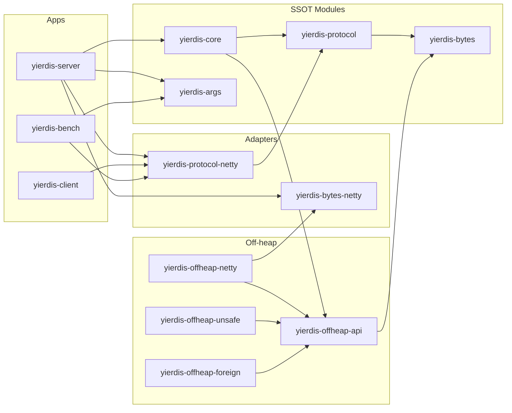
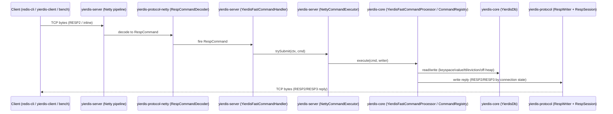

# 架构设计

本文档描述 Yierdis 的模块边界、依赖方向与核心调用链（以代码为准）。

## 模块划分与依赖方向

### 模块职责（SSOT）

- `yierdis-bytes`：中立 bytes 抽象（`BytesSource/BytesSink/BytesSlice`），供协议层/off-heap/I/O 复用（SSOT，**Netty-free**）
- `yierdis-bytes-netty`：`yierdis-bytes` 的 Netty 适配层（`ByteBuf` ↔ `DirectBytesSink/BytesSource`），为 server/off-heap 提供 fast-path（adapter）
- `yierdis-protocol`：RESP 对象模型 + fast-path `RespWriter` + `RespFrame/RespSession` 抽象（SSOT，**Netty-free**）
- `yierdis-protocol-netty`：Netty codec（decoder/encoder）+ `RespFrame/RespSession` 的 Netty 适配实现（adapter，可复用）
- `yierdis-core`：DB/Keyspace/Value/TTL/maxmemory/命令处理（SSOT）+ embedded instance/runtime（`YierdisInstance`：多 DB 装配/路由/生命周期，Netty-free），**不依赖 Netty**
- `yierdis-args`：server 参数模型与校验（picocli，SSOT），供 server/bench 复用
- `yierdis-client`：Netty client + CLI（调试工具），依赖 `yierdis-protocol-netty`
- `yierdis-server`：Netty server bootstrap + pipeline + executor（只做执行/治理与装配；DB/instance 装配语义由 core SSOT 提供）
- `yierdis-bench`：纯 Java benchmark 工具（socket + shared codec），依赖 `yierdis-protocol-netty`
- `yierdis-offheap-*`：off-heap API 与后端实现（API 不依赖 Netty；netty/unsafe/foreign 分模块）

### 依赖方向（约束）

- `yierdis-core` / `yierdis-protocol` 不依赖 `io.netty.*`
- `yierdis-protocol-netty` **可以**依赖 `io.netty.*`，但只允许向下依赖 `yierdis-protocol`（不得反向渗透）
- `yierdis-offheap-api` 不依赖 `io.netty.*`（Netty 相关 adapter 放在 `yierdis-offheap-netty`）
- `yierdis-server` 依赖 `yierdis-core` / `yierdis-protocol-netty` / `yierdis-args`
- `yierdis-client` / `yierdis-bench` 依赖 `yierdis-protocol-netty`（可选依赖 `yierdis-args` 复用参数 SSOT）

> 说明：通用 bytes 抽象已抽取到 `yierdis-bytes`（中立模块）。`yierdis-protocol` 与 `yierdis-offheap-api` 都依赖该模块，但这不等同于“协议层依赖某个具体 off-heap 后端”，后端选择仍由 server bootstrap 层负责。

## 内核契约（SSOT Contracts）

为避免“补齐生产能力时倒逼大改”，Yierdis 将以下内部契约作为演进边界冻结（以代码实现为准）：

- **KeyHandle（key identity SSOT）**
  - 代码：`yierdis-core` 中 `yier.bubu.redis.db.key.KeyHandle`
  - 目标：统一 heap/off-heap/bytesview 的 key 表示，支持未来 keyspace/expires/scan 的零拷贝落地
  - 现状：keyspace/expire/scan 已完成 handle 全链路落地；热路径禁止隐式 canonical heap key copy（以回归与 diagnostics 计数锚定）
- **MemoryLedger（maxmemory SSOT）**
  - 代码：`yierdis-core` 中 `yier.bubu.redis.db.memory.MemoryLedger`
  - 目标：将预算判定/拒写点/淘汰触发收敛到单点，并以 reserve→commit/rollback 保障异常路径一致性
  - 现状：写路径已落地 `reserve → commit/rollback`；`prepareWrite` 作为命令 preflight 入口；`enforceMaxmemory` 仅作为后台维护入口（server 维护 tick 触发）
- **ScanCursorV2（SCAN cursor SSOT）**
  - 代码：`yierdis-core` 中 `yier.bubu.redis.db.ScanCursorV2`
  - 目标：锁定 cursor 的“可推进/可终止”语义；cursor v2 为 rehash-aware，并保持“数字 bulk string”生态兼容
- **Instance / 执行模型（SSOT）**
  - 代码：`yierdis-core` 中 `yier.bubu.redis.runtime.YierdisInstance` / `YierdisInstanceConfig`
  - 目标：保持 DB 单线程语义不变，将“多 DB 装配/路由/global maxmemory/allocator 生命周期”上移到 instance；server/bench/测试统一复用
  - 现状：server/embedded 场景都通过 instance 装配 DB；未绑定或跨线程访问会 fail-fast（避免静默竞态）
- **SlowCommandGovernor（慢命令治理 SSOT）**
  - 代码：`yierdis-core` 中 `yier.bubu.redis.command.SlowCommandGovernor`
  - 目标：为 `KEYS` 等潜在全表扫描命令提供“时间预算/结果上限”，避免极端情况下阻塞 executor；小数据集下尽量保持 Redis 语义
  - 现状：server 通过启动参数下发；embedded 可注入自定义 governor

## 核心调用链（请求/响应）

## 执行模型与扩展策略（冻结）

> 本节是“生产能力扩展”的前置护栏：明确哪些语义固定不变，扩展点在哪里，以及未来 shard/router 的演进边界。

- **单线程 DB 语义（SSOT）**
  - 每个 `YierdisDb` 必须绑定到唯一 owner thread；所有读写/维护逻辑都在该线程上执行。
  - 未绑定或跨线程访问直接 fail-fast（以错误暴露误用，而不是默默竞态）。
- **扩展点：instance 层（现状）**
  - `YierdisInstance` 负责装配多 DB、选择路由策略、管理共享 allocator 生命周期，以及启用 global maxmemory 协调器。
  - 当前路由维度为“逻辑 DB”（RESP session 的 `dbIndex()`，由 `SELECT` 设置）；server 只做会话管理与调度，不承担 DB 语义。
- **未来 shard/router（策略冻结）**
  - 默认保持 **single-shard**（一个 instance 即一组 DB，不做 key hash 分片）。
  - 若未来引入 key-hash shard：
    - 单 key 命令按 key→shard 路由，仍保持每 shard 内单线程 DB 语义不变。
    - **跨 shard 多 key 命令不默认支持**：当一个命令涉及多个 key 且落在不同 shard 时，应返回确定性的错误（例如类似 Redis Cluster 的 CROSSSLOT 语义），避免“部分成功/部分失败”导致一致性不可解释。
      - 典型多 key 命令：`EXISTS k1 k2 ...`、`DEL k1 k2 ...`、`PFCOUNT k1 k2 ...`、`PFMERGE dest src1 src2 ...`
      - 若未来需要支持：应以“显式 fan-out + 明确失败语义 + 可观测”推进，而不是隐式跨 shard 聚合。
    - 需要全量遍历的命令（`KEYS`/`SCAN`）应被视为“每 shard 一份”的能力；instance 级聚合需明确成本与背压策略，否则不提供。
- **慢命令治理（现状 + 边界）**
  - 慢命令治理的 SSOT 在 core（`SlowCommandGovernor`），server 只负责从启动参数注入配置。
  - 原则：预算耗尽应尽量 fail-fast（减少 executor 被长时间占用），并在文档/可观测中明确推荐用 `SCAN` 做分页遍历。

## 生产能力扩展前置条件（Guardrails）

> 目标：在“加能力”（RDB/AOF/复制/ACL/模块）时，避免倒逼大改 DB 内核契约。

- **持久化/复制必须走冻结契约**
  - 快照读取：只能通过 `YierdisSnapshot`（基于 `ScanCursorV2` 的 time-slice snapshot），不得读取/遍历 keyspace 内部结构。
  - 变更事件：只能消费 `YierdisChangeSink` 的事件流，不得在命令层/存储层绕开统一出口“偷写日志”。
- **不得绕开 ledger/maxmemory SSOT**
  - 任何写入路径都必须遵守 `MemoryLedger.reserve → commit/rollback` 的两阶段语义；禁止在扩展模块中直接修改 `usedBytes` 等内部字段。
- **off-heap 生命周期必须显式可审计**
  - 扩展模块不得持有 raw address/allocator slice 超过命令边界；若需要缓存，必须明确 copy 策略与释放时机。
- **ACL/模块接入的线程语义**
  - ACL/模块执行不得跨线程直接触达 `YierdisDb`；必须通过 instance/processor 在 owner thread 上执行，或将操作显式调度到 executor。

## Major Architecture Decisions（摘要）

| adr_id | title | date | status | affected_modules | details |
|--------|-------|------|--------|------------------|---------|
| ADR-20260114-01 | protocol/core/args/client 模块拆分与依赖收敛 | 2026-01-14 | ✅ Accepted | yierdis-protocol,yierdis-core,yierdis-args,yierdis-client,yierdis-server,yierdis-bench | 以“协议/核心/参数”为 SSOT，server/bench/client 只做装配与复用 |
| ADR-20260114-02 | offheap-api 去 Netty 依赖 | 2026-01-14 | ✅ Accepted | yierdis-offheap-api,yierdis-offheap-netty | ByteBuf 适配下沉到 netty 模块；API 仅保留 bytes sink/source 抽象 |
| ADR-20260115-01 | protocol 拆分 protocol-netty（codec 下沉） | 2026-01-15 | ✅ Accepted | yierdis-protocol,yierdis-protocol-netty,yierdis-server,yierdis-client,yierdis-bench | `yierdis-protocol` 收敛为 Netty-free SSOT；Netty codec/adapters 下沉到 `yierdis-protocol-netty`，降低耦合与泄漏风险 |
| ADR-20260115-02 | off-heap capabilities（address allocator） | 2026-01-15 | ✅ Accepted | yierdis-core,yierdis-offheap-api,yierdis-offheap-unsafe | 以 `YierdisOffHeapAddressAllocator` 显式表达 raw address 能力：core 通过 capability 选择 keyspace/expires 的 off-heap 路径，避免对具体后端的 `instanceof` 耦合 |
| ADR-20260115-03 | backlog bytes 预算（retained bytes SSOT） | 2026-01-15 | ✅ Accepted | yierdis-server,yierdis-protocol,yierdis-protocol-netty,yierdis-args | 在执行器中引入 bytes-based 预算与滞回反压（与条数阈值并存），口径以 `RespFrame.retainedBytes()` 为准（更贴近真实驻留内存） |
| ADR-20260115-04 | 消除 split-package（protocol-netty 独立包名） | 2026-01-15 | ✅ Accepted | yierdis-protocol-netty,yierdis-protocol,yierdis-server,yierdis-client,yierdis-bench | netty codec/adapters 迁移到 `yier.bubu.redis.protocol.netty`，让 `yierdis-protocol` 独占 `yier.bubu.redis.protocol` |
| ADR-20260115-05 | Version SSOT（构建元数据注入） | 2026-01-16 | ✅ Accepted | yierdis-core,yierdis-server | `HELLO` 的 version 由构建资源注入读取，避免硬编码常量造成漂移 |
| ADR-20260116-01 | 单入口执行 + DB fail-fast 线程语义 | 2026-01-16 | ✅ Accepted | yierdis-server,yierdis-core | server 侧仅保留走执行器的命令路径；DB 未绑定/跨线程访问一律 fail-fast，降低误用与竞态风险 |
| ADR-20260116-02 | 命令层拆分（CommandRegistry + Domain Commands） | 2026-01-16 | ✅ Accepted | yierdis-core | 将命令实现按 domain 拆分为多个 `*Commands`，集中注册与错误映射，降低新增命令的修改半径 |
| ADR-20260116-03 | frame compaction 与连接级公平调度 | 2026-01-16 | ✅ Accepted | yierdis-server,yierdis-protocol-netty | 在 retained-bytes 预算基础上，支持可配置 compaction 与 per-channel round-robin，降低驻留与 starvation 风险 |
| ADR-20260116-04 | 架构护栏与可观测性加固优先（bytes 模块后续评估） | 2026-01-16 | ✅ Accepted | yierdis-offheap-api,yierdis-server,yierdis-core,yierdis-protocol-netty,helloagents/wiki | 先通过文档/护栏/启动诊断降低退化风险；抽取 bytes 基础模块作为可选演进 |
| ADR-20260116-05 | QUIT 的 close-after-reply 语义与 post-QUIT backlog 跳过 | 2026-01-16 | ✅ Accepted | yierdis-protocol,yierdis-core,yierdis-server | QUIT 纳入 core 命令；命令层通过 `RespWriter` 请求 close-after-reply；执行器 flush 后关闭连接并跳过该连接后续已入队命令（仅回收，不执行） |
| ADR-20260116-06 | 引入 bytes-netty 适配层（ByteBuf sink 上移） | 2026-01-16 | ✅ Accepted | yierdis-bytes-netty,yierdis-server,yierdis-offheap-netty | 将 ByteBuf→BytesSink/DirectBytesSink 适配器收敛到 `yierdis-bytes-netty`，避免通用写回适配落在 offheap 后端模块，并保持 off-heap slice 写出 fast-path |
| ADR-20260117-01 | server pipeline 内聚与执行器组件化落地 | 2026-01-17 | ✅ Accepted | yierdis-server | pipeline 装配下沉到 initializer；执行器拆分预算/compaction 等组件，降低单类复杂度并便于测试 |
| ADR-20260117-02 | ConnectionContext 仅表达协议会话，执行器调度状态归属 server | 2026-01-17 | ✅ Accepted | yierdis-protocol-netty,yierdis-server | 连接级协议会话收敛到 `ConnectionContext`；server 运行时连接状态（pending/backpressure/closing/counters）收敛到 `ServerConnectionState`；per-channel 调度（队列+scheduled 标志）下沉到 server 私有 `NettyExecutorChannelState`（`Channel.attr`） |
| ADR-20260117-03 | 请求解码对齐 Redis：保留 inline；控制字符 fatal protocol error | 2026-01-17 | ✅ Accepted | yierdis-protocol-netty,yierdis-server | decoder 明确允许集合（array + inline）；top-level 非 array 按 inline 处理（含看似 RESP3 前缀的误用输入）；控制字符/结构性错误判为 protocol error 并 close（由回归测试锁定） |
| ADR-20260202-01 | RespWriter 作为 RESP2/RESP3 reply 写出 SSOT（含 encoder 对齐） | 2026-02-02 | ✅ Accepted | yierdis-protocol,yierdis-protocol-netty,yierdis-server | 统一 `RespWriter/RespObject/RespEncoder` 的 RESP3 类型集合与写出语义；details: helloagents/history/2026-02/202602022147_redis_compat_alignment/how.md#adr-001 |
| ADR-20260202-02 | MULTI 入队错误采用 Redis 风格 EXECABORT（事务队列有界） | 2026-02-02 | ✅ Accepted | yierdis-core,yierdis-server,yierdis-args | 事务队列新增 commands/bytes 上限并对齐 EXECABORT；details: helloagents/history/2026-02/202602022147_redis_compat_alignment/how.md#adr-002 |
| ADR-20260202-03 | maxmemory scope 升级为 global（保留 per-db 兼容开关） | 2026-02-02 | ✅ Accepted | yierdis-core,yierdis-server,yierdis-args,helloagents/wiki | 默认 global 更贴近 Redis 全实例预算；per-db 保留旧行为；details: helloagents/history/2026-02/202602022147_redis_compat_alignment/how.md#adr-003 |
| ADR-20260202-04 | busy 错误保持兼容形态但增强原因表达 | 2026-02-02 | ✅ Accepted | yierdis-server,helloagents/wiki | `-ERR busy <reason>` + `STATS` 映射，提升排障能力；details: helloagents/history/2026-02/202602022147_redis_compat_alignment/how.md#adr-004 |
| ADR-20260204-01 | core 暴露 Netty-free embedded instance API（YierdisInstance） | 2026-02-04 | ✅ Accepted | yierdis-core,yierdis-server | 统一 instance 装配语义并支持 bench/工具/测试嵌入使用；details: helloagents/history/2026-02/202602041128_core_embedded_instance_runtime_api/how.md#adr-001-place-embedded-instance-api-in-yierdis-core-netty-free |
| ADR-20260206-01 | RESP wire scan/skip 语义下沉到 protocol 作为 SSOT | 2026-02-06 | ✅ Accepted | yierdis-protocol,yierdis-protocol-netty | 引入 Netty-free `RespWireSupport/RespWireSkipper` 并由 Netty decoders 复用（保留 request fast-path），减少多实现漂移；details: helloagents/history/2026-02/202602061102_resp_parser_ssot_alignment/how.md |
| ADR-20260206-02 | RESP 解析质量兜底：golden/round-trip/fuzz/差分测试矩阵 | 2026-02-06 | ✅ Accepted | yierdis-protocol,yierdis-protocol-netty,yierdis-server,helloagents/wiki | 以测试锁定 attributes/streamed/limits/close 策略等行为边界，降低 fast-path/materialize/skip-scan 漂移风险；details: helloagents/history/2026-02/202602061216_resp_codec_test_matrix/how.md |

## Security Check（2026-02-02）

本轮变更按 G9 对以下高风险点做了“硬限制/净化/可观测”收敛，并补齐文档说明：

- **输入上限（DoS 防护）**：request 解码上限由 `RespLimits` 作为 SSOT，并通过 server 参数 `--protocolMaxBulkBytes/--protocolMaxArgs/--protocolMaxLineBytes` 显式可配。
- **事务队列上限（OOM 风险）**：MULTI 事务队列新增 `--transactionQueueMaxCommands/--transactionQueueMaxBytes` 两条硬上限；触达上限会触发入队错误并进入 aborted，后续 EXEC 返回 `EXECABORT` 并丢弃队列。
- **错误消息净化（response splitting 风险）**：RESP error 写出统一做 CR/LF 过滤与限长；拒绝/忙错误的 reason 为固定枚举码，不携带客户端原始输入。
- **拒绝路径资源回收（泄漏风险）**：busy/拒绝路径会回收 `RespCommand/RespFrame`（避免 ByteBuf 驻留或泄漏），并通过回归测试锁定。
- **off-heap 上限不“隐式无限”**：maxmemory 与 off-heap 是两套约束；当启用 off-heap 后端但 `--offheapMaxBytes=0` 时，server 启动会给出显式风险提示，避免误以为 maxmemory 具备硬上限语义。

结论：上述风险点均已具备“可配置硬上限/错误净化/回归测试 + 文档解释”，未发现需要阻断发布的高风险缺口。

## 架构风险评审（DB/Off-heap 重点）

> 目标：列出当前代码层面的不一致点与风险面，并给出可执行的缓解建议（以可维护性/可插拔性/预算口径/泄漏风险为主）。

### 1) 不一致点（行为/语义漂移风险）

- **协议层 SSOT 边界漂移：**若 `RespWriter` 与 codec 混放在同一模块，容易出现“server/client/bench 引用的 codec 版本不一致”，导致行为漂移；已通过 `yierdis-protocol` / `yierdis-protocol-netty` 拆分降低该风险。
- **maxmemory / MEMORY USAGE 口径：**off-heap 启用时若同时计入 heap 估算与 off-heap payload，可能出现明显双计数或漏计，进而导致淘汰/拒写时机不可解释（建议以 `heap 元数据估算 + allocator.usedBytes()` 为统一口径，并在 `MEMORY USAGE` 侧明确说明“估算/实占”的差异）。

### 2) 可维护性（依赖/演进成本）

- **避免 core 引入 Netty internal：**`io.netty.util.internal.PlatformDependent` 属于 Netty internal API，版本升级风险高、语义不稳定；目前 core 通过 `yierdis-offheap-api` 的 capability（`YierdisOffHeapAddressAllocator`）表达 raw memory 能力，具体实现留在后端模块中，便于替换与审计。
- **bytes 抽象与 off-heap 能力的语义：**bytes 抽象已迁移到 `yierdis-bytes`（SSOT，Netty-free），off-heap allocator/capability API 继续留在 `yierdis-offheap-api`。协议层不再需要通过 “off-heap” 命名模块来复用 bytes 接口，依赖方向更直观，也降低误解成本。
- **连接级协议状态（SSOT）与 server 调度边界：**RESP2/RESP3 协商属于连接级协议会话，收敛到 `ConnectionContext`（实现 `RespSession`）并在 Netty 侧以 `Channel.attr` 绑定；pending/backpressure/closing/counters 属于 server 运行时语义，收敛到 server 私有 `ServerConnectionState`（同样与连接生命周期绑定）。与之相对，执行器调度（per-channel 队列 + scheduled 标志）属于 server 内部实现细节，收敛到 `NettyExecutorChannelState`（`yierdis-server` 私有，`Channel.attr` 绑定），避免 protocol 模块被调度策略绑死。

### 3) 可插拔性（后端替换/灰度能力）

- **off-heap 后端插拔：**建议将“后端选择”限制在 bootstrap/factory 层（server args → allocator/backend），core 逻辑仅依赖 `yierdis-offheap-api` 的抽象与 capabilities（例如 `YierdisOffHeapAddressAllocator`），避免业务逻辑散落 `if (backend == ...)` 的分支导致可插拔性退化。
- **codec 插拔：**协议对象模型与 codec 分层后，未来可新增非 Netty 的 codec（例如纯 NIO/foreign-memory）而不影响 core 与协议对象模型。

### 4) 预算口径（容量规划/成本估算）

- **预算=可观测：**建议将 maxmemory 的“触发依据”固定为可观测指标组合（`heapEstimateBytes + offheapUsedBytes`），并在日志/INFO/诊断命令中同时输出两者，便于定位“到底是 heap 还是 off-heap 顶住了”。
- **bench 口径一致：**压测工具应复用 server 的 args/默认值，避免压测结论与线上配置口径不一致（当前 bench 允许复用 `yierdis-args` 的 SSOT）。

### 5) 泄漏风险（ByteBuf/off-heap 生命周期）

- **ByteBuf ownership：**decoder/encoder 产生的 frame 必须明确“谁 release”；当前通过 `RespFrame.close()` 统一回收语义，并让 `RespCommand.recycle()` 负责关闭 frame，建议在 review 中强制检查：所有异常路径是否都会 recycle/close。
- **off-heap address 生命周期：**Unsafe/off-heap 分配必须存在唯一 owner，并保证 delete/expire/evict/shutdown 路径都能回收；建议持续用 `allocator.usedBytes()` 作为回归验证锚点，并在测试中覆盖异常/早退路径。
- **retained bytes 与 compaction：**零拷贝 slice 可能让小 frame 持有大底层 buf；执行器应以 `retainedBytes()` 做预算，并允许在阈值触发时 compact（copy→precise frame）释放驻留体积。
